# Morserino-32: Detaillierte Aufbauanleitung
*Version Dezember 2020 - Gilt für 1. und 2. Auflage des Morserino-32*

### Bevor du beginnst:

* **Überprüfe, ob du alle Bauteile erhalten hast!** Siehe die Liste der Bauteile im Appendix "Bauteile"

* **Obwohl der Bausatz recht einfach zu montieren ist, solltest du einige Erfahrungen mit dem Zusammenbau von elektronischen Bausätzen haben.** Wenn nicht, empfehle ich dringend, jemanden um Hilfe zu bitten, der diese Erfahrung hat. Selbst einfach zu bauende Kits können leicht ruiniert werden (natürlich kann ich dir Ersatzteile zur Verfügung stellen, falls etwas Schlimmes passiert ist - aber du wirst verstehen, dass ich das nicht kostenlos tun kann - ich muss die Teile ja selbst auch kaufen.)

* Stelle sicher, dass du weißt, welchen Typ von LiPo-Akku du verwendest und wo du ihn anbringen möchtest:
	* Wenn er klein genug ist, sollte er unter das ESP32-Modul passen.
	* Andernfalls solltest du ihn an der Bodenplatte des Gehäuses befestigen und sicherstellen, dass zwischen Batterie und Leiterplatte genügend Abstand besteht (**Achtung! Stelle sicher, dass keine scharfen Drahtenden oder dergleichen den Akku beschädigen** - Dies kann zur Explosion des Akkus führen!). Zwei verschiedene Größen von Abstandsbolzen sind im Lieferumfang enthalten - verwende die 12-mm-Bolzen, wenn der Akku auf der Bodenplatte sitzt. Wenn er SEHR dick ist, kannst du  sogar die 6 mm und 12 mm Abstandhalter kombinieren, um einen Abstand von 18 mm zu erhalten! Wenn du keinen zusätzlichen Platz unter der Leiterplatte benötigst, verwende die 6-mm-Abstandhalter.
* Ich gehe davon aus, dass du einen Akku mit einem Molex-Stecker verwendest. Wenn du einen Akku mit einem anderen Stecker bevorzugest, musst du dir ein eigenes Kabel mit einem passenden Stecker für den Akku besorgen.
* Lege alle nötigen Werkzeuge bereit: einen Lötkolben mit feiner Spitze, einen dünnen Lötdraht (verwende kein bleifreies Lot, wenn du dir nicht das Leben schwer machen willst), gute Beleuchtung, möglicherweise eine Lupe, einen kleinen Drahtschneider und (zur Montage des Gehäuses) den kleinen 2mm Inbusschlüssel, der dem Bausatz beiliegt.
* **Hinweise zum Löten:** KEIN bleifreies Lot verwenden (ich habe es schon erwähnt, nicht wahr?). Verwende einen hochwertigen Lötkolben, der auf eine vernünftige Temperatur eingestellt ist (ich bevorzuge es, ein wenig auf der hohen Seite zu sein - das ermöglicht es, die Verbindungen schnell herzustellen, und einige der Teile sind etwas groß, und wenn sie mit Masse verbunden sind, benötigen sie viel Hitze, um eine einwandfreie Lötstelle herzustellen. Dort viele Sekunden mit dem Lötkolben zu warten, bis das Lot endlich schmilzt, ist eine gute Möglichkeit, die Leiterplatte zu ruinieren.

* Überprüfe, ob alle Komponenten bereit sind - identifiziere sie anhand der Packliste und ermittele anhand der Zeichnung, wohin sie gehören. Bitte informiere [mailto:info@morserino.info](mailto:info@morserino.info) falls Bauteile fehlen oder defekt sein sollten, damit dir Ersatz geschickt werden kann!

Beachte dass in der zweiten Auflage 2 Trimmerpotentiometer enthalten sind, eines davon (500 oder 1000 Ohm) erkennt man an dem kleinen Knopf, mit dem es auch mit dem Fingernagel eingestellt werden kann.

**Hinweis:** *Der Trimmer mit Knopf hat einen Wert von 500 oder 1000 Ohm, je nach Verfügbarkeit; dies hat keine Auswirkungen auf die Funktionalität.*

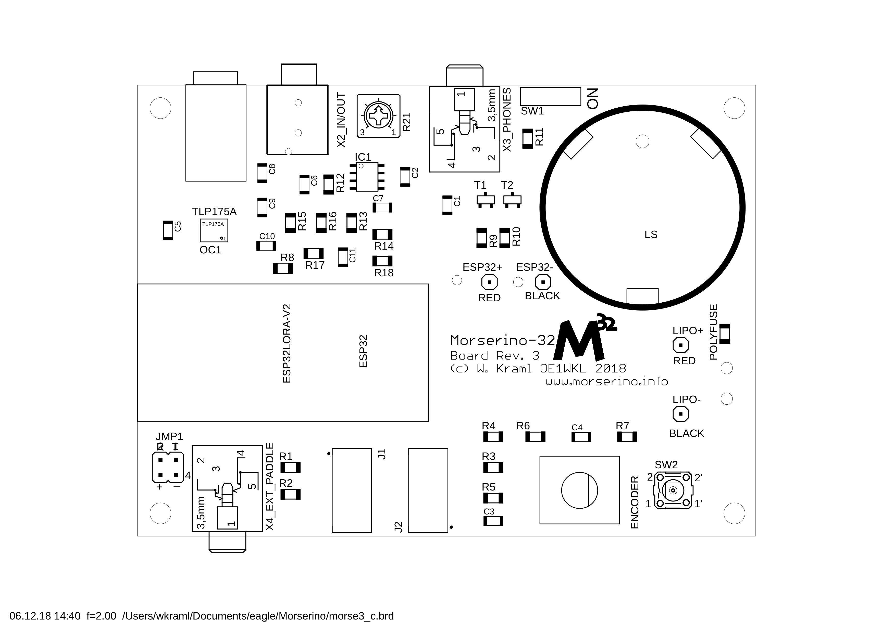

*Anordnung der Komponenten, 1. Auflage*

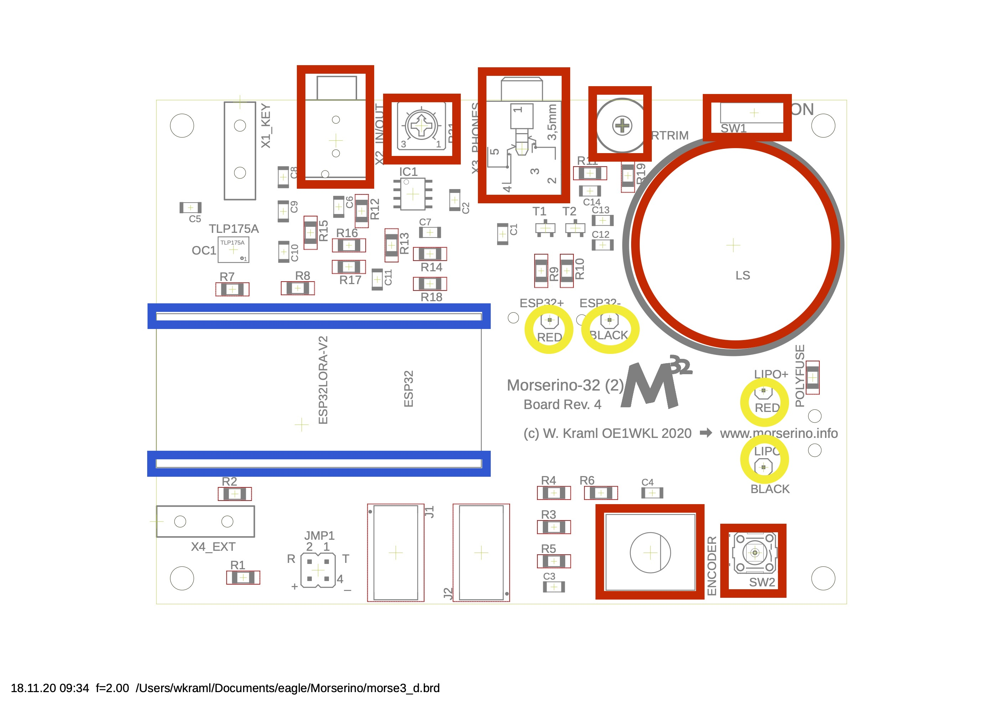

*Anordnung der Komponenten, 2. Auflage (rot = einzulötende Teile, blau = Buchsenleisten, gelb = Kabelanschlüsse)*

### Schritt-für-Schritt-Anleitung (lies sie zumindest durch, auch wenn du dich entscheiden solltest, es anders zu machen)

1. Löte zuerst die folgenden Komponenten auf die Leiterplatte: Die Telefonbuchsen (2 verschiedene Typen - 3 in der 1. Auflage -, aber es ist leicht zu erkennen, welcher wo passt); dann den Trimmerwiderstand zwischen den Buchsen (**seine Ausrichtung spielt keine Rolle**) und für die 2. Ausgabe auch den anderen Trimmer (der mit dem Knopf) in der Nähe des Lautsprechers; da diese Trimmer schwer zu beschaffen sind und je nach Verfügbarkeit unterschiedliche Anschlüsse aufweisen, sind mehr Löcher auf der Leiterplatte erforderlich, damit alle Varianten montiert werden können.

Es ist wichtig, dass der Trimmer am Rand der Platine sitzt und dass sich jedes Bein in einem der vertikal ausgerichteten Löcher befindet (markiert mit vertikalen Linien auf der Oberseite der Leiterplatte; siehe Bilder).

 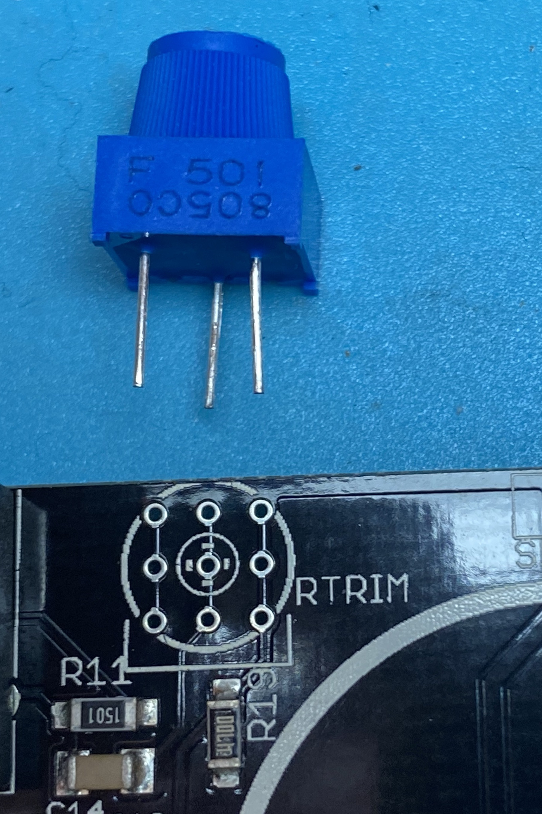   
 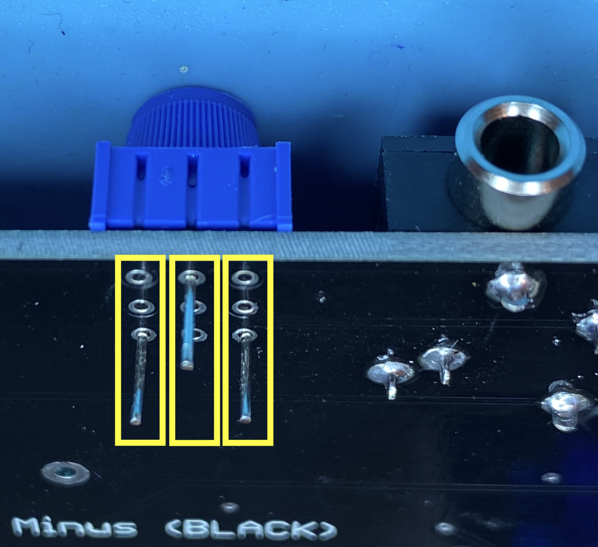

2. Jetzt kommt der Schiebeschalter (der Hebel zeigt natürlich nach außen), dann der Drehgeber und der Druckknopfschalter (sei besonders vorsichtig mit diesem - er neigt dazu, leicht schräg zu enden - er passt dann möglicherweise nicht gut in das Loch der oberen Gehäuseplatte. Stelle sicher, dass er wirklich bündig auf der Leiterplatte sitzt. Dieser Schalter hat hervorstehende "Nasen" auf seinem Gehäuse - eine sollte zur langen Kante der Leiterplatte und die andere - klarerweise - zum Lautsprecher zeigen.

3. Du findest alle diese Bauteile in der rosafarbenen Plastiktüte (siehe auch die Abbildung am Ende dieser Anleitung). Löte noch nicht die 2 Buchsenleisten, die Kabel und den Lautsprecher ein. Stelle sicher, dass alle Komponenten auf der Leiterplatte bündig sind - insbesondere der Drehgeber, der Trimmer und der Drucktastenschalter - ich hab das doch soeben erwähnt, nicht? (sonst passt das Gehäuse dann nicht sehr gut). Stelle sicher, dass sich der Schiebeschalter in der Position "OFF" (in Richtung der Klinkenbuchse) befindet.
4. Verbinde das Kabel mit dem kleinen 1,25-mm-JST-Stecker mit der Buchse an der Unterseite des Heltec-Moduls (achte darauf, dass du die Buchse nicht mit brutaler Gewalt von der Platine abreißt - halte sie mit dem Finger fest).
Der rote Draht muss auf der Seite sein, wo am Heltec-Modul ein + aufgedruckt ist.

 

 *Ausrichtung des Anschlusskabels*

  

	*Befestigen des Anschlusskabels*

5. Stecke die Buchsenleisten (18 Positionen) auf die Stifte des Heltec-Moduls, und stelle auch hier sicher, dass sie bündig auf dem Modul sitzen.
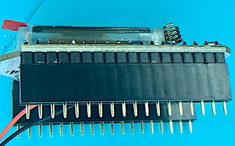

 *Aufgesteckte Buchsenleiste*

 **Sei sehr vorsichtig beim Umgang mit dem Heltec-Modul! Übe keinen Druck auf das Display oder das Kabel aus, das das Display verbindet,  oder auf die kleine Antennenspule neben dem Display** - diese Dinge sind sehr spröde und brechen leicht. **Halte das Heltec-Modul nur an der Platine fest und bring die Leiste durch abwechselnden Druck links und rechts langsam auf die Stifte!**
 
 Wenn du willst, kannst du die Aufkleber mit den Pinbezeichnugnen des Heltec Moduls seitlich auf die Pins des Moduls aufkleben (ist aber keineswegs notwendig): Auf der Seite der Paddles der Aufkleber mit "GND" bis "16", gegenüber der mit "GND" bis "21". "GND" ist jeweils nahe der USB-Buchse.

6. Setze das Heltec-Modul mit den aufgesteckten Leisten vorsichtig auf die Platine, sodass der USB-Anschluss am Rand der Platine positioniert ist, und stelle sicher, dass keine Stifte verbogen werden. Löte dann die Pins der Buchsenleisteniten auf die Platine, und achte dabei darauf, dass alles sehr bündig auf der Platine sitzt.

7. Löte die Enden des Kabels, das vom Heltec-Modul baumelt, an die mit ESP32 + (rot) und ESP32- (schwarz) gekennzeichneten Pads auf der Oberseite der Leiterplatte, nachdem die Drähte durch die Löcher neben den Pads geführt wurden (diese sind als Zugentlastung vorgesehen), und fädle sie **von unten** in die Lötpads ein. **Achte auf die Polarität (Farben!) des Kabels - bei einem Fehler wird mit ziemlicher Sicherheit das Heltec-Modul zerstört**

8. **(Optional):** Kürze das Anschlusskabel für den Akku mit dem Molex-Stecker - die Länge hängt davon ab, wo man die Batterie unterbringen will. Wenn es unter dem Heltec-Modul sitzt, sollte es ungefähr 3-4 cm lang sein. Entferne die Isolierung für ca. 3 mm und verzinne die Enden vorsichtig.

 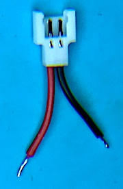

	*Gekürztes Akku-Anschlusskabel*

9. Wenn der Akku unter dem Modul sitzen soll, führe die Batteriekabel von der Oberseite der Platine durch die Löcher neben den Pads LIPO + und LIPO- und dann in die Löcher der Pads und löte sie auf der Oberseite der Platine fest. Wenn sich der Akku unter der Leiterplatte befinden soll, kürze das Kabel auf eine geeignete Länge, führe es von unten durch die Zugentlastungslöcher in die Lötpads und verlöte sie an der Unterseite. Die Ober- und Unterseite der Leiterplatte haben Markierungen, damit du das richtige Pad finden kannst. **Achte auf die Polarität (Farben!) des Kabels - bei einem Fehler wird mit ziemlicher Sicherheit das Heltec-Modul zerstört**

 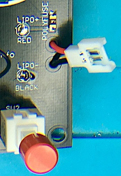

 *Anschlusskabel montiert für Akku unter Heltec Modul*

10. Löte nun den Lautsprecher auf die Platine (dies erst jetzt, da es schwierig wird, die Kabel auf der Oberseite zu löten, sobald der Lautsprecher auf der Platine sitzt). Der lautsprecher für die 2. Auflage hat Markierungen (+, -); ich glaube nicht, dass die Polarität wesentlich ist, aber ich setze die + Seite so dass sie zum Rand der Platine zeigt.

11. Setze den schwarzen Knopf auf den Schaft des Drehgebers (im Inneren des Knopfs befinden sich 2 kleine Führungsleisten, die auf die abgeflachte Seite des Schafts auszurichten sind), und die rote Kappe auf den Schaft des Drucktasters.

12. Wenn sich der Akku unter dem Heltec-Modul befinden soll, befestige ihn dort mit einem kleinen Streifen doppelseitigem Klebeband (wie Tixo, aber auf beiden Seiten klebend). Verwende keine dicken doppelseitigen Klebebänder, da der Akku dann unter Umständen nicht genügend Platz unter dem Modul hat!
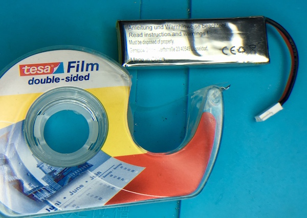

 *Dünnes doppelseitiges Klebeband*

13. **(Empfohlen):** Ich würde jetzt den Batterieanschluss mit einem Ohmmeter überprüfen, nachdem ich den Schiebeschalter auf ON gestellt habe, um festzustellen, dass wir nirgendwo einen Kurzschluss erzeugt haben. Es sollte einen relativ hohen Widerstand aufweisen (> 100 kOhm). Wenn es nahe 0 Ohm anzeigt, überprüfe die Verkabelung! Schiebe dann den Schalter wieder in die Position OFF.

14. Stecke den Stecker des Akkus in den Molex-Anschluss.

15. Setze die Paddles in die Platinenstecker ein (linkes und rechtes Paddel sind gleich, daher kann man hier keinen Fehler machen). **Die gelben Klebestreifen von den Platinensteckern vorher vorsichtig entfernen!** (Diese sind vom Hersteller angebracht und wurden für die automatische Bestückung der Platine benötigt.)

 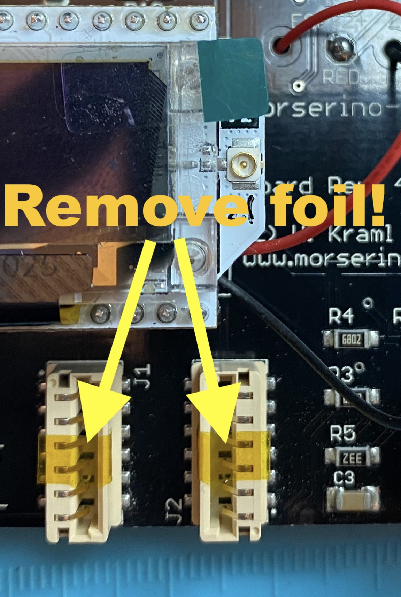   

16. Entferne die Schutzfolien von den Plexiglasplatten (die gravierte Seite hat keine Schutzfolie). Dies kann schwierig sein - versuche es mit einem Fingernagel in einer der Ecken oder verwende ein starkes Klebeband, um die Folie an einer Ecke zu lösen.

17. Montiere zuerst die 15 mm-Abstandsbolzen (weiblich / weiblich) mit den mitgelieferten Metallschrauben an der oberen Platte des Gehäuses. Die Bolzen sollten sich unter der Platte befinden, und die eingravierten Inschriften von oben lesbar sein.

18. Befestige den Antennenstecker an der oberen Platte. Verwende dazu die gezahnte Unterlegscheibe an der Unterseite und den Federring sowie die Mutter an der Oberseite (sie sollte fest sitzen, aber auf das Acrylglas keinen zu hohen Druck ausüben, da dieses sonst springen könnte; überprüfe des öfteren, ob der Anschluss fest sitzt - häufiges Entfernen und Anschließen der Antenne kann die Befestigung lockern).

	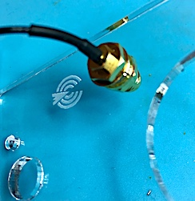

	*Montierte SMA Buchse*

19. Drücke den kleinen IPX-Koaxialstecker auf die Koaxbuchse des Heltec-Moduls. Bei diesem Schritt kann eine Lupe und ein kleiner flacher Schraubendreher hilfreich sein. Bring den Stecker flach über die Buchse und übe mit der flachen Seite des Schraubendrehers vertikal Druck von oben aus (nicht schräg!).

20. Befestige nun die obere Platte samt ihren schon montierten Abstandshaltern auf der Leiterplatte. Verwende dazu auf der Unterseite entweder die 6-mm-Abstandshalter (wenn der Akku unter dem Heltec-Modul sitzen soll) oder die 12-mm-Abstandshalter (wenn der Akku  unter der Platine untergebracht werden soll, wo etwas mehr Platz ist.

  Achte darauf, dass sowohl das Display als auch die kleine Spule (WLAN-Antenne) gut in die Öffnung  gelangen. Stelle sicher, dass die Batteriekabel und das Antennenkabel so verlaufen dass sie nirgends stören und den Encoder oder den Druckknopfschalter nicht behindern.

	**Achte darauf, die Kupferspule (WLAN-Antenne) nicht zu beschädigen oder zu verbiegen, keinen Druck auf das Display auszuüben oder und das flexible Verbindungskabel des Displays nicht zu beschädigen! Auf das Display darf kein Druck ausgeübt werden!**

	 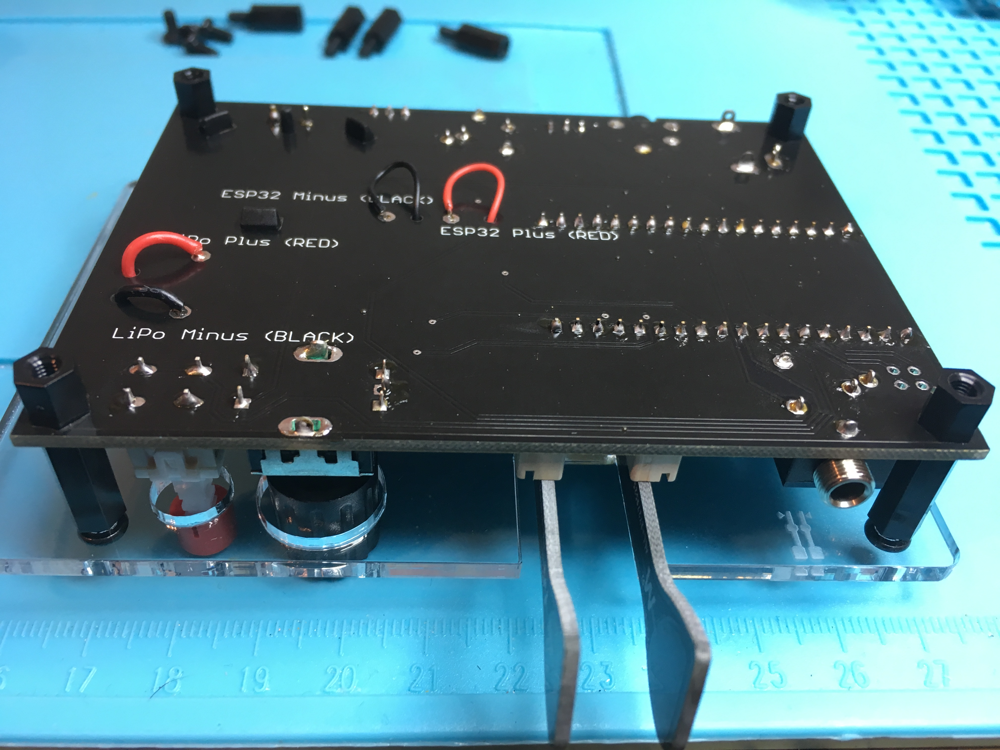

	 *Ansicht Platinenunterseite*

21. Wenn sich der Akku auf der Bodenplatte befinden soll, befestige diesen jetzt (mit doppelseitigem Klebeband) und schließe ihn an.

22. Befestige nun die Bodenplatte mit den mitgelieferten Metallschrauben an den Abstandshaltern.

23. Befestige die selbstklebenden Kunststofffüße neben den Schrauben auf der Bodenplatte.

24. Schraube die Antenne an den Antennenanschluss. (**Natürlich benötigt man die Antenne nur, wenn man mit LoRa sendet. Beachte jedoch, dass das Senden ohne Antenne den LoRa-Transceiver auf dem Heltec-Modul letztendlich zerstört!** Sicher ist sicher!)

25. **(Optional, aber empfohlen):** Gehe zum Ende dieses Dokuments und führe das **Testverfahren** durch (und ggf. eine notwendige Fehlerbehebung).

26. Schiebe nun den Batterieschalter auf "ON" und starte den Morserino-32! Wenn du noch keinen Akku hast, kannst du das USB-Kabel verwenden, um ihn so an eine 5-V-Quelle anzuschließen, entweder an deinem Computer oder einem Telefonladegerät. Da das Modul bereits programmiert ist, kann der Morserino-32 sofort verwendet werden. **Lese im Benutzerhandbuch** nach, wie man das Gerät verwendet, und seine zahlreichen Funktionen benutzt. Die Software kann auch aktualisiert werden, wenn eine neuere Version verfügbar ist - dies wird auch ausführlich im Benutzerhandbuch beschrieben.

27. Solltest du nach einer Box für die Aufbewahrung (und den Transport) deines Morserinos suchen, würde ich eine Lunchbox aus Kunststoff als sehr kostengünstige Lösung empfehlen (siehe Foto; ich würde zusätzlich auch einige Schaumstoffeinlagen empfehlen).

	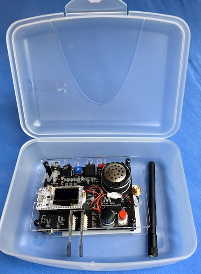

	*Aufbewahrung in einer Lunchbox*

### Auswahl eines geeigneten LiPo Akkus für den Morserino-32

Für meine Morserinos verwende ich einen kleinen 600-mAh-LiPo-Einzelzellenakku, der üblicherweise in RC-Geräten wie Quadcoptern usw. verwendet wird. Die Marke, die ich verwende, ist „Tattu“ und hat die folgenden Spezifikationen (siehe https://www.gensace.de/tattu-600mah-3-7v-30c-1s1p-lipo-battery-pack-with-molex-plug-1-pcs-pack.html or https://www.gensace.de/tattu-600mah-3-7v-30c-1s1p-lipo-battery-pack-with-molex-plug-1-pcs-pack.html):

**Tattu** 600mAh 3.7V 30C 1S1P Lipo Akku mit Molex Stecker

* Kapazität: 600mAh
* Spannung: 3.7V
* Max Dauerentladestrom: 30C (18A)
* Gewicht: 15.7g
* Abmessungen: 60 x 19 x 7mm

Siehe das Bild unten, Tattu ist der obere Akku.

Natürlich kann man ähnliche Akkus auch anderer Hersteller benutzen; damit der Akku unter dem Mikrocontroller Platz hat, darf er **nicht größer** sein als **65 x 20 x 8 mm**.

Der Akku darf nur eine Zelle haben (Nominalspannung 3,7 V), und sollte mit einem Molex-Stecker versehen sein (ein Kabel mit passendem Gegenstück ist im Bausatz enthalten. Willst du einen Akku mit anderem Anschluss benutzen, musst du dir selber ein passendes Kabel mit Stecker besorgen).

Du kannst auch größere Akkus verwenden, die müssen dann unter der Platine auf der Bodenplatte des Gehäuses montiert werden. Damit man da etwas Flexibilität hat, liegen dem Bausatz Distanzstücke von 6mm und 12mm Länge bei, mit denen man die Bodenplatte befestigen kann. Mit den 12mm Distanzstücken dürfen die größeren Akkus bis zu 10 mm dick sein. Man könnte auch die 6mm und 12mm Abstandsbolzen in Kombination verwenden, da darf der Akku sogar bis zu 16 mm dick sein. Man muss in jedem Fall dafür sorgen, dass der Akku nicht durch vorstehende Spitzen auf der Paltinenunterseite beschädigt werden kann - dies könnte zu Feuer und Explosion des Akkus führen!

Eine Option wäre dieser Typ (im Bild die Batterie unten):
https://www.amazon.de/gp/product/B01JJ6DA7A/ oder dieser Typ: https://www.amazon.com/FPVERA-Battery-Connector-Charger-Quadcopter/dp/B089R8SGJR/ oder sogar dieser für noch mehr Kapazität: https://www.gensace.de/gens-ace-3500mah-3-7v-tx-2s1p-lipo-battery-pack-with-jr-plug.html (aber beachte, dass dieser keinen Molex-Stecker verwendet - Man müsste ein Kabel mit einem geeigneten Stecker finden, um diesen an den Morserino-32 anzuschließen).

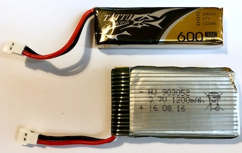

*Zwei verwendbare Akkutypen*

## Appendix: Bauteile

### Liste aller Bauteile des Bausatzes (2. Auflage):
	
(47 Teile)	
	
| Anzahl | Bauteil |
|-------|----- |
|1|	Platine (mit schon aufgelöteten SMD Bauteilen)|
|1|	Heltec ESP32 Wifi LoRa board V2.1 (programmiert)|
|1|	DC Kabel (rot/schwarz) mit Stecker (winzig!)|
|1|	DC Kabel (rot/schwarz)  mit Stecker  (groß)|
|1|	Antennenkabel konfektioniert (IPX – SMA female)|

Antistatischer Beutel mit folgenden Bauteilen:

| Anzahl | Bauteil |
|-------|----- |	
|1|	Rotary Encoder |
|1|	Knopf für Rotary Encoder (schwarz)|
|1|	Push Button Schalter|
|1|	Kappe für Push Button Schalter (rot)|
|1|	Trimmer Potentiometer (blau)|
|1|	Trimmer Potentiometer mit Knopf|
|1|Schiebeschalter(grau/dunkelrot)|
|1|	Klinkenbuchse 4-polig (klein)|
|1|	Klinkenbuchse 3-polig |
|1|	Lautsprecher|
|2|	Female Pin Header, 18-polig|
|2|	Paddles (Platinenmaterial, schwarz, vergoldete Kontakte)|

Bauteile für das Gehäuse:

| Anzahl | Bauteil |
|-------|----- |	
|1	|Grundplatte (Acrylglas)|
|1	|Frontplatte (Acrylglas, graviert)|
|1	|432 MHz Antenne, mit SMA (male) Stecker|
|4	|Abstandsbolzen, Nylon schwarz, 15mm, female/female M3|
|4	|Abstandsbolzen, Nylon schwarz, 6mm, male/female M3 *)|
|4	|Abstandsbolzen, Nylon schwarz, 12mm, male/female M3 *)|
|8	|Schwarz anodisierte Schrauben (Inbus) 6mm M3|
|4	|Selbstklebende Kunststofffüße|
|1	|2mm Inbus Schlüssel|

*) Man benutzt entweder die 6mm oder die 12mm Abstandsbolzen - siehe Aufbauanleitung

*Diese Bilder zeigen die 2. Auflage des Bausatzes. Die erste Auflage war ähnlich.*

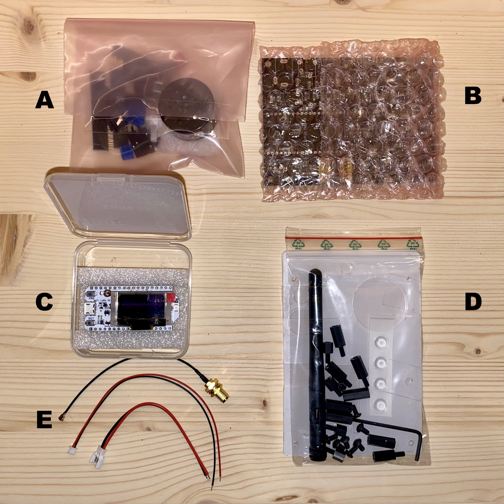

***Bausatz Inhalt:*** *A: Tüte mit Bauteilen, B: Tüte mit Platine, C: Schachtel mit Heltec Modul, D: Gehäuseteile (2 Acrylglas Platten, Schrauben, Abstandhalter, Füße, Inbusschlüssel), E: Kabel (Antennenkabel konfektioniert, Heltec Anschlusskabel, Akkukabel, alle drei üblicherweise in der Heltec Schachtel zu finden).*

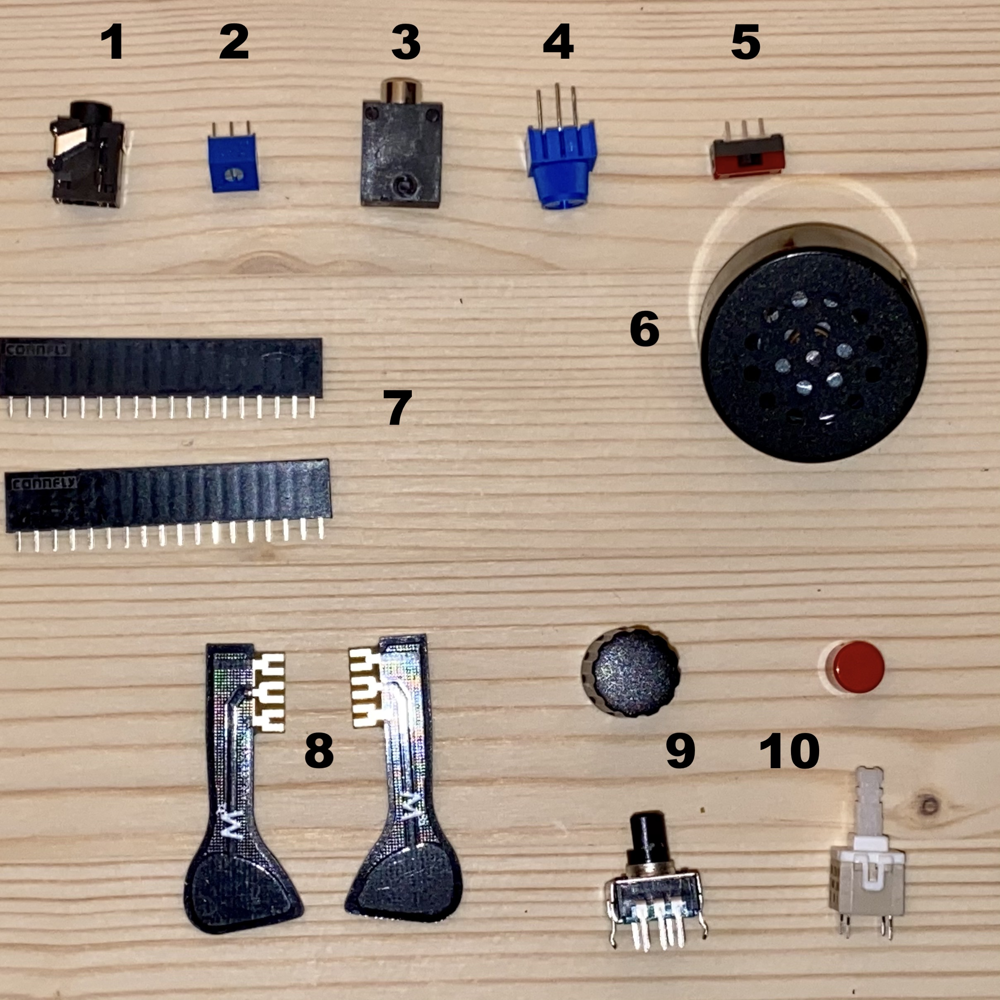

***Teile aus der Bauteiltüte, angeordnet wie sie auf der Platine zu sitzen kommen:*** *1: 4-poliger Klinkenstecker, 2: Trimmer, 3: 3-poliger Klinkenstecker, 4: Trimmer mit Knopf, 5: Schiebeschalter, 6: Lautsprecher, 7: Buchsenleisten 18-polig, 8: Touch paddles, 9: Rotary Encoder und schwarzer Knopf, 10: Drucktaster und rote Tastenkappe.* **Anmerkung zur 1. Auflage:** Teil #4 gibt es nicht, und Teil #3 ist zweimal vorhanden; es gibt noch einen zusätzlichen 2-poligen Klinkenstecker. Lautsprecher sieht anders aus.

 ## Morserino-Test nach Zusammenbau & Fehlerbehebung

 #### Ziel
 Überprüfung, ob die folgenden Komponenten zu funktionieren scheinen, und Anweisungen zur Behebung von Problemen
 (sollte weit über 95% aller bisher beobachteten Probleme abdecken):

 * Display
 * Lautsprecher / Kopfhörer
 * Encoder-Drehfunktion
 * Encoder-Druckschalter
 * Touchpaddel
 * ROTER Tastenschalter
 * Audio Line Input / Output
 * Optokoppler (Ausgang zum Sender / Transceiver)

 ###### Optional:
 * Externes Paddel
 * Externe Handtaste
 * Batterie

 ##### Nicht von diesem Test abgedeckt:
 * LoRa-Funktionalität
 * WiFi-Funktionalität

 (In Bezug auf Fehler beim Zusammenbau kann hier nicht viel passieren, abgesehen davon, dass das LoRa 432 MHz-Antennenkabel und die Antenne nicht richtig angeschlossen sind.)

 #### Vorbereitung - Benötigt werden:
 * Aufgebauter Morserino-32 mit angebrachten Touchpaddels
 * Audiokabel mit 3,5 mm 4-poligen Klinkenstekcern an beiden Enden
 * Audiokabel mit 3,5 mm 2-poligen oder 3-poligen Klinkensteckern an beiden Enden
 * Krokodilklemmenkabel (mit sehr kleinen Krokoklemmen)
 * Kleiner flacher Schraubendreher zur Bedienung des blauen Trimmers
 * Ohmmeter
 * Kopfhörer (Telefonhörer)
 ###### Optional:
 * Externes Paddel mit 3,5 mm Klinkenstecker
 * Handtaste mit 3-poliger 3,5-mm Klinkenstecker
 * LiPo-Akku für Morserino

Hier ein allgemeiner Ratschlag, falls du auf Schwierigkeiten stoßen oder Fragen haben solltest, die in diesem Dokument oder im Benutzerhandbuch nicht beantwortet zu werden scheinen: **Tritt der Morserino-Benutzergruppe** auf groups.io bei (<https://groups.io/g/morserino>). Viele sachkundige Leute lesen dort mit, und es ist wahrscheinlich der kürzeste Weg zu einer nützlichen Antwort!

 #### Test- und Fehlerbehebungsverfahren
 (Siehe Bild zur Identifizierung der Heltec Pins zum erneuten Löten der Heltec-Sockelleisten.)

 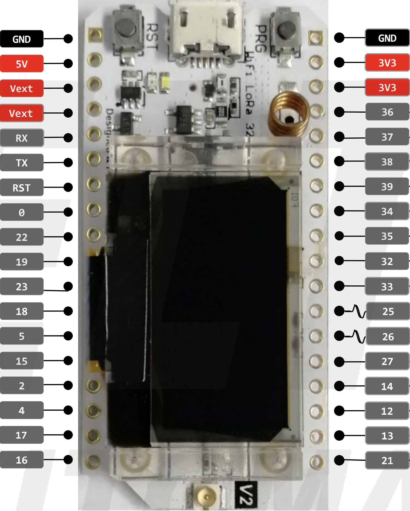

1. Stromversorgung über USB (Netzschalter auf OFF) - Startbildschirm und Menü sollten angezeigt werden und eine gute Lesbarkeit aufweisen. ANZEIGE OK.

 *Wenn es nicht funktioniert*: Wenn das Display dunkel bleibt oder fehlende Linien anzeigt, ist es defekt und das Heltec-Modul muss ersetzt werden.

2. Drehe den SCHWARZEN Knopf - es sollten verschiedene Menüpunkte angezeigt werden. In beide Richtungen drehen. ENCODER-Funktion OK.

 *Wenn es nicht funktioniert*: Löte den Encoder neu (Seite mit 3 Stiften). Wenn das Probllem bestehen bleibt, löte den Heltec Sockel, Pins 38 und 39, nach.

3. Drehe den schwarten Knop, bis "CW Keyer" angezeigt wird, und drücke kurz den SCHWARZEN Knopf. Nun sollte der Keyer starten (wird auf dem Display angezeigt). ENCODER SWITCH OK.

 *Wenn es nicht funktioniert*: Löte den Encoder neu (Seite mit 2 Stiften). Wenn das Problem bestehen bleibt, löte den Heltec Sockel Pin 37 nach.

4. Berühre das linke und das rechte Paddel - eines sollte hörbare und sichtbare Punkte (weiße LED) erzeugen, das andere Striche. TOUCH PADDLES OK.

 *Wenn es nicht funktioniert*: Fehlender Kontakt; Wurde die gelbe Folie an den Sockeln für das Touchpaddel entfernt? Wenn ja, Heltec Sockel, Pins 2 und 12, nachlöten.

5. **Optional:** Schließe ein externes Paddel an X4 an (unten links). Das Drücken des externen Paddels sollte den gleichen Effekt haben wie das Drücken der Touchpaddles. EXTERNE PADDELS OK.

 *Wenn es nicht funktioniert*: Wenn Touchpaddles funktionieren: Lötbuchse für externe Paddles / Taste (X4) nachlöten. Bei anhaltendem Problem Heltec Sockel, Pins 32 und 33, nachlöten.

6. Drücke kurz die ROTE Taste. Dies sollte den Encoder auf Lautstärkeregler umstellen. Drehe den den Encoder, berühre die Paddels und prüfe, ob sich die Lautstärke ändert: ROTER Tastenschalter OK.

 *Wenn es nicht funktioniert*: Löte den ROTEN Schalter nach. Wenn das Problem bestehen bleibt, löte den Heltec Sockel nach, Pin 0.

6. Schließe Kopfhörer an den Kopfhöreranschluss an und berühre die Paddels - nun sollte der Ton in den Kopfhörern zu hören sein. Man kann den Pegel mit dem Trimmer in der Nähe des Lautsprechers so einstellen, dass bei Auswahl der lautesten Lautstärke der Ton im Kopfhörer sehr laut, aber nicht unangenehm ist (dieser Trimmer hat keinen Einfluss auf die Lautstärke des Lautsprechers).
 
7. Drücke länger auf den SCHWARZEN Knopf (um zum Hauptmenü zurückzukehren).

8. **Optional**: Schließe anstelle der Paddel eine Handtaste an X4 an. Wähle im Hauptmenü „CW Decoder“. Versuche, einige Morsezeichen mit der Handtaste zu geben. Man sollte einen Ton hören, wenn man die Taste betätigt, und die generierten Zeichen werden auf dem Display dekodiert. HANDTASTE OK.

 *Wenn es nicht funktioniert*: Wenn die externen Paddels funktionieren, muss auch auch die Handtaste funktionieren. Überprüfe die Verkabelung der Handtaste!

9. Stecke das 2-polige (oder 3-polige) Audiokabel an X1 an (1. Buchse oben links).

10. Stecke das 4-polige Audiokabel an X2-IN / OUT an. Am anderen Ende dieses Kabels verbinde die Spitze des Klinkensteckers mit dem innersten Ring des Klinkensteckers mithilfe des Krokodilklemmenkabels.

11. Mit einem Ohmmeter den Widerstand zwischen Spitze und inneren Ring des 2-poligen (oder 3-poligen) Klinkensteckers des Audiokabels an X1 messen. Es sollte einen sehr hohen Widerstand aufweisen (viele Ohm oder sogar unendlich).

 *Wenn Null Ohm angezeigt wird*: Zwischen dem Optokoppler und der Buchse befindet sich ein Kurzschluss, sehr wahrscheinlich direkt an der Buchse. Überprüfe die Lötstellen der Buchse (X1) auf Lötbrücken!

12. Drücke länger die ROTE Taste, um die Funktion zur Einstellung des Pegels für den Line-In Eingang zu starten. Man sieht die weiße LED aufleuchten und eine Anzeige „Audio Adjust“ auf dem Display. Verwende nun den Schraubendreher und verändere die Position des Reglers am blauen Trimmer neben X2. Die Anzeige sollte sich ändern und es sollte möglich sein, den Balken innerhalb des äußeren Rechtecks ​​und außerhalb des inneren Rechtecks ​zu ​positionieren.  LINE I/O OK.

  *Wenn es nicht funktioniert*: Überprüfe die Lötstellen der I/O Buchse (X2) und des blauen Trimmers daneben. Überprüfe auch die Pins 17 und 36 der Heltec-Buchse (löte sie nach). Wenn das Problem bestehen bleibt, ist die Hauptplatine defekt (defekter Operationsverstärker). Ersetze den Operationsverstärker.

13. Messe mit einem Ohmmeter den Widerstand zwischen Spitze und innerem Ring des Klinkensteckers am 2-poligen (oder 3-poligen) Audiokabel. Es sollte nun einen Wert von weniger als 100 Ohm anzeigen. Optokopplerfunktion OK.

  *Wenn es einen hohen oder unendlichen Widerstand zeigt*: Überprüfe die Lötstellen der Klinkenbuchse (X1) auf schlechte Kontakte (nur bei der ersten Auflage des M32). Überprüfe auch Pin 25 der Heltec-Buchse (nachlöten). Wenn das Problem bestehen bleibt, ist die Hauptplatine defekt (defekter Optokoppler). Ersetze den Optokoppler.

14. Drücke die ROTE Taste erneut, um die Funktion zur Einstellung des Pegels für den Line-In Eingang zu verlassen.

15. **Optional**: Schalte den Schiebschalter ein, wenn ein geeigneter LiPo-Akku am Morserino angeschlossen ist (der Akku sollte nicht vollständig aufgeladen, aber auch nicht vollständig leer sein). Die orangefarbene LED sollte sehr hell leuchten, um anzuzeigen, dass der Akku geladen wird. Trenne den USB-Anschluss, das orangefarbene Licht erlischt, aber der Morserino funktioniert noch. BATTERIE OK.
 
 *Empfohlen:* Es wäre angebracht, nun die **Kalibrierung der Batteriemessung** vorzunehmen, wie im Benutzerhandbuch (Anhang 1.2) beschrieben.

  *Wenn es nicht funktioniert*: Wird ein geeigneter LiPo-Akku verwendet? Überprüfe die Batteriespannung und stelle sicher, dass sie zwischen 3,4 und 3,9 Volt liegt. Führe eine Kalibrierung des Batteriemanagements durch (siehe Anhang 1.2 des Benutzerhandbuchs). Überprüfe die Kabelverbindungen zur Batterie (nachlöten). Schiebeschalter nachlöten. Wenn das Problem weiterhin besteht, ist die Ladeschaltung des Heltec Moduls wahrscheinlich defekt, und das Heltec Moudl muss getauscht werden.
