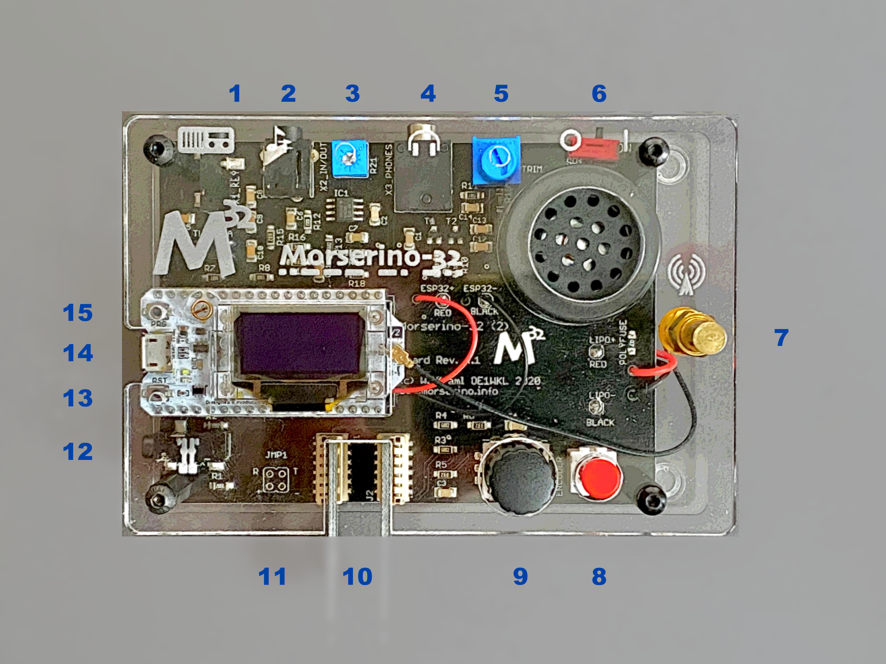

= Morserino-32: User Manual
W. Kraml (OE1WKL)
v4.0 January 2021
:organization: Morserino-32 User Manual
:doctype: book
// Settings:
:experimental:
:reproducible:
:icons: font
:listing-caption: Listing
//:sectnums:
:toc: macro
:toclevels: 4
ifeval::["{asciidoctor-version}" < "1.5.7"]
:legacy-footnoteref:
endif::[]
ifdef::backend-pdf[]
:pdf-theme: m32
:pdf-themesdir: {docdir}
:source-highlighter: rouge
//:rouge-style: github
:media: prepress
endif::[]

toc::[]

[preface]
== Preface

image::Morserino.jpg[Morserino-32]

[.lead]
"`*_Morserino-32 -- A multi-functional Morse Code Device, perfect for Learning and Training_*`"

This manual reflects the features of firmware Version 4.x of the Morserino-32. In its pictures it shows the hardware of the 2nd edition M32, but is equally useful for the older 1st edition. It has been created using **asciidoc** (instead of Markdown for the earlier versions), and the pdf version rendered through
**asciidoctor-pdf**, to create a manual that is better readable and more pleasing to the eye.

I'd like to thank everybody who through comments, criticism and suggestions has helped to make the Morserino-32 a successful and outstanding product.

== Connectors and Controls [[controls]]

[cols="^.1,.<3,.<10",options=header]
|===
|#
|Connector / Control
|Usage

|1
|3.5mm Phone Jack (3 poles): to TX
|Connect this to your transmitter or transceiver if you would like to key them with this device. Only the tip and sleeve are being used.

|2
|.5mm Phone Jack (4 poles): Audio In / Line Out
|**Audio input** for the CW decoder; connect the audio output of a receiver for decoding CW signals. **Audio output** (pretty close to a pure sine wave) that is not influenced by setting the loudspeaker volume. The assignments to the jack are as follows: Tip and 1st ring - audio in; 2nd ring: ground; sleeve: audio out.

|3
|Audio Input level
|Adjust audio input level with the help of this potentiometer;
there is a special function to help with level adjustment, see section <<app2>> at the end of the document.

|4
|3.5 mm Phone Jack (3 poles): Headphones
|Connect your headphones (any stereo headphones with standard phone jacks from mobile phones should work) here to listen through headphones and switch off the speaker. You cannot attach a loudspeaker directly to this jack without providing some interface (headphone out needs a DC connection to ground through 50 - 300 Ohms).

|5
|Phones Level Trimmer
|Used to adjust the headphone level for maximum comfort. 1st edition M32 does not have this.

|6
|Power Switch
|Connect / disconnect the LiPo battery from the device. For frequent use of the Morserino-32 you can leave the battery connected.
If you will not use the device for several days, disconnect the battery (through the Power Switch), as otherwise it will be slowly discharged.

|7
|SMA female Antenna Connector
|Connect an antenna suitable for the operating frequency (standard is around 433 MHz, but there also modules available for 860-925 MHz) for LoRa operation. Do not transmit LoRa without an antenna!

|8
|RED (Power/Vol/Scroll) Button
|When the device has gone into deep sleep, this wakes up and restarts your Morserino.
When the device is up and running (performing one of the modi), a short press of this button swaps the rotary encoder between adjusting the keyer speed and volume control.
A long press of the button allows you to scroll the display with the rotary encoder, pressing the button again changes the function back to speed control.
While in the menu, a long press starts the mode to adjust audio input level. See the section <<buttons>> below for further details.

|9
|BLACK Rotary Encoder
|Used to make your selection within menus, to adjust speed, volume, or scroll the display, and to set various parameters and options.
Can be rotated and is also a push-button switch. See the section <<buttons>> below for further details.

|10
|Connectors for touch paddles
|These PCB connectors accept the capacitive touch paddles.
If you are only using an external paddle (or for transport), you may remove the touch paddles.

|11
|Serial Interface
|You can connect a cable (directly or through a 4-pole pinhead connector) to an external serial device, e.g. a GPS receiver module (this is currently not supported by software, but not very difficult to do). The 4 poles are T (Transmit), R (Receive), + and - (3.3V power from the Heltec module).

|12
|3.5 mm Phone Jack (3 poles): External Paddle
|Use this to connect either an external (mechanical) paddle (tip is left paddle, ring is right paddle, sleeve is ground),
or a straight key (tip is the key).
With a straight key you can use the CW decoder to monitor the quality of you fist!

|13
|Reset Button
|Through a small hole you can reach the Reset button of the Heltec module (rarely needed).

|14
|USB
|Use a normal 5V USB Charger to power the device and charge its LiPo Battery. The microcontroller firmware can also be reprogrammed through USB (through the software development environment on a computer, or using a special update utility - see <<appendix4>>; another method is to update the Morserino-32 firmware  through a WiFi connection).

You can also output keyed or decoded characters on the USB serial device to use this information in a computer program - see the parameter "Serial Output" for further information.

|15
|PRG Button
|Through a small hole you can reach the Programming Button of the Heltec module (normally not needed).
|===

== Quick Guide to Using the M32

(This is for the impatient, but is not a replacement for reading the whole manual!)

==== Controls to be used:
* ON/OFF (battery) switch: sliding switch at the rear side, near the loudspeaker. Connects / disconnects battery.
* BLACK: The black knob (encoder), you can rotate it, and press it.
* RED: The red button switch.

=== How To Turn On the M32
Either connect a USB power supply, or, if you have a battery installed, turn the battery switch ON (I).

A start-up screen will appear momentarily, showing firmware version and battery status, and then you will be
	in the Main Menu (“Select Modus:“), unless you selected the quick start parameter, then the last modus you had chosen will be started automatically.

When the M32 is turned on, but there is no change in the display for a longer period of time, the M32 will go into sleep mode. You can wake it up by clicking RED.

=== How To Select a Modus (= one of the functions of the M32):
Rotate BLACK to find wanted function, click BLACK to select or to enter next lower menu level, long press of BLACK to exit  / go up one level.

=== How to Change Speed or Volume, and How To Scroll the Display
This is done with BLACK and RED when you are in one of the operation functions (these do not work while you are in the menu):

* Change speed: rotate BLACK.
* Change volume: click RED, rotate BLACK to adjust volume, click RED again to revert to speed setting.
* Scroll display: long press of RED, scroll back and forth with BLACK, exit with RED click.

=== How To Change Parameters (settings):
Double click BLACK, rotate BLACK to select the parameter you want to change. Long press of BLACK to exit parameter menu.

(When a function is active, only the relevant parameters for this function are shown, when called from a menu, all parameters are shown.)

There are numerous parameters, read the manual to find out what they are for.

You can also store and recall parameters in so called „snapshots“.

=== How To Charge the Battery
Connect USB power, switch battery switch to ON (I), orange LED will be lit very brightly, when orange LED is dark the  battery is fully charged. When orange LED is lit or flickers dimly, the battery is not connected / not switched on.

== Using the M32, Step by Step

=== Powering On and Off / Charging the Battery [[power]]

If you want to use the device with a USB power, just plug a USB cable in from virtually any USB charger (it consumes a max of 200 mA, so any 5V charger will do).

If you run it from battery power, slide the sliding switch to the ON position.

When the device is off but with the battery connected (sliding power switch is on), it is in deep sleep in reality: almost all functions of the microcontroller are turned off, and power consumption is minimal (less than 5% of normal operation).

To turn the device on from deep sleep, just press the RED (Power/Vol/Scroll) button momentarily.

When the Morserino-32 boots up, you will see a startup screen for a couple of seconds.
On the top line you will see an indication for which LoRa frequency the M32 is configured (as a 5-digit number), and
at the bottom of the display you will see an indication of how much battery power is still left.
If this goes way towards empty, you should connect your device to a USB power source.
(The battery will be drained even if you never turn the device on - although this is rather minimal in its deep sleep status,
a full battery will be empty after a couple of days.
Therefore, if you intend not to use the Morserino for a longer period of time, disconnect the battery from the device using the slider switch at the back...)

WARNING: If the battery voltage is dangerously low when you attempt to turn it on, an empty battery symbol will show on the screen and the device will refuse to boot up.
If you see this symbol, you should begin charging your battery as soon as possible.

TIP: After using any of the WiFi functions, battery measurement does not work correctly until the Morserino-32 is powered down and up again (or a reset with the Reset button has been performed). This is due to a hardware problem on the Heltec board. In such cases the Morserino-32 displays "Unknown" instead of the battery voltage, and the battery symbol is shown with an inscribed question mark. After a power cycle everything should work OK again.

TIP: If the display shows the empty battery symbol although sufficient power should still be available, it is advisable to perform a battery measurement calibration. See <<appendix1_2>>.

To disconnect the device from the battery (turning it off, unless you are USB powered), slide the sliding switch to the OFF position.

To put the device into deep sleep, you have two options:

* In the main menu, select the option "Go To Sleep"
* If in the parameter menu a "Time Out" value has been set, do nothing. If there is no display update, the device will power itself off and go into deep sleep after the time set there has passed.

**To charge the battery**, connect it with a USB cable to a reliable USB 5V power source, like your computer, or a USB charger like your phone charger.

WARNING: Make sure the hardware switch of the device is *ON* while charging - if you disconnect the battery through the switch,
the battery cannot be charged. When charging, the orange LED on the ESP32 module is lit brightly.
When the battery is disconnected, this LED will not be lit brightly, but rather be blinking nervously or half lit.

Once the battery has been fully charged, the orange LED will not be lit anymore.

You can of course always use the device when it is powered by USB, if the battery is charging or not.

[WARNING]
====
To prevent deep discharging of the LiPo battery, always turn the Morserino-32 off via the main slide switch. Do not leave it in 'sleep mode' for long periods of time (up  to a day or maybe two is ok, if it was well charged; a fully charged 600 mAh battery will be discharged to the level of about 3.2 V within 3 to 4 days during deep sleep).

The Heltec module has electronics on board for charging the battery, and it it prevents overcharging quite well. But it has no prevention of deep discharge! **Deep discharge leads to diminished battery capacity and eventually early death of the battery!**
====

=== Setting Up the LoRa Band and Frequency

The standard version of the Morserino-32 comes with a pre-configured frequency within the 433 MHz Amateur and ISM band (ISM only in ITU Region 1). **If this fits your requirements, you have nothing to do at this stage.**

If your regulations do not allow the use of this frequency, you can buy a version of the M32 that supports LoRa bands between 860 and 925 Mhz. **In this case you have to configure the correct band and frequency before you are going to use the LoRa functionality of the M32.**

[WARNING]
====
Please be aware that you need a special version of the Heltec module for the use of the 868 or 920 MHz band.
The "standard" version only supports the 433 MHz band, and the alternative version only supports the 868 and 920 MHz bands!

If you currently have a standard M32 and want to use the higher frequency bands, you can order a Heltec module (plus antenna) for these bands.
**After replacing the Heltec module you have to perform the LoRa setup for the required band before using LoRa!**
====

**See <<appendix1_1>> at the end of this document** to learn how you can configure LoRa for modules that support the 868 and 929 MHz bands, and how to change the LoRa frequency settings.

=== Using the BLACK Knob and RED Button [[buttons]]
Selections of the various modes, and setting all sorts of parameters is being done using the **rotary encoder** and its BLACK **button**.

*Rotating* the encoder leads you through the options or values, *clicking* the button once selects an option or a value,
or brings you to the next level of the menu (there are up to three levels in the menu).

A  ***double click*** of the BLACK knob brings you to the parameter setting menu. If you do this from the menu, all parameters can be changed.
If done from within a modus, only the parameters that are relevant for the current modus are being shown and can be changed.

A ***long press*** brings you back to the menu from any of the modi, and within the menu promotes you a level up.

While you are selecting a menu (e.g. immediately after power-on), a **long press** of the **RED button** starts a function
to adjust the audio input level (and possibly the output level on a device you connected to the Morserino-32's line-out port).
See <<app2>> towards the end of this document.

When you left the menu to execute one of the modi (keyer, generator, echo trainer etc.)
the **RED (Power/Vol/Scroll) Button** allows you to quickly toggle between **speed control** and **volume control** with a **single click**.

A **long click** of the RED button while a modus is active (i.e. when the menu is not shown) changes the display and encoder into **scroll mode** (the display has a buffer of 15 lines, and normally only the bottom three lines can be seen; in scroll mode you can scroll back to the previous lines; while you are in scroll mode, a **scroll bar** is shown at the far right side of the display, indicating roughly where you are within the 15 lines of text buffer). **Clicking** again in scroll mode changes the screen into its normal operating mode and brings the encoder back to speed control.

When you are in the parameter setting menu, a **short click** of the RED button **recalls** a parameter snapshot, and a **long press** of the RED button **stores** a parameter snapshot.
See the section <<snapshots>> for further details.

=== The Display

The display is divided into two main sections: on top is the status line, that gives important information according to the current state of the device, and below is an **area of three scrolling lines** where the generated Morse code characters are shown in clear text.  All characters from Morse code are shown in lower case, for better readability; Pro signs are shown as letters in brackets, like `<ka>` or `<sk>`. In addition, when in Echo Trainer modus (see below), the result of your attempt to enter the correct Morse code is shown as `ERR` or `OK` (together with some audible signals).

Although only three lines of scrolling text are shown, there is internally a buffer of 15 lines -- after a long press of  the RED (Vol/Scroll) button you can use the encoder to scroll back and make the previous lines visible again.
This works while you are in any of the modi and screen output is being generated - nothing is lost and the display reverts to its normal behaviour once you leave the scroll mode.

==== The Status Line

While you are presented a menu (either the start menu, or a menu to select preferences), the status line tells you what to do (**Select Modus** or **Set Preferences:**).

When in Keyer Modus, CW Generator Modus or Echo Trainer Modus, the status line shows the following, from left to right:

* **A**,**B** , **U**, **N** or **S**, indicating the automatic **keyer mode**: Iambic **A**, Iambic **B**,  **U**ltimatic, **N**on-Squeeze or **S**traight Key (for details on these modi see below in section <<keyer>>).

* The currently set **speed** in words per minute (the reference word is the word PARIS, which also means that 1 wpm equals 5 characters per minute).
In CW Keyer modus as **nn**WpM, in CW Generator or Echo Trainer modus as (nn)**nn**WpM. The value in brackets shows the effective speed, which differs when inter-word spacing or inter-character spacing are set to other values than those defined by the norm (length of 3 dits for inter-character spacing, and length of 7 dits for inter-word spacing). See the notes in section <<keyer>> regarding the parameters you can set in CW Generator modus.
+
When in a transceiver modus, you also see two values for speed -- the one in brackets is the speed of the signal received, the other one the speed of your keyer.

When using  straight key, the speed shows how fast your keying actually is.
+
When the digits indicating the speed are shown as **bold**, turning the rotary encoder will change the speed. When they are shown in normal characters, turning the rotary encoder changes the volume.
* A horizontal "progress" bar that extends from left to right indicates the **volume** of the side tone generated by the device (full length of the bar means top volume). This normally shows a white frame around the black progress bar (an extension of the rest of the status line); if this is reversed (white progress bar within black surroundings - and the WpM digits are not bold), turning the rotary encoder will change the volume and not the speed.
* On the very right hand end of the status line there will be an indicator (showing concentric half-circles) symbolizing radio transmission whenever the **LoRa** modus is active (if the Morserino-32 is in LoRa Transceiver mode, or you have set a parameter to transmit LoRa while in one of the CW generator modi).

== The Top Menu and the Morserino Modi

You select the Moodus of your Morserino-32 by rotating the black encoder knob, and quickly pressing ("clicking") that knob to select that function (or, in several cases, a sub-menu for a more detailed selection).

=== CW Keyer [[keyer]]

This is an automatic keyer that supports Iambic A, Iambic B (these are sometimes also called Curtis A and Curtis B), and Ultimatic mode,
as well as Non-squeeze mode (emulating a single lever key with a dual lever paddle).
You can either use the built-in capacitive paddle, or connect an external paddle (dual or single lever paddle).
Internal and external paddles work in parallel, so there is no need to configure this.

There are a number of **parameters** that determine how the automatic keyer works.
See the section <<Parameters>> for the details. In any case, you should be aware of the following:

`External Pol.` : If your external key is wired "the wrong way around", you can correct this here.

`Paddle Polarity`: On which side do you want the dits and on which the dahs?

`Keyer Mode`: Select Iambic A or B, Ultimatic mode,  Non-Squeeze mode or Straight Key mode.

What are theses **Iambic Modes**?
When you press both paddles of a iambic keyer, dahs and dits will be generated alternatively, while both paddles are being pressed,
starting with the one you have hit first (the name "Iambic", by the way, comes from the fact that in a iambic verse there are alternating
short and long syllables; the name "Curtis" on the other hand comes from The developer of the groundbreaking Curtis Morse keyer chip,
John G. “Jack” Curtis, K6KU, ex W3NSJ).

The difference between modes A and B is the behavior when both paddles are released when the current element is being generated:
in Mode A the keyer stops after the current element, in Mode B the keyer will add another element opposite to the one during which
you released the paddles.

In other words, in Curtis B mode the opposite paddle is checked while the current element (dit or dah) is being output,
and if a paddle is pressed during that time, another opposite element is added to the current one.
In mode A this is not the case. As mode B is a bit tricky to use, this was later changed, so that only after a certain percentage
of the duration of the element the paddles are being checked. This is the percentage you can set here with the parameters "**CurtisB DahT%**"
and "**CurtisB DitT%**".

If you set them to 0, the lowest value, the Mode is identical with the original Curtis B Mode;
the later developed "enhanced" Curtis B mode uses a percentage of roughly 35%-40%.
If you set the percentage to 100, the highest value, the behavior is the same as in Curtis A mode.

This parameter allows you to set any behavior between Curtis A and original Curtis B modes on a continuous scale,
and you can set the percentage for dits and dahs separately (this makes sense, as the timing for dits is just a third of that for dahs,
and so you might find that you want a higher percentage for dits to feel comfortable).

**Ultimatic Mode**: In Ultimatic Mode, when you keep both paddles pressed, a dit or a dah is generated,
depending on which paddle you hit first, and afterwards the opposite element is being generated continuously.
This is of advantage for characters like j, b, 1, 2, 6, 7.

**Non-Squeeze Mode**: This „simulates“ the behavior of a single lever paddle when using a dual lever paddle.
Operators used to single lever paddles tend to have difficulties using dual-lever paddles, as they sometimes inadvertently squeeze the paddles,
especially at higher speeds. The non-squeeze mode just ignores squeezing, making it easier for these operators to use a dual lever paddle.

TIP: Iambic modes and Ultimatic mode can only be used with the built-in touch paddle or an external dual-lever paddle; the selection of these modes is irrelevant when you use an external single-lever paddle.

The parameter `Latency`  defines, how long after generating the current element (dot or dash) the paddles will be „deaf“.
In early firmware versions this used to be 0, with the effect, that especially at higher speeds you would generate more dots than intended,
as you had to release the paddle while the last dot was still „on“. Now you can set this to a value between 0 and 7,
meaning 0/8 to 7/8 of a dot length (default is 4, i.e. half a dot length). If you still tend to generate unwanted dits, increase this value.

For the parameter `AutoChar Spce` (defining a minimum length for the space between characters) see the section <<parameters>> for details.

**Straight Key Mode**: This is not really an automatic keyer mode, but it enables the Morserino-32 to be used with a simple straight key. It will decode whatever you key with your straight key. You can also use the Echo Trainer and the Transceiver modes using a straight key!

=== CW Generator [[generator]]

This either generates randomized groups of characters and words for CW training purposes, or plays the contents of a text file in Morse code. You can set a number of options by choosing appropriate parameters (see the section <<parameters>> below).

You can **start** and **stop** the CW Generator **by quickly pressing a paddle** (either one side or both), or **by clicking the BLACK knob**.

When it starts, it will first alert you by generating "`vvv<ka>`" (`+..._    ..._    ..._      _._._+`) in Morse code, before it actually begins generating groups or words.

If you enable the parameter `Stop/Next/Rep', only one word or group of characters will be played, and then the Morserino stops and and waits for paddle input. A press of the left paddle will repeat the current word, while a press on the right paddle will generate the next word. This is useful for training your head copy proficiency: let it play a word (without looking at the screen), and try to decode it in your head, if you are not sure, press left for repeat; if you think you got it right, compare it with the display. Now you can either repeat it again (left press), or look away and press the right paddle for the next word. (You can remember the functions of left and right paddle by thinking of typical music player buttons - left is back, right is forward.) Please note that the options Word Doubler and Stop/Next/Repeat are incompatible with each other - if you set one to ON, the other will be set to OFF automatically.

Once you touch a paddle, it shows what it just had played, so you can check if you decoded it correctly.
When you touch a paddle again, it will play the next word. This is useful for learning to decode in your head.

Normally the Morserino-32 just continues to generate until you pause it manually,
but there is a parameter that can be set which makes the device pause after a certain number of words (or letter groups).
See `Max # of Words` in the section <<parameters>>.

**Other noteworthy parameters** for CW Generator are:

`Intercharacter Space` This describes how much space is inserted between characters. The "norm" is a space which has the length of three dits. To make it easier to copy code that is being sent at high speeds, and as a good method to learn Morse code, this space can be extended. The code should be sent at rather high speeds ( > 18 wpm) , to make it impossible to "count" dits and dahs, so that you rather learn the "rhythm" of each character. In general, it is better to rather increase the space between words, and not so much the space between characters; therefore it is recommended to set this value between 3 and max. 6. See below.

`Interword Space`. Normally this is defined as the length of 7 dits. When in CW Keyer modus, we determine a new word after a pause 6 dits long, to avoid text appearing on the display without spaces between words. In CW Trainer modus, you can set the interword space to values between 6 and 45 (which is more than 6 times the normal space) to make it easier to copy code in your head at high speeds. In analogy to Farnsworth spacing, this is also being called Wordsworth spacing. This is an even better way to learn copying high speed code word by word in your head. Of course you can combine both interword and intercharacter spacing methods.

As character spacing can be set independently, this would mean that you can set character spacing higher than interword spacing, which would be rather confusing. In order to avoid this confusion, interword space will always be at least 4 dit lengths longer than the character spacing, even if a smaller interword space has been set.

The ARRL and some Morse code training programs use something they call *"Farnsworth Spacing":* here the spaces between characters and between words are lengthened proportionately by a certain factor. You can emulate Farnsworth Spacing by incrementing both inter-character and inter-word space, e.g. setting inter-character space to 6 and inter-word space to 14, thus effectively doubling all spaces between characters and words. if you do this at a character speed of 20 WpM, the resulting effective speed will be 14 WpM. This will be shown on the status line as (14)**20**WpM.

`Random Groups`: Defines which characters should be contained in the random character groups. You can choose between Alpha / Numerals / Interpunct. / Pro Signs / Alpha + Num / Num+Interp. / Interp+ProSn / Alpha+Num+Int / Num+Int+ProS / All Chars.

`Length Rnd Gr`: Defines how many characters there should be in a random group. You can either select a fix length ( 1 to 6), or a randomly chosen length between 2 to 3 and 2 to 6 (length chosen randomly within these limits).

`Length Calls`: The length of call signs that will be generated. Choose a value between 3 and 6 or Unlimited.

`Length Abbrev` and `Length Words`: The length of common CW abbreviations or common English words, respectively, that will be generated. Choose between 2 and 6, or Unlimited.

`Each Word 2x`: Each "word" (characters between spaces) will be output twice, as a help to learn to copy by ear.

For the less frequently used parameters `Key ext TX` , `CW Gen Displ` and `Send via LoRa` see the section <<parameters>>.

==== What can be generated?

You can choose between the following at the second level of the menu:

* **Random**: Generates groups of random characters. The length of the groups as well as the choice of characters can be selected in the parameters, by double clicking the black rotary knob (see the description of parameters for details).
* **CW Abbrevs**: Random abbreviations that are very common in CW transmissions (through a parameter setting you can choose the maximum length of the abbreviations you want to train).
* **English Words**: Random words from a list of the 370 most common words in the English language (again you can set a maximum length through a parameter).
* **Call Signs**: Generates random strings that have the structure and appearance of amateur radio call signs (these are not real call signs, and there will be some generated that could not exist in the real world, as either the prefix is not in use or a country's administration would not hand out certain suffixes). The maximum length can be selected through a parameter.
* **Mixed**: Selects randomly from the previous possibilities (random character groups, abbreviations, English words and call signs).
* **File Player**: Plays the content of a file in Morse code, that has been uploaded to the Morserino-32.
Currently it can hold just one file, as soon as you upload a new one, the old one will be overwritten.
Upload works through WiFi from your PC (or Mac or tablet or smartphone or whatever - see the section <<upload>> for instructions how to do this).
+
The file player modus remembers where you stopped (by pressing the BLACK knob long in order to exit this mode; do not just switch off - if you do this, the Morserino
has no chance to remember where you were),
and will continue there the next time you restart the File Player.
Once the end of the file is reached, it will commence at the beginning again.
+
The file should contain ASCII characters only (upper or lower case does not matter) -
characters that cannot be represented in Morse code are just ignored.
Pro signs can be in the file, they need to be written as 2 character representations with either [] or <> around them, e.g. `<sk>` or `[ka]`, or prepend them with a backslash, e.g. \kn.
+
The following pro signs are recognized:
====
** `<ar>` : will be shown on display as + (plus sign)
** `<bt>` : will be shown on display as = (equal sign)
** `<as>`
** `<ka>`
** `<kn>`
** `<sk>`
** `<ve>`
====
There is also a parameter for file player called `Randomize File`. If set to „On“ (default is „Off“),
the device will skip n words after each word sent (n = random number between 0 and 255);
as file reads wrap around at end-of-file, you will see all the words in the file eventually (but it could take a while).
If your file is for example an alphabetical word list, words generated will still be in alphabetical order during one pass of the file;
so to get more unpredictable results, it will be best to start with a random list of words.

What can this be used for? You could for example take a list of call signs and upload this file to the Morserino-32
(Check the Morserino-32 GitHub repository to get a file with calls that actually have been active in HF contests!).
Now File Player lets you train these call signs in a random fashion.
You might want to visit the Morserino-32 GitHub repository in order to find other suitable files for training!

=== Echo Trainer

Here the Morserino-32 generates a word (or a group of characters; you have the same selection available as with the CW Generator), and then waits for you to repeat these characters using the paddle. If you wait too long, or if you response is not identical to what has been generated, an error is indicated (on display and acoustically), and the prompt word is being repeated. If you keyed the correct characters, this is also indicated acoustically and on screen, and you are prompted for the next word.

In this modus, the prompt word will not normally be shown on the display -- only your response is shown.

The sub-menus are the same as for the CW Generator: **Random, CW Abbrevs, English Words, Call Signs, Mixed** and **File Player**.

Like in CW Generator modus, you **start the generation by pressing a paddle**, and then the sequence "`vvv<ka>`" will be generated as an alert before the echo training starts. You cannot stop or interrupt this modus by pressing the paddle -- after all, you use the paddle to generate your responses! So **the only way to stop this modus is a click of the BLACK encoder button**.

Again, like with the CW Generator, you can set a huge range of parameters to fine tune the generation of things. Of particular interest for the Echo Trainer are:

`Echo repeats`: how often a word is repeated when the response is either too late or erroneous, before a new word is being generated

`Echo Prompt`: This defines how you are prompted in Echo Trainer mode. The possible settings are: „Sound only“ (default; best for learning to copy in your head), „Display only“ (the word you are supposed to enter is shown on the screen, no audible code is generated; good for training paddle input), and „Sound & Display“, i.e you hear the prompt AND you can see it on the display.

`Confrm. Tone`: Normally an audible confirmation tone is sounded in Echo Trainer modus. If you turn it off, the device just repeats the prompt when the response was wrong, or sends a new prompt. The visual indication of "OK" or "ERR" will still be visible when the tone is turned off.

`Max # of Words`: As with CW generator, you can make the M32 stop after a specified number of words.

`Adaptv. Speed`:  This should help you to train for maximum speed. Whenever your response was correct, the speed will be increased by 1 wpm (word per minute); whenever you make a mistake, it will decrease by 1 wpm. Thus you will eventually always train at your limit, which certainly is the best way to push your limits...

=== Koch Trainer

The German psychologist Koch developed a method for learning Morse code (in the 1930s), by which each lesson adds an additional character.
The order is neither alphabetical, nor sorted by the length of the Morse codes, but follows a certain rhythmical pattern,
so that the individual characters are learned as rhythm, and not as a succession of dits and dahs.

Should you want to use the Koch method for learning Morse code (learning and training one character after the other),
**you will find everything you need in the Menu item "Koch Trainer"**.
It has a submenu to enter the lesson you want to add, one to practice just this one new letter
(using the echo trainer modus, so you are encouraged to repeat what you hear), and the modi "CW Generator" and "Echo Trainer",
each of the last two with the submenus for "Random" (groups of random characters out of the so far encountered characters),
"CW Abbrevs" (the abbreviations usually used in CW QSOs), "English words" (the most common English words) and "Mixed"
(random groups, abbreviations and words mixed randomly).
Of course, only the already learned characters will be used - which means, that while you are still struggling with your first characters,
the number of abbreviations and words will be quite limited).

In order to prevent counting dits and dahs, or thinking of and reconstructing what you heard, the speed should be sufficiently high (min. 18 wpm),
pauses between characters and words should not be lengthened enormously (and it is always better to just lengthen the pauses between words,
and keep the inter-character spaces to more or less the normal space).
With our device you can set interword space independently from intercharacter space, so you can find a setting that perfectly fits your needs.

==== Koch: Select Lesson [[koch]]

Select a "Koch lesson" between 1 and 50 (you will learn 50 characters in total through the Koch method). The number of the lesson and the character associated with that lesson will be displayed in the menu.

The order of the characters learned has not been strictly defined by Koch, and therefore different learning courses use slightly different orders. Here we use the same order of characters as defined by the program "Just Lean Morse Code", which again is almost identical to  the order used by the "SuperMorse" software package (see http://www.qsl.net/kb5wck/super.html). The order is as follows:

[cols=">.3,3,>.3,3",options=header,width=88%,stripes=odd]
|===
| Lesson # | Character | Lesson # | Character
| 1 | m | 26 | 9
| 2 | k | 27 | z
| 3 | r | 28 | h
| 4 | s | 29 | 3
| 5 | u | 30 | 8
| 6 | a | 31 | b
| 7 | p | 32 | ?
| 8 | t | 33 | 4
| 9 | l | 34 | 2
| 10 | o | 35 | 7
| 11 | w | 36 | c
| 12 | i | 37 | 1
| 13 | . (dot) | 38 | d
| 14 | n | 39 | 6
| 15 | j | 40 | x
| 16 | e | 41 | - (minus)
| 17 | f | 42 | =
| 18 | 0 (zero) | 43 | SK (Pro Sign)
| 19 | y | 44 | AR (Pro Sign, also +)
| 20 | v | 45 | AS  (Pro Sign)
| 21 | , (comma) | 46 | KN  (Pro Sign)
| 22 | g | 47 | KA (Pro Sign)
| 23 | 5 | 48 | VE (Pro Sign)
| 24 | / | 49 | @
| 25 | q | 50 | : (Colon)
|===

There is also an option to use a slightly different order of characters, as is used by the popular on-line training tool "Learn CW On-line" (LCWO). This can be set in the parameters menu of the Morserino-32, under "Koch Sequence".

The sequence of characters when "LCWO" is chosen is as follows:

k m u r e s n a p t l w i . j z = f o y , v g 5 / q 9 2 h 3 8 b ? 4 7 c 1 d 6 0 x - SK AR(+) KA AS KN VE @ :

===== Koch: Train with a customized set of characters

You can also use the Koch Trainer to train your specific character set:  You upload a text file for the file player that contains the characters you want to train (as one „word“ or several, in one line or more), and then set the parameter 'Koch Sequence' to the new option „Custom Chars“. This reads the characters from the file. Now you can use the Koch Trainer (CW Generator or Echo Trainer), and it will use exactly those characters for your training (the setting of the Koch lesson has no influence at this point). If you want to change the character set, upload a new text file, and re-select the option „Custom Chars“ (even if it had been selected before), to prepare the new character set (if you just upload a new text file, the custom character set will not change - you have to go into parameters and re-select „Custom Chars“ again; this is a feature, not a bug: it means you can switch between training your characters, and using a (different) text file for file player …). Setting „Koch Sequence“ to M32 or LCWO will revert to the „normal“ Koch trainer option.

==== Koch: Learn New Chr

Selecting this the new character (according to the Koch lesson selected) will be introduced - you will hear the sound, and see the sequence of dots and dashes quickly on the screen, as well as the character displayed on the screen. This will be repeated until you stop by pressing the BLACK knob. After each occurence you have the opportunity to repeat with the paddles what you have heard, and the device will let you know if this was correct or not.

Once you have mastered the new character, you can progress to either CW generator or Echo Trainer within the Koch Trainer, in order to practice the newly learned character in conjunction with all the characters you have learned so far.

==== Koch: CW Generator and Echo Trainer

The functionality is the same as described above for these two functions, with the following small differences:

- Only the characters up to the selected Koch lesson will be generated (or the characters defined through your specific character set, see above)
- The parameter "Random Groups" will be ignored.
- There is no sub-menu "File Player".

=== Transceiver

There are three transceiver modi in the Morserino-32. The first one is a self contained transceiver for communication with Morse code, using LoRa spread spectrum radio technology (in the standard version on the 433 MHz band, but versions  for 868 and 920 MHz bands are available).  The next one uses the Internet Protocol (specifically UDP on port 7373) for communicating across an IP network (using WiFi). The third one is a transceiver mode that can be used either with an external transceiver (e.g. a shortwave amateur radio transceiver) or with a protocol like iCW (CW over Internet). In all three cases the CW Keyer and a CW Decoder are active at the same time.

==== LoRa Trx

As stated above, this is a Morse code transceiver, using LoRa for transmitting Morse code to other Morserino-32s.
In addition to the functionality of the CW keyer, this sends out whatever you key through the LoRa transceiver
(using a special data format that encodes the dots and dashes you keyed, regardless if these are legal Morse code characters or not),
and it listens on the band when you are not keying; therefore you can really have an interactive conversation in Morse code
between two or more Morserino-32 devices!
Please be aware that characters are being transmitted word by word,
therefore there is a little delay on the receiving end - QSK is therefore not possible. It encourages you to use proper hand-over procedures!

===== More information about the Modus "LoRa Trx"
Basically, this uses the same interface as the CW Keyer. But as soon as you receive something, the status line also shows the speed of the sending station in addition to your own speed - you see something like **18r20sWpM**, which indicates you are receiving a station with a speed of 18 Wpm, and you are sending at 20 WpM.
In addition, the volume bar on the right of the status line changes its function: instead of indicating the current volume level, it gives you an indication of the signal strength - a crude form of an S-Meter, if you like.
the full bar indicates an RSSI level of roughly -20dB, and the bar begins to show at a level of roughly -150dB.

Pressing the RED Pwr/Vol/Scroll Button still enables you to set the audio level.

Morse characters received by the transceiver
are shown in bold in the (scrollable) text area on the display, while everything you are sending is shown in regular characters.

Another feature is worth mentioning here: The frequency of the tone you are hearing when you are receiving the other station is adjusted through the "Pitch" parameter, as in the other modi.
When you are transmitting the pitch of the tone can be the same, or a half tone higher or lower then the receiving tone -
this is being set through the `Tone Shift` parameter, in the same way as in Echo Trainer modus.

One other thing you might want to know: the LoRa CW Transceiver does not work like a CW transceiver on shortwave, where an unmodulated carrier is being keyed, and the delay between sender and receiver is just defined by the delay in the path of the electromagnetic waves carrying the signals. LoRa uses a spread spectrum technology to send data packets - in a way a bit similar to WiFi that you use on your phone or PC.
Therefore all you are keying in is being encoded into data first - essentially the speed and all the dots, dashes and pauses between characters.
As soon as the pause is long enough to be recognized as a pause between words (as a blank space, as it were),
the whole data packet assembled so far is being transmitted and in due course being played back at the indicated speed by the receiving Morserino-32.

When morse code is packed into a LoRa data packet, dots, dashes and pauses are encoded; it is not so that the clear text would be sent as ASCII characters. Therefore it is possible to send "illegal" morse code characters, or characters that might only be used in certain languages. They will be transmitted correctly (but shown on the display as non-decodable).

Sending the code word by word means there is a significant delay between sender and receiver, and the delay depends to a large degree on the length of the words being sent, and on the speed that is being used. As most words in a typical CW conversation are rather short (7 characters or more already constitutes a very long word), this is nothing to worry about (unless you are sitting both in the same room using no headphones - then it will be really confusing). But try sending really long words, say 10 or more character long, at really low speed (5 WpM), and you will see what I am talking about!

===== Using two different LoRa "Channels"
LoRa data packets are addressed with a so called "Sync Word" - receivers discard packets that do not show the sync word they are expecting.

Morserino-32 as of Version 2.0 can make use of two different sync words, thus effectively creating two different "channels"
over which it can communicate. This can be used, for example, in a class room situation,
to create two independent groups that do not interfere with each other.

Normally M32 LoRa works with sync word 0x27 (we call it the "Standard" channel), but through the setting `LoRa Channel` in the parameters menu
can be switched to 0x66 (called "Secondary" channel).

===== Using different LoRa frequency bands and/or frequencies
By default the Morserino-32 kits are being shipped with a LoRa module that works in the 70 cm band,
and as standard frequency within that band on 434.150 MHz (within 70cm Amateur band and within region 1 ISM band).

If for whatever reason you cannot use this frequency (maybe because of band plans, regulatory reasons etc.), you can change the frequency on the standard LoRa Module between 433.65 and 434.55 MHz in steps of 100 kHz.

Should you require a LoRa frequency either around 868 MHz or around 920 MHz, the kit can be shipped with Heltec modules that support this higher frequency range (it is also possible to buy such a Heltec module later on). In that case, you MUST configure your Morserino to use the correct band and frequency.

**See <<appendix1_1>> at the end of this document** to learn how you can configure LoRa for modules that support the 868 and 929 MHz bands, and how to change the LoRa frequency settings.

===== Technical Details of LoRa Trx
* Frequency: Default is 434.150 MHz (within 70cm Amateur band and within region 1 ISM band) - but see the notes above for choosing other frequencies
* LoRa Spreading Factor: 7
* LoRa Bandwidth: 250 kHz
* LoRa CRC: no CRC
* LoRa Sync Word: 0x27 (= decimal 39) for standard channel, and 0x66 (= decimal 102) for secondary channel
* HF Output: 20 dBm (100 mW)

==== Wifi Trx [[wifitrx]]

You can use this transceiver mode to communicate with your CW buddy using the Internet protocol, either on your local area network, or across the Internet. As it uses WiFi, you need to make sure you can connected to WiFi - so you must have performed the function "WiFi Config" before. On your local network it is very easy to use this transceiver mode: just select it from the menu, and you will be able to communicate (without configuring a peer address it will send to the IP address 255.255.255.255, which is a broadcast address and can be received by all devices on this network). The Morserino-32 uses UDP port 7373 for asynchronous communication.

When you start Wifi Trx, the IP address of your peer (or "IP Broadcast") will be shown for a moment on the display.

If you want to communciate with a specific Morserino-32 over the Internet, you need to configure the IP address of your buddy - this is done through the menu item 'Config WiFi', which shows now a third field beyond SSID and Password. In this field you need to enter the IP address of your peer (or its DNS host name), and then the Wifi Transceiver will send the packets to that specific IP address.

If that IP address is not on your local network, and if you are behind some form of firewall or a router that treats your network as a private network, the Morserino will be able to send out to the Internet (unless specific firewall rules are blocking most UDP ports), but the packets coming from your buddy will be blocked at the router. In this case you need to configure "Port Forwarding", telling the router to send all UDP packets on port 7373 to your Morserino. At the same time, you need to tell your buddy your OUTSIDE IP address (i.e. the IP address of your router interface to your Internet provider), and your buddy has to do the same (configure port forwarding, and telling you his Internet-facing IP address, which you will enter into your Morserino). Sounds a bit complicated at first, but isn't really that bad.

Another option, perhaps a bit more complicated, would be to set up a VPN (Virtual Private Network), so that both your Morserinos are on the same "virtual network" and hence can talk to each other without any firewall rules blocking the traffic. How to do this goes clearly beyond the scope of this manual -- ask an Internet guru for further details!

==== iCW/Ext Trx

In this modus a transceiver connected to the Morserino-32 is being keyed, or you can use the line-out audio to either key
for example an FM transceiver, or use CW over the Internet (iCW - this uses Mumble as an audio exchange protocol).
Any CW signals coming in as audio through the audio-in port are being decoded and displayed on the screen.
An external transceiver connected through the connector #1 will be keyed by the keyer, or you can use the audio output
on connector # 2 to feed it into a computer, or into an FM transceiver.

=== CW Decoder

In this modus, Morse code characters are being decoded and shown on the screen. The Morse code can either be entered via a Morse key ("straight key" - connected to the jack where you would normally connect an external paddle; you can also use one of the touch paddles to manually key the decoder). Using the decoder in this way, you can control and improve your keying with a straight key, by checking, if the decoder decodes correctly what you tried to send.

You can also decode a tone input (at the audio input port) taken for example from a receiver. The tone should be at around 700 Hz. Optionally there is a pretty sharp filter (implemented in software) that detects just tones in a very narrow range around 700 Hz, and disregards all others. This is being used by selecting the Parameter "Narrow" (see the section <<parameters>>).

The status line is slightly different from the other modi. First of all, the rotary encoder is always in the volume setting mode - speed is determined from the decoded Morse code and cannot be set manually. Pressing the encoder button  will end the decoder modus and bring you back to the Start Menu.

On the left of the status display at the top, you will see a black rectangle whenever the key is pressed (or a 700 Hz tone is detected) - this replaces the indicator for the keyer mode.

The current speed as detected by the decoder is displayed as WpM on the status line.

This modus does not have many parameters (see the section <<parameters>>); maybe the most important is the ability to switch the filter bandwidth of the audio decoder between narrow (ca 150 Hz) and wide (ca 600 Hz). For decoding signals from a transceiver (where there might be other signals in the vicinity), it is usually best to set the bandwidth to "Narrow" and tune the signal to precisely 700 Hz. For decoding signals from an FM transceiver, or from iCW or other environments with little interference, it is better to use the "Wide" setting - in that case the audio frequency does not need to be exactly 700 Hz.

=== WiFi Functions

You can use the WiFi feature of the Heltec ESP32 Wifi LoRa Module used in the Morserino-32 for two functions of the device:

* Uploading a text file to the Morserino-32 that can then be played in CW Generator Modus oder Echo Trainer modus.
* Uploading the binary file of a new firmware version.

For both of these functionalities the file to be uploaded (be it a text file or the compiled binary file for the software update)  must be on your computer (even a tablet or smartphone will work, as you only need basic web-browser functionality on that device), and your Morserino must be connected to the same WiFi network as your computer.

In order to connect your Morserino-32 to your local WiFi network, you usually need to know the SSID (the "name") of the network, and the password to connect to it. And you must enter these two items into your Morserino-32. As it does not have a keyboard for convenient entry of this information, we use another way of doing it, and for this end another WiFi function has been implemented: network configuration, which is the first you have to use before you can use the upload or update functions.

For home networks that use a list of allowed MAC addresses (for security reasons), you have to configure your router and enter the M32's MAC address before you can connect your M32 to the network. In order to be able to do so, there is also a function implemented to show the MAC address on the display.

All network related functions can be found under the menu entry "**WiFi Functions**"

IMPORTANT: In software version before 2.0 the WiFi functions were not integrated into the main menu. In case you want to update from version 1.x to version 2.x through WiFi, please read section <<appendix3>> at the end of the document.

==== Displaying the MAC Address
This is the first entry under the menu "Wifi Functions", and it displays the Morserino's MAC address in the status line. Each Morserino has a unique MAC address.

You can use this information to allow the Morserino access to your WiFi network, if your router is configured to recognize only certain MAC addresses.

If you press the RED button, the Morserino-32 will restart normally. if you do nothing, the Morserino will go into deep sleep, depending on the settings you defined for that, as usual.

==== Network Configuration

Select the sub-menu "WiFi Config" to proceed with network configuration.

The device will start WiFi as an *access point*, thus creating its own WiFi Network (with the SSID "morserino"). If you check the available networks with your computer or smartphone, you will find it easily; please select this network on your computer (or tablet, or smartphone -- you will not need a password to connect).

Once you are connected, enter "http://m32.local" into your browser on your computer. If your computer or smartphone does not support mDNS (Android, for example, is not supporting it, and Windows only rudimentary), you have to enter the IP address **192.168.4.1** into the browser instead of m32.local. You will then see a little form with just 3 times 3 empty fields in your browser: "SSID of WiFi network?", "WiFi Password?" and "WiFi TRX Peer IP?".

You only need to fill in one set of fields, but you can use two or three sets if you want to store **different network configurations** for different usage scenarios (e.g.,connection to different WiFi networks). There is a separate entry in the WiFi menu to select which configuration you want to use.

Enter the name of your local WiFi network, and the corresponding password (you can leave the third field empty for now), and click on the "Submit" button. Your Morserino-32 will store these network credentials and then restart itself (so the network "morserino" will disappear).

The third field ("WiFi TRX Peer IP/Host?") is used, when you want to use the Wifi Transceiver functionality, i.e. to talk to another Morserino user over the Internet. In such a case you have to enter the IP address or the DNS host name, if it has any, of the other Morserino into this field. See section <<wifitrx>> above. If you communicate with other Morserinos in your local network, you don't need an IP address there (it will use the broadcast address by default, so all Morserinos can receive what one of them sends).

IMPORTANT: Your Morserino cannot make use of a WiFi network with a "captive portal", as they are often used on public networks.  These networks require that a browser is available on the device that wants to connect to the network, and the Morserino-32 does not have a browser...

IMPORTANT: Your Morserino-32 only supports WiFi networks in the 2.4 GHz band, not in the 5 GHz band. It also sometimes seems to have problems with Apple Airport routers.

TIP: If you have configured your WiFi before, and perform this step again, the previously entered SSID name will be pre-filled in the form, and you only need to change it if necessary. The password field will be empty, but if you do not enter a new one, the old password will still be stored. The TRX Peer IP address field will also be pre-filled with a value if you have entered one before. If you now delete the values in this field, this IP address will be deleted.

TIP: You can configure three different network settings; but the network configurations will also be stored in Snapshots, this means you can also use snapshots to recall many more different network settings.

==== Checking your network connectivity
Use the sub-menu entry "Check WiFi" under "WiFi Functions" to test network connectivity.

This either shows an error message ("No WiFi" and the SSID you had entered), or a success message ("Connected!"), the SSID and the IP address the Morserino got from your WiFi router.

TIP: You might have to move your Morserino pretty close to your WiFi router (within the same room is usually OK)! The WiFi antenna of the Heltec module is very small and will not pick up weak WiFi signals.

TIP: When you get an error message although you had entered the correct credentials and the Morserino is in direct vicinity of your WiFi router, you should try again - sometimes the first try is not successful, for whatever reasons...

If you press the RED button, this functions returns to the menu. If you do nothing, the Morserino will go into deep sleep, depending on the settings you defined for that, as usual.

==== Uploading a Text File [[upload]]

Once you configured your Morserino-32 with your local WiFi credentials, you are ready to upload a text file to use for your Morse code training. Currently only one file can reside on the Morserino-32, This means, whenever you upload a new file, the old one will be overwritten.

The **file** that you upload should be a plain ASCII text file without any formatting (no Word files, pdf documents etc.). German characters (ÄÖÜäöüß) encoded as UTF-8 are allowed and will be converted to ae, oe, ue and ss. The file can contain uppercase and lowercase letters, and all the characters that are part of the Koch method set (50 characters in total). Any other characters will just be disregarded when the file is played in Morse code. The file that you upload can be pretty large - you have almost 1 MB space available for it (enough to store a copy of Mark Twain's "The Adventures of Huckleberry Finn").

In order to upload the file, select "File Upload" from the "WiFi Functions" menu. After a few seconds (it needs to connect to your Wifi network first) Morserino-32 will indicate that it is waiting for upload. You point the browser of your computer to "http://m32.local" (or, if that does not work, replace "m32.local" with the IP address shown on the display).

TIP: For the upload function your Morserino-32 (and of course your PC or tablet etc.) must be on your local WiFi network again!

First you will see a **Login** screen on your browser. Use "**m32**" as User ID and "**upload**" as password. On the next screen in your browser you will find a file selection dialog - select the file you want to upload (its name or extension doesn't matter) and click the button labelled "Begin". Once the upload is completed (it will not take long) the Morserino-32 will restart itself, and you can now use the uploaded file in *CW Generator* or *Echo Trainer* modus.

IMPORTANT: If for any reason you need to abort the process, you have to restart the device either by completely disconnecting it from power (battery off and USB disconnect), or pressing the Reset button with the help of a tiny screwdriver or a ball point pen (the reset button can be reached through the hole next to the USB connector, towards the external paddle connector).

==== Updating the Morserino-32 Firmware

Updating the firmware of the Morserino-32 through WiFi is one way of doing it;  you can also do this by using the Arduino IDE on your computer (you also need to install a bunch of specific files and libraries for support of the Heltec module and the ESP32 processor, and then compile the binary from the source code), or by using a special update utility (see <<appendix4>>).

TIP: You can update to any version, you can "jump" versions, you can also go back to an older version.

Updating the firmware is very similar to uploading a text file. You first need to get the binary file from the Morserino-32 repository on GitHub (https://github.com/oe1wkl/Morserino-32 - look for a directory under "Software" called "Binaries". Get the latest version and download it to your computer. The file name looks like this:

`morse_3_vx.y.ino.wifi_lora_32.bin` with x.y being the version number.

Now get the WiFi Functions menu again and select the item "**Update Firmw**". Similar to file upload, you point the browser of your computer to "http://m32.local" (or, if that does not work, the IP address shown on the display, http://n1.n2.n3.n4 - replace n1.n2.n3.n4 with that IP address), and you will eventually see a Login screen. This time you use the user name "**m32**" and the password "**update**".

Again you will see a file selection screen next, you select your binary file and click the button labelled "Begin". This time the upload will take longer - it can take a few minutes, so be patient. The file is big, needs to be uploaded and written to the Morserino-32 and needs to be verified to make sure it is an executable file. Finally, the device will restart itself and you should notice the new version number on the display during start-up.

[TIP]
====
To sum it up, these are the steps for updating the firmware through WiFi:

1. Do the network configuration as described above (for this the Morserino sets up its own WiFi network, and you use your browser to enter the name and password of your home WiFi network). You do this only once, as the Morserino will remember these credentials for future use. You might want to use the "Check WiFi" function to make sure your Morserino can connect to your network. Remember that your Morserino has to be pretty close to your WiFi router!

2. You download the new binary to your computer.

3. You start „Update firmware“ on your Morserino. After a while it will show you and IP address (which is on your home network!)  and a message, that it is waiting for an update.

4. You leave your computer on your home network, and point your browser either to the IP address shown on the Morserino (http://ww.xx.yy.zz), or to „http://m32.local“ (this works on Macs and iPhones, usually, it does not work on Windows PCs or Android devices).

5. You will get a login screen on your browser. Enter „m32" as username and „update“ as password.

6. You will see a file selection dialogue. You select the binary file in your download folder, and then click „Begin“. You will see a progress bar, and after some time (can take a few minutes - even when the progress bar already shows 100%) the Morserino will restart itself, and show the new version number on the startup screen. Then you know the update was successful.
====

==== WiFi Select
Here you can select which of your stored network configurations should be used, when more than one network has been configured.

=== Go To Sleep

This menu item, when selected, puts the Morserino-32 into a deep sleep mode, where it will consume considerable less power than when operating normally. But it will still drain the battery within a few days, so this is only meant for shorter breaks between your training sessions. See the section <<power>> further up in this manual.

== Parameters [[parameters]]

You always reach the parameters menu by **double clicking** the **BLACK rotary encoder button**. This provides you with a menu of settings (you will see a  `**>**` character in front the of the current parameter, and the line underneath shows the current value). Use the encoder to lead you through the available parameters. If you want to leave the parameter setting menu, just press the encoder button a bit longer, and you will be back in the operational modus from which you called the parameter setting menu (or back in the menu, if you entered a double click from the menu).

When you have reached the parameter you want to change, click once. Now the "**>**"  character will be at the bottom line in front of the parameter value, indicating that rotating the encoder will change this value. Once you are satisfied with the value, **click once** to return to the selection of parameters, or **press the button a bit longer** to leave the parameter menu.

Obviously the parameters that can be set vary depending on the modus you are in: When you double click while in a particular modus, you will only get to those parameters that are relevant for the current modus. Did you double click from the Start Menu, you will be presented the complete range of parameters.

=== Snapshots [[snapshots]]
For different types of training you usually need different settings of the parameters - you might want to change the inter-character- or inter-word spaces, or the length of character groups or words, etc. S going from one type of training to the next would require you to change various settings every time.

In order to make this easier, you can use "snapshots" of the settings: once you have changed everything for your first mode of training, you store all current parameters in one of eight snapshots; then you do the same with your other training modes. You can then quickly recall the settings by recalling a particular snapshot.

TIP: The "Koch Lesson" that you selected will be stored in non-volatile storage and hence will be available after a restart, but it will not be stored or overwritten in one of the snapshots.

==== Storing a snapshot

First, double click to get into the parameter menu. Now a long press of the RED button gives you an opportunity to select with the encoder at which location you want to store the current settings, from "Snapshot 1" to "Snapshot 8"; a further option reads "Cancel Store" and allows you to get out without storing a snapshot. Snapshot locations that are already in use are shown in **bold**, but you can overwrite those as well. Clicking on the black knob stores the snapshot in the desired location, and gives you a quick indication about its success.

==== Recalling a snapshot

Again, you double click the black knob first to get into the parameters menu. Now a **short** click on the RED button lets you select with the encoder which of the stored snapshots you want to recall, and you recall it by clicking the black encoder button; if there are no snapshots stored, you get a message "NO SNAPSHOTS" and you can leave by clicking any of the buttons.

==== Deleting a snapshot

You can also delete a snapshot that is no longer needed, or that was created in error. Proceed as if you wanted to recall a snapshot, select the one you want to delete, and then click the RED button for deleting it. Like with storing and recalling snapshots, a short message will indicate that the action was successful.

=== General Parameters
A number of parameters are very generic in nature, and therefore apply to all modi of the Morserino-32.

These are:

`Encoder Click`: If you do not want to hear a click whenever you turn the encoder, set this to off.

`Tone Pitch`: The frequency of the side tone for the Morse code.

`Time Out`:  If this is set to a value other than "No timeout" , the M32 will go into deep sleep mode after a specified time without any activity on the screen.  You can restart teh M32 by pressing the RED button.

`Quick Start`: If this is set to ON, the M32 will immediately execute the Modus that was last active whenever it is switched on or restarted from deep sleep.

=== List of All Morserino-32 Parameters
Bold values are standard or recommended ones. When called from the start menu, all parameters are available for modification, when called from a running modus, only those that are relevant for this modus are available.

[cols="2,6,3",options=header]
|===
|Parameter Name
|Description
|Values

| Encoder Click | Turning the encoder may generate a short tone burst, or be silent   | Off / On
| Tone Pitch Hz   | The frequency of the side tone, in Hz | A series of tones between 233 and 932 Hz, corresponding to the musical notes of the B flat major scale from b flat to b'' flat (2 octaves)
| External Pol.        | Allows to reverse the polarity of an external paddle. Use this if your external paddle is wired "the wrong way", so that dots and dashes of internal and external paddle are all on the same side. | Normal / Reversed
| Paddle Polarity | Defines which paddle side is for dits, and which for dahs | ` _. dah-dit` / **`._ di-dah`**
| Latency | Defines how long after generating the current element (dot or dash) the paddles will be „deaf“. If it is 0, you have to release the paddle while the last element is still „on“. If set to 7, the paddles will only react to a paddle press after 7/8 of a dot length. | A value between 0 and 7, meaning 0/8 to 7/8 of a dot length (default is **4**, i.e. half a dot length).
| Keyer Mode     | Sets the Iambic Mode (A or B),  Ultimatic, Non-Squeeze or Straight Key; see the section <<keyer>>  | Curtis A / Curtis B / Ultimatic / Non-Squeeze / Straight Key
| CurtisB DahT% | Timing in Curtis B mode for dahs; see below     | 0 -- 100, in steps of 5 [**35 - 55**]
| CurtisB DitT% | Timing in Curtis B mode for dits; see below     | 0 -- 100, in steps of 5 [**55 - 100**]
| AutoChar Spce   | Minimum spacing between characters  | Off / min. 2 / **3** / 4 dots
| Tone Shift | The pitch of the tone, when you are transmitting in LoRa CW Trx modus or using the Echo Trainer modus, can either be the same as the one you get from the receiver (or from the prompt in Echi Trainer modus), or can be a half tone lower or a half tone higher. |**No Tone Shift** / Up 1/2 Tone / Down 1/2 Tone
| Interword Spc | The time (in lengths of a dit) that is inserted between words (see section <<generator>> )    | 6 -- 45 [**7**]
| Interchar Spc | The time (in lengths of a dit) that is inserted between characters (see section <<generator>> ) | 3 -- 15 [**3**]
| Random Groups | For the output of groups of random characters, determine which character subsets should be included | Alpha / Numerals / Interpunct. / Pro Signs / Alpha + Num / Num+Interp. / Interp+ProSn / Alpha+Num+Int / Num+Int+ProS / All Chars
| Length Rnd Gr | Here you select how many characters there should be in each group of random characters; traditionally this is 5, but for training it might make sense to start with a smaller number. | Fixed lengths 1 -- 6, and 2 to 3 -- 2 to 6 (length chosen randomly within these limits) [**5**]
| Length Calls | Select the maximum length of generated call signs | Unlimited / max. 3 -- max. 6
| Length Abbrev | Select the maximum length of the randomly generated common CW abbreviations and Q groups | Unlimited / max. 2 -- max. 6
| Length Words | Select the maximum length of the randomly generated common English words | Unlimited / max. 2 -- max. 6
| Max # of Words | When the specified number of words or letter groups has been generated, the Morserino-32 will generate a final AR ("+") pro sign to indicate that this sequence is over, and then pause  and wait - with a touch of a paddle (or clicking the black knob) it will continue and generate the next sequence of  words. (When "Auto Stop" is active, this parameter will be ignored in CW Generator modus.) | **Unlimited** / 5 to 250 in steps of 5
| CW Gen Displ | Select, how the CW Generator, or the LoRa or CW Transceiver should display what is generated or received | Display off / **Char by Char** / Word by word
| Each Word 2x | In the CW Trainer modus, each "word" (characters between spaces) will be output twice, as a help to learn to copy by ear. This option and the option 'Stop/Next/Rep' are not compatible with each other, setting one to ON, will set the other to OFF automatically.| **Off** / On
| Randomize File | If set to „On“, file player will skip n words after each word sent (n = random number between 0 and 255) |  **Off** / On
|Echo Repeats    |Here you can set how often a word is repeated if the answer is either too late or incorrect before the Echo Trainer generates a new word. If the value is 0, then the next word is always a new one, regardless of whether the response was right or wrong.     | 0 -- 6 / Forever
|Echo Prompt    | This defines how you are prompted in Echo Trainer mode. The possible settings are: „Sound only“ (default; the standard behavior in previous versions; best for learning to copy in your head), „Display only“ (the word you are supposed to enter is shown on the screen, no audible code is generated; good for training paddle input), and „Sound & Display“, i.e you hear the prompt AND you can see it on the display.               | **Sound only** / Display only / Sound&Displ
| Confrm. Tone  | This defines if an audible confirmation tone should be sounded in Echo Trainer modus. If you turn it off, the device just repeats the prompt when the response was wrong, or sends a new prompt. The visual indication of "OK" or "ERR" will still be visible when the tone is turned off. | **On** / Off
|Key ext TX        | Here you determine, if a connected Transmitter will be keyed when you use the device | Never / **CW Keyer only** / Keyer&Genertr
| Generator Tx (used to be called "Send via LoRa") | This allows the CW Generator to send, what it generates, eiher via LoRa or via WiFi - so you can have one device generating something, and several others receiving the same sequence. This can be used in all CW Generator and Koch / CW Generator modes, including File Player. Could be useful for groups of learners, as you can transmit e.g. contents of a file to a group of people. Obviously this should only be used with caution (and not for extended period of time) on public M32 chat servers, but can be very handy for a group on the same network segment, using broadcast as TrX peer, or a privately set up chat server, or via LoRa when all participants are close enough together.
Be aware that you must have an antenna connected when you transmit via LoRa, otherwise the LoRa transceiver will eventually be destroyed! | **„Tx OFF“** (= do not transmit generated CW), „LoRa Tx ON“ (transmit generated code through LoRa) and „WiFi Tx ON“ (transmit generated code through WiFi).
| LoRa Channel | Selects which virtual channel LoRa is using. | **Standard Ch** / Secondary Ch
| Bandwidth | Defines the bandwidth the CW decoder is using (this is implemented in software using a so called Goertzel filter).  (Wide = ca. 600 Hz, Narrow = ca. 150 Hz; center frequency = ca 700 Hz) | **Wide** / Narrow
| Adaptv. Speed | If this is set to ON, the speed will be increased by 1 WpM whenever you gave a correct response in Echo Trainer modus, and will be decreased by 1 whenever you made a mistake. | ON / **OFF**
| Koch Sequence | This determines the sequence of characters when you use the Koch method for learning and training. You can also use your customized character set by choosing Custom Chars - see the section  <<koch>>, the last paragraph. | **M32 / JLMC** (Just Learn Morse Code)  /  LCWO / Custom Chars
| Time Out | If the time specified in this parameter passes without any display updates, the device will go into deep sleep mode. You can restart it by pressing the RED button. | No timeout / **5 min** / 10 min / 15 min
| Quick Start | Allows you to bypass the initial menu selection, i.e.  at startup the device will immediately begin executing the modus that had been in effect before last shutdown. | ON / **OFF**
| Stop/Next/Rep | Stops the generating of morse characters after each word in CW Generator and Koch Generator modes to help with learning head copying. Continue by touching the right paddle to play the next word, or by touching the left paddle to repeat the word. This option and the option 'Each Word 2x' are not compatible with each other, setting one to ON, will set the other to OFF automatically. | ON / **OFF**
| Serial Output | Here you control, if generated characters from the Keyer and/or decoded characters from the Decoder should be output on the USB connector. With the setting "ERRORS only" only certain debugging messages will be output (these only when no other option has been selected).

The option "Everything" displays both keyed and decoded characters, and also all output generated in CW Generator or Echo Trainer.  See also <<appendix5>>.| **Keyer** / Decoder / Keyer+Decoder / Everything / ERRORS only
|===

== Appendices

=== Appendix 1:  Hardware Configuration (LoRa Bands & Frequencies and Calibration of Battery Measurement)

There is a hardware configuration menu that  can be reached by pressing a paddle (or external paddle or straight key) while switching the M32 on. You can then select the configuration you want to perform by rotating the encoder knob, and pressing it once the right option shows up.

The selectable options are "Calibr. Batt." (calibration of battery measurement), "LoRa Config." and "Cancel" (which just leaves this menu and continues with regular start-up of the M32).

==== Appendix 1.1: Configuring LoRa Bands and Frequencies [[appendix1_1]]

If you have a standard 433 MHz Heltec module in your Morserino-32, it has been already preconfigured for the right band and a default frequency within that band.

IMPORTANT: If you have to change either the frequency within the standard band, or you use  a Heltec module for the 868 and 920 MHz bands, you have to configure your Morserino-32 before you use the LoRa capabilities.

The following bands and frequency ranges can be configured in the Morserino-32 for Heltec modules supporting the upper UHF LoRa modules:

* 868 MHz band:
		866.25 to 869.45 MHz in steps of 100 kHz (default: 869.15 MHz)
* 920 MHz band:
		920.25 to 923.15 MHz in steps of 100 kHz (default: 920.55 MHz)

The default Heltec modules supports the 433 MHz band only, and the Morserino-32 can be configured to use 433.65 to 434.55 MHz in steps of 100 kHz (default: 434.15 MHz).

**In order to configure the Morserino-32 for non-standard frequencies and bands, please proceed as follows:**

* Start your Morserino-32 keeping the BLACK encoder knob pressed.
* When you see a message, release the black knob.
* Select the Option "LoRa Config." with the rotary encoder.
* First you will be asked to select the desired band (select 433 for the default LoRa module, and either 868 or 920 for the upper UHF LoRa module); rotate the encoder to the desired band, and click the black knob once. **The band selection has to fit the Heltec module you are using!**
* Now your are being asked to select a frequency within your selected band. The first frequency shown is the default for that band - if that is OK, just click the black knob once, otherwise select a frequency by rotating the encoder and clicking the knob once you have found the correct frequency.
* Immediately after that the Morserino-32 will start normally, with the now selected LoRa settings in effect. On the top line of the Startup Screen you will see the configured QRG for LoRa as a 5-digit number (e.g. 43415 for the default in the 433 MHz band).

==== Appendix 1.2: Calibration of Battery Measurement [[appendix1_2]]

The built-in capability of Heltec modules to measure battery voltage unfortunately is not very reliable. Various factors apparently contribute to the problem: a measurement error within the ESP32 processor due to a slight variation of the reference voltage for each chip (leading to a relatively small error), and problems with the voltage divider circuit on the Heltec module (leading to pretty big variations among the modules). Although measuring the battery is not very crucial for the operation of the Morserino-32, it is nevertheless a nuisance, and can also lead to the situation that the M32 cannot be switched on, as the firmware thinks that the voltage is too low, when in reality it would still be sufficient.

In order to calibrate the voltage measurement, you have to measure the actual battery voltage of your Morserino-32 with the help of a multimeter. Once you know this value, you perform the following steps:

* Start your M32 while holding the touch paddles (or external paddles, or straigth key) pressed.
* Select the Option "Calibr. Batt." with the rotary encoder.
* You will see a voltage value (in Millivolts) on the display. Now rotate the encoder until the displayed value is as close as possible to the measured battery voltage.
* Press the BLACK encoder knob to store the calibration value, and to continue with the boot-up of the M32.

=== Appendix 2: Adjusting Audio Input Level [[app2]]

You can also reach one **other function** while you are positioned within the Start Menu - not through a menu selection, but through **a long press on the RED button**:

This starts a function to adjust the audio input level: make sure a tone signal is available on the input, for example from your shortwave receiver (see <<controls>> at the beginning of this document, #2), and a bar graph will indicate the voltage of the input signal. Adjust it with the blue trimmer potentiometer, so that the left and right ends of the solid bar are within the two outer rectangles. At the same time, a sinus signal is output on line-out, and the transceiver output is shortened (keying a transmitter, should you have it connected to one - disconnect your transceiver first if this is not what you want!). You can now, for example, adjust the level of the output signal on a connected computer, or check whether a transmitter is being keyed.

A simple test or demo for the audio-in adjustment is to connect line-out with audio in (connect tip with sleeve), feeding the output sine wave into the audio input. You can see the solid bar graph changing when you turn the potentiometer, leaving just a tiny solid bar in the middle and exposing the two rectangles on both ends of the graph at one end of the potentiomenter range (essentially you are just measuring the noise on the operation amplifiers input), and with the solid bar graph extending beyond the rectangles on both ends on the other end of the potentiometer sweep. Now you can set the potentiometer so that the solid bar is almost touching the outer bounds of the rectangles. This is the optimal setting for the audio in level. Obviously you have to perform this for the audio source you are planning to use, e.g. for your radio receiver.

TIP: Only while you are in the menu will the RED button **long press** activate the level adjustment function. While you are executing one of the Morserino modes (Keyer, Generator, Echo Trainer, Transceiver etc.) a long press of the RED button activates the scroll mode of the display to enable you to read text that has already scrolled away...

=== Appendix 3: Updating the Firmware from Versions < 2.0 [[appendix3]]

With firmware versions 1.x the WiFi functions were not accesible directly from the main menu, but by quickly pressing the RED button three times. Hence the update procedure has to be performed as follows:

If not already done before, you have to do the WiFi configuration first.

While your Morserino-32 is displaying the Start menu, click the RED button three times quickly, in order to get into the WiFi Menu. The top entry is "WiFi Config", select it to proceed.

The device will start WiFi as an access point, thus creating its own WiFi Network (with the SSID "Morserino"). If you check the available networks with your computer or smartphone, you will find it easily; please switch your computer to use this network (you will not need a password to connect).

Once you are connected, enter "m32.local" into your browser on your computer. If your computer or smartphone does not support mDNS (Android, for example, is not supporting it), you have to enter the IP address 192.168.4.1 into the browser instead of m32.local. You will then see a little form with just 2 empty fields in your browser: SSID and password. Enter the name of your local WiFi network, and the correspondig password, and click on the "Submit" button. Your Morserino-32 will store these network credentials and then restart itself (so the network "Morserino" will disappear).

Now get the WiFi menu again by clicking quickly three times on the RED button, and select the enry "**Update Firmw.**". Similar to file upload, you point your browser to "m32.local" (or the shown IP address), and you will eventually see a Login screen. This time you use the user name "**m32**" and the password "**update**".

Again you will see a file selection screen next, you select your binary file and click the button labelled "Begin". This time the uplaod will take longer - it can take a few minutes, so be patient. The file is big, needs to be uploaded and written to the Morserino-32 and needs to be verified to make sure it is an executable file. Finally, the device will restart itself and you should notice the new version number on the display during start-up.

Of course you can also update through USB when you are still on an older software version (see next appendix).

=== Appendix 4: Updating the Firmware via USB [[appendix4]]
This simple update procedure, currently available for the Windows operating system, has become possible through work by Matthias Jordan and Joe Wittmer.

First make sure you have a driver for the Silicon Labs CP210x USB to serial device, used by the Heltec Modul for its USB interface. Current versions of Windows 10 install this automatically; if yours doesn't, you can get the driver from here:
    https://www.silabs.com/products/development-tools/software/usb-to-uart-bridge-vcp-drivers

To check if you have the correct driver installed, and to see to which port it connects, open the Device Manager on your computer (in the search field in the lower left of the screen start typing "settings: device" and it will come up for selection).

Connect your Morserino with a USB cable to your computer. The device manager should update its screen and show an entry "Ports" - open it and it should indicate something like: Silicon Labs CP210x ... (COM3). Could be another COM port in your case, so please remember your correct port name.

TIP: Make sure you have a cable that is a "proper" USB cable, not just a cable for a charger!

Now download the update utility from Joe's GitHub repository:
https://github.com/joewittmer/Morserino-32-Firmware-Updater/tree/master/release

Unzip that file. You will find a program "update_m32.exe" - copy that to a folder of your choice (I usually prefer the folder Downloads). Now get the binary Morserino file for the version you want to install from the Morserino GitHub, ideally into the same directory.

Now open a command box on your computer (in the search field in the lower left of the screen start typing "cmd" and it will come up for selection). First "cd" (change directory) to the directory where the utility and the binary file are located; e.g., if you used the Downloads directory:

`cd Downloads`

Then enter the following command line:

`update_m32 <COMx> 921600 <binaryfilename>`

replacing <COMx> with your COM port name, and <binaryfilename> with the correct name of the Morserino binary file.
In my case that was:

`update_m32 COM3 921600 morse_3_v3.0.ino.wifi_lora_32_V2.bin`

After a short while your Morserino should restart, showing the updated version number.

=== Appendix 5: Using the Serial Output of the Morserino-32 [[appendix5]]

The Morserino-32 is able to output data on the serial USB interface. You can use this to display the characters that are shown on the display in a terminal window of a computer, for example. In this way you can show the Morserino output on a big screen or a projector; this might be useful for exhibitions or for classroom use.

You have to select a Baud rate of 115200 for the terminal.

You can also use this in conjunction with computer software that has been written especially for the Morserino-32, to enhance its training capabilities. Currently there are two software products available for this purpose:

* CW Trainer for Morserino by Enzo, IW7DMH (see https://iw7dmh.jimdofree.com/other-projects/cw-trainer-for-morserino-32/), and

* Morserino Phrases Trainer by Tommy, OZ1THC (see https://github.com/Tommy-de-oz1thc/Morserino-32-Phrases-trainer).

See also the description of the Parameter "Serial Output" in section <<parameters>>.
