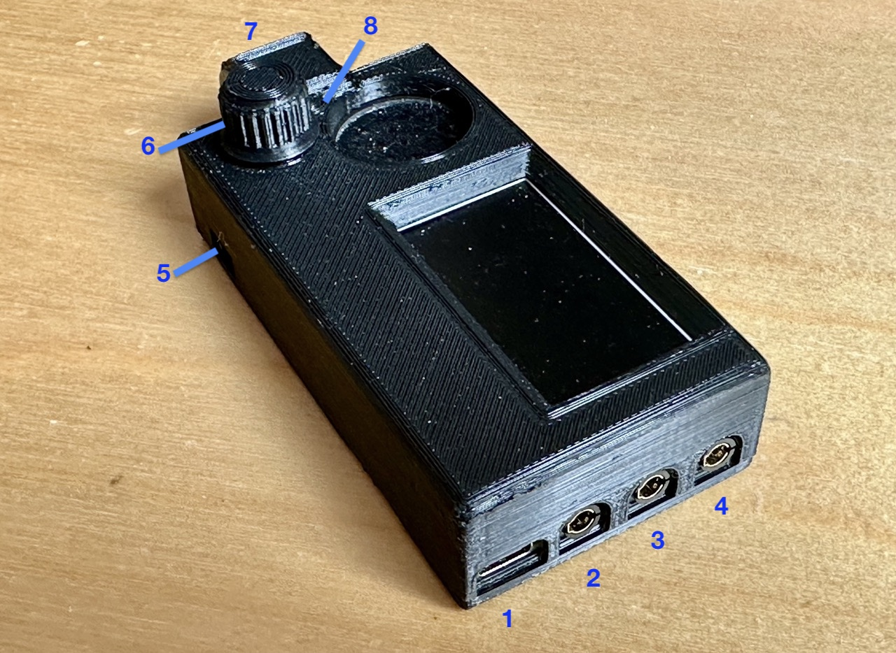
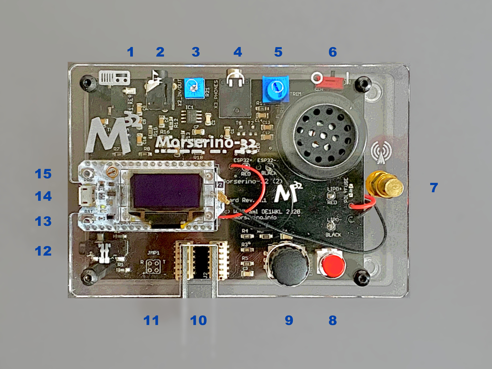
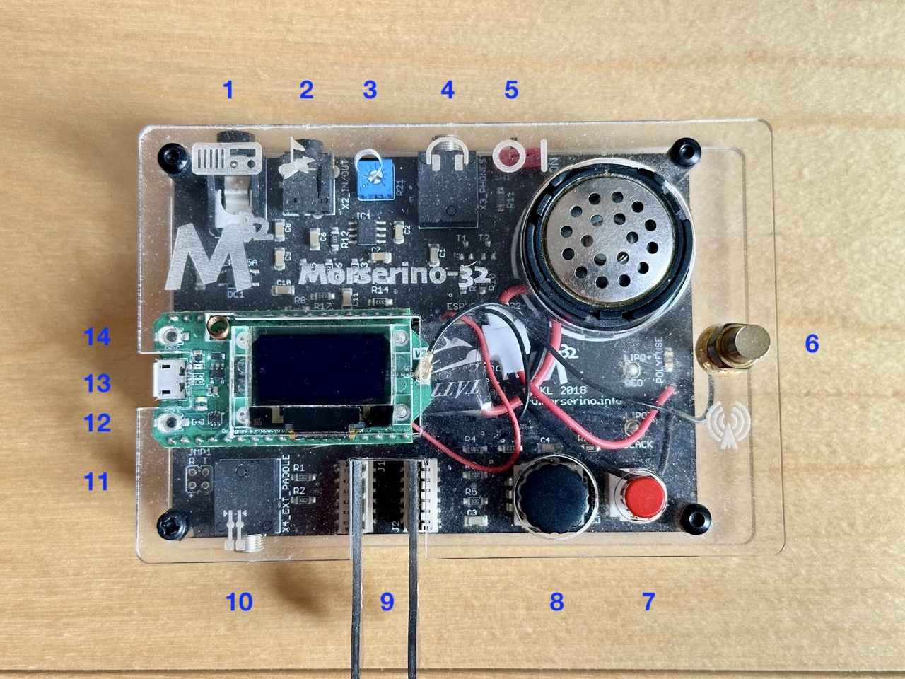
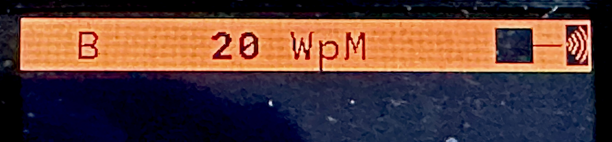

# Preface


::: quote
*"Morserino-32 – A multi-functional Morse Code Device, ideal for
learning and training, and having fun."*
:::


This manual reflects the features of firmware Version 8.x of the
Morserino-32. This firmware version is available for the new Morserino
Pocket **(M32Pocket)**, as well as for the earlier 1st and 2nd editions
of the Morserino-32. The functionality provided by this version is
basically the same for all three Morserino editions, with the
exception that the M32Pocket does not have LoRa transceiver capabilities
in its standard configuration, but offers new features such as a colour display, games, and a battery status icon.

I would like to thank all those who contributed–through code,
comments, suggestions, criticism, reviews, blog entries, Youtube videos
and other means–to making the Morserino-32 a successful and
outstanding product. Among the many contributors, one deserves special mention: Hari, OE6HKE — without him the M32 Pocket wouldn't exist!

What is new in Version 8?

-   In Echo Trainer Mode, you can set a speed limit for keying your
    input.
-   Generation of random call signs has been improved. You can now also
    set a filter to only get calls from a certain continent, or also
    filter out very rare prefixes.
-   File Player can do multi-part files now (a poor man's way of
    supporting several files ;-) If an uploaded text file is recognized
    as multipart, you will be asked which part you want to use when you
    start file player.
-	For the M32 Pocket only: Battery level and charging status is now shown through an icon on the top line of the display, while you are within a menu.

- Also for the M32 Pocket only: We have begun to implement games, to bring even more fun to learning and training Morse code! The first game is "Morse Invaders": the player has to prevent the invading letters from planet Morse (or was it Mars?) from reaching the ground.

# Connectors and Controls

## M32Pocket



| # | Connector / Control | Usage |
|:---:|---|---|
| 1 | USB-C | Use a normal 5V USB Charger to power the device and charge its LiPo Battery. The microcontroller firmware can also be reprogrammed through USB; another method to update the Morserino-32 firmware is through a WiFi connection. You can also output keyed or decoded characters on the USB serial device to use this information in a computer program – see the preference **Serial Output** for further information. |
| 2 | 3.5 mm Phone Jack (3 poles): External Paddle | Use this to connect either an external (mechanical) paddle (tip is left paddle, ring is right paddle, sleeve is ground), or a straight key (tip is the key). |
| 3 | 3.5mm Phone Jack (3 poles): to TX | Connect this to your transmitter or transceiver if you would like to key them with this device. Only the tip and sleeve are being used. |
| 4 | 3.5mm Phone Jack (4 poles): Headphones / Audio In / Line Out | Connect your headphones (with 3-pol or 4-pole plug) here. Audio input for the CW decoder; connect the audio output of a receiver for decoding CW signals. Audio output (for external amplifiers or PC etc.). The assignments to the jack are as follows: Tip and 1st ring – audio or headphones out; 2nd ring: ground; sleeve: audio in. See also section **6.2.1 General Preferences** for available settings regarding this connector! |
| 5 | Power Switch | Connect / disconnect the LiPo battery from the device. For frequent use of the Morserino-32 you can leave the battery connected. The ON position is towards the touch paddles, and marked with a small notch on the case. If you will not use the device for several days, disconnect the battery (through the Power Switch), as otherwise it will be slowly discharged. <br> For charging, the battery needs to be connected, i.e. the switch must be in the ON position! |
| 6 | ENCODER – Encoder and its Pushbutton switch | Can be rotated and is also a push-button switch. Used to make your selection within menus, to adjust speed, volume, or scroll the display, and to set various preferences and options. |
| 7 | Touch paddles | These are capacitive touch paddles. Please note that for left-handed use, the display can be flipped 180°! |
| 8 | FN Button switch (integrated into the case) | When the device has gone into deep sleep, this wakes up and restarts your Morserino. When the device is up and running (performing one of the operation modes), a short press of the FN button toggles the rotary encoder between adjusting the keyer speed and volume control. A long press of the FN button allows you to scroll the display with the rotary encoder, pressing the button again changes the function back to speed control.  See the section **4.2 Using the ENCODER Knob and FN Button** for further details.  <br> A double click of this button reduces display brightness in several steps. |


## Morserino-32 2nd edition



| # | Connector / Control | Usage |
|:---:|---|---|
| 1 | 3.5mm Phone Jack (3 poles): to TX | Connect this to your transmitter or transceiver if you would like to key them with this device. Only the tip and sleeve are being used. |
| 2 | 3.5mm Phone Jack (4 poles): Audio In / Line Out | Audio input for the CW decoder; connect the audio output of a receiver for decoding CW signals. Audio output (pretty close to a pure sine wave) that is not influenced by setting the loudspeaker volume. The assignments to the jack are as follows: Tip and 1st ring – audio in; 2nd ring: ground; sleeve: audio out. |
| 3 | Audio Input Level Trimmer | Adjust audio input level with the help of this potentiometer; there is a special function to help with level adjustment, see section **Appendix 3 Adjusting Audio Level**.|
| 4 | 3.5 mm Phone Jack (3 poles): Headphones | Connect your headphones here (any stereo headphones with standard phone jacks from mobile phones should work) to listen through headphones and switch off the speaker. You cannot attach a loudspeaker directly to this jack without providing some interface (headphone out needs a DC connection to ground through 50 – 300 Ohms). |
| 5 | Phones Level Trimmer | Used to adjust the headphone level for maximum comfort. 1st edition M32 does not have this. |
| 6 | Power Switch | Connect / disconnect the LiPo battery from the device. For frequent use of the Morserino-32 you can leave the battery connected. The ON position is towards the side of the antenna connector.  If you will not use the device for several days, disconnect the battery (through the Power Switch), as otherwise it will be slowly discharged. <br> For charging, the battery needs to be connected, i.e. the switch must be in the ON position! |
| 7 | SMA female Antenna Connector | Connect an antenna suitable for the operating frequency (standard is around 433 MHz) for LoRa operation. Do not transmit LoRa without an antenna or a dummy load! |
| 8 | FN Button (RED button) | When the device has gone into deep sleep, this wakes up and restarts your Morserino. When the device is up and running (performing one of the operation modes), a short press of the FN button toggles the rotary encoder between adjusting the keyer speed and volume control. A long press of the FN button allows you to scroll the display with the rotary encoder, pressing the button again changes the function back to speed control.  While in the menu, a long press starts the mode to adjust audio input level. See the section **4.2 Using the ENCODER Knob and FN Button** for further details.<br> A double click of this button reduces display brightness in several steps. |
| 9 | ENCODER – Encoder and its Pushbutton Switch | Can be rotated and is also a push-button switch. Used to make your selection within menus, to adjust speed, volume, or scroll the display, and to set various preferences and options. |
| 10 | Connectors for Touch Paddles | These PCB connectors accept the capacitive touch paddles. If you are only using an external paddle (or for transport), you may remove the touch paddles. |
| 11 | Serial Interface | You can connect a cable (directly or through a 4-pole pinhead connector) to an external serial device, e.g. a GPS receiver module (**this is currently not supported by the firmware**). The 4 poles are T (Transmit), R (Receive), + and - (3.3V power from the Heltec module). |
| 12 | 3.5 mm Phone Jack (3 poles): External Paddle | Use this to connect either an external (mechanical) paddle (tip is left paddle, ring is right paddle, sleeve is ground), or a straight key (tip is the key). |
| 13 | Reset Button | Through a small hole you can reach the Reset button of the Heltec module (not needed for normal operation). |
| 14 | USB – Micro USB Connector | Use a normal 5V USB Charger to power the device and charge its LiPo Battery. The microcontroller firmware can also be reprogrammed through USB. You can also output keyed or decoded characters on the USB serial device to use this information in a computer program – see the preference **Serial Output** for further information. |
| 15 | PRG Button | Through a small hole you can reach the Programming Button of the Heltec module (not needed for normal operation). |


## Morserino-32 1st edition



| # | Connector / Control | Usage |
|:---:|---|---|
| 1 | 3.5mm Phone Jack (3 poles): to TX | Connect this to your transmitter or transceiver if you would like to key them with this device. Only the tip and sleeve are being used. |
| 2 | 3.5mm Phone Jack (4 poles): Audio In / Line Out | Audio input for the CW decoder; connect the audio output of a receiver for decoding CW signals. Audio output (pretty close to a pure sine wave) that is not influenced by setting the loudspeaker volume. The assignments to the jack are as follows: Tip and 1st ring – audio in; 2nd ring: ground; sleeve: audio out. |
| 3 | Audio Input Level Trimmer | Adjust audio input level with the help of this potentiometer; there is a special function to help with level adjustment, see section **Appendix 3 Adjusting Audio Level**. |
| 4 | 3.5 mm Phone Jack (3 poles): Headphones | Connect your headphones here (any stereo headphones with standard phone jacks from mobile phones should work) to listen through headphones and switch off the speaker. You cannot attach a loudspeaker directly to this jack without providing some interface (headphone out needs a DC connection to ground through 50 – 300 Ohms). |
| 5 | Power Switch | Connect / disconnect the LiPo battery from the device. For frequent use of the Morserino-32 you can leave the battery connected. The ON position is towards the side of the antenna connector.<br> If you will not use the device for several days, disconnect the battery (through the Power Switch), as otherwise it will be slowly discharged. <br>For charging, the battery needs to be connected, i.e. the switch must be in the ON position! |
| 6 | SMA female Antenna Connector | Connect an antenna suitable for the operating frequency (standard is around 433 MHz) for LoRa operation. Do not transmit LoRa without an antenna or a dummy load! |
| 7 | FN Button (RED button) | When the device has gone into deep sleep, this wakes up and restarts your Morserino. When the device is up and running (performing one of the operation modes), a short press of the FN button toggles the rotary encoder between adjusting the keyer speed and volume control. A long press of the FN button allows you to scroll the display with the rotary encoder, pressing the button again changes the function back to speed control.<br> While in the menu, a long press starts the mode to adjust audio input level. See the section **4.2 Using the ENCODER Knob and FN Button** for further details.<br> A double click of this button reduces display brightness in several steps. |
| 8 | ENCODER – Encoder and its Pushbutton Switch | Can be rotated and is also a push-button switch. Used to make your selection within menus, to adjust speed, volume, or scroll the display, and to set various preferences and options. |
| 9 | Connectors for Touch Paddles | These PCB connectors accept the capacitive touch paddles. If you are only using an external paddle (or for transport), you may remove the touch paddles. |
| 10 | 3.5 mm Phone Jack (3 poles): External Paddle | Use this to connect either an external (mechanical) paddle (tip is left paddle, ring is right paddle, sleeve is ground), or a straight key (tip is the key). |
| 11 | Serial Interface | You can connect a cable (directly or through a 4-pole pinhead connector) to an external serial device, e.g. a GPS receiver module (**this is not supported by current firmware**). The 4 poles are T (Transmit), R (Receive), + and - (3.3V power from the Heltec module). |
| 12 | Reset Button | Through a small hole you can reach the Reset button of the Heltec module (not needed for normal operation). |
| 13 | USB – Micro USB Connector | Use a normal 5V USB Charger to power the device and charge its LiPo Battery. The microcontroller firmware can also be reprogrammed through USB . You can also output keyed or decoded characters on the USB serial device to use this information in a computer program – see the preference **Serial Output** for further information. |
| 14 | PRG Button | Through a small hole you can reach the Programming Button of the Heltec module (not needed for normal operation). |


# Quick Guide to Using the M32

::: important
**This is for the impatient, but is not a replacement for reading the
whole manual!**
:::

**Controls** to be used:

• ON/OFF (Battery): Sliding switch located on the back near the
loudspeaker. Connects/disconnects battery.

• ENCODER: The black knob that you can rotate and press.

• FN: The other push-button switch (red on the first and second edition
Morserinos; integrated into the case on the M32Pocket).

**How To Turn On** the M32

Either connect a USB power supply, or, if you have a battery installed,
turn the battery switch to ON (I).

A start-up screen will briefly appear, showing the firmware version and
battery status. Then you will be in the Main Menu ("Select Mode:"),
unless you selected the quick start preference; in that case the last
operational mode you had chosen will start automatically.

If there is no change in the display for a long time after turning on
the M32, it will go into sleep mode. You can wake it up by pressing the
FN button.

**How To Select a Mode** (Menu):

Rotate the ENCODER to find the desired mode. Click the ENCODER to select
it or to enter the next lower menu level. Press and hold the ENCODER to
exit or go up one level.

**How to Change Speed or Volume, and Scroll** the Display

This is done with FN and the ENCODER when you are in one of the
operational modes. These do not work while you are in the menu.

-   Change speed: rotate ENCODER.
-   Change volume: click FN, then rotate ENCODER to adjust volume, click
    FN again to revert to speed setting.
-   Scroll display: Press and hold FN. Scroll back and forth with the
    ENCODER. Exit by clicking FN.

The speed setting is written to permanent memory after 12 characters are
keyed at the same speed. The volume setting is written as soon as you
toggle back from the volume setting mode to the speed setting mode with
the FN button.

**How To Change the Brightness** of the Display

There are five levels of brightness. Each double-click of the FN button
reduces the brightness slightly. When the lowest level is reached, a
double-click resets the display to full brightness.

**How To Change Preferences** (Settings):

Double-click the ENCODER, then rotate the ENCODER to select the
preference you want to change. Press and hold the ENCODER to exit the
preference menu.

When a mode is active, only the relevant preferences for that mode are
shown. When called from a menu, all preferences are shown.

There are numerous preferences, see section **6
Preferences** to find out what they are for.

You can also store and recall preferences in so called "snapshots", see
section **6.1 Snapshots**.

**How to Use External Paddles and Keys**

You can connect external paddles (dual lever or single lever), or a
straight key (normal, or sideswiper) to your M32, by using the 3.5 mm
connector for external keys.

To use a straight key, you can use the CW decoder mode without changing
any preferences. This mode decodes Morse either through the audio I/O
connector or from your key. To use the Echo Trainer or Transceiver modes
with a straight key, change the **Keyer Mode** preference to **Straight
Key**.

Note that the **CW Keyer** mode works differently with a straight key:
it behaves the same way as in Decoder mode; with a straight key,
you are the keyer, not the Morserino!

You can use the built-in capacitive touch paddles like a sideswiper /
cootie key when the Keyer Mode is Straight Key (but not an external paddle, unless it is wired as a sideswiper)!

**How To Charge the Battery**

Connect USB power, switch battery switch to ON (I).

With the M32 1st or 2nd edition, an orange LED will light up very
brightly. When the orange LED is dark, the battery is fully charged.
When the orange LED is lit or flickering dimly, the battery is not
connected or switched on.

The M32Pocket will display the battery status as an icon whenever you are in a menu.

# Using the M32, Step by Step

## Powering On and Off / Charging the Battery

If you want to use the device with USB power, just plug a USB cable in
from virtually any USB charger (it consumes a max of 200 mA, or 500 mA for the M32Pocket, when charging the battery), so any 5V charger will do).

If you run it from battery power, slide the sliding switch to the ON
position.

Make sure you install the battery with the correct polarity before
turning the switch to the ON position. Reversing the polarity could
destroy your Morserino! For the M32Pocket, it is advisable to use a
14500 LiIon cell (3.7 V) with protection against deep discharge.

When the device is off but with the battery connected (sliding power
switch is on), it is in deep sleep – in reality: almost all functions
of the microcontroller are turned off, and power consumption is minimal
(less than 5% of normal operation with M32 1st or 2nd edition, around 1%
with M32Pocket).

**To turn the device on from deep sleep**, press the FN button briefly.

When the Morserino-32 boots up, a startup screen will appear for a few
seconds. The top line shows the LoRa frequency that the M32 is
configured to use (as a five-digit number; not on the M32Pocket). At the
bottom of the display, you will see an indication of how much battery
power is left (not on the M32 Pocket). If the battery is low, connect your device to a USB power
source. The battery will drain even if you never turn the device on.
Although the drain is minimal in deep sleep mode, the battery will be
empty after a few days. Therefore, if you intend not to use the
Morserino for a longer period of time, disconnect the battery from the
device using the power switch at the back.

If the battery voltage is dangerously low when you try to turn on the
device, an empty battery symbol will appear on the screen, and the
device will not boot up. If you see this symbol, begin charging your
battery as soon as possible.

First edition of M32 only: After using any of the WiFi functions,
battery measurement does not work correctly until the Morserino-32 is
powered down and up again (or a reset with the Reset button has been
performed). This is due to a hardware problem on the Heltec board V2.0.
In such cases the Morserino-32 displays "Unknown" instead of the
battery voltage, and the battery symbol is shown with an inscribed
question mark. After a power cycle everything should work OK again.

If the display shows the empty battery symbol although sufficient power
should still be available, it is advisable to perform a battery
measurement calibration. Usually not necessary on the M32Pocket. See
**Appendix 7.1.2: Calibration of Battery Measurement**.

To disconnect the device from the battery (turning it off, unless you
are USB powered), slide the sliding switch to the OFF position.

To put the device into deep sleep, you have two options:

-   In the main menu, select the option **Go To Sleep**
-   If a **Time Out** value has been set in the preference menu, do
    nothing. If there is no display update, the device will power itself
    off and enter deep sleep mode after the set time has passed.

**To charge the battery**, connect the device to a reliable USB 5V power
source with a USB cable, such as your computer or a USB charger like
your phone charger.

::: important
Make sure the hardware switch of the device is ON while charging – if
you disconnect the battery through the switch, the battery cannot be
charged.
:::

When charging a 1st or 2nd edition M32, the orange LED on the ESP32
module is lit brightly, and when the battery is disconnected, this LED
will not be lit brightly, but rather be blinking nervously or half lit.
Once the battery has been fully charged, the orange LED will not be lit
anymore.

You can of course always use the device when it is powered by USB, if
the battery is charging or not.

::: important
To prevent deep discharge of the battery, always turn off the
Morserino-32 via the main slide switch. Do not leave it in sleep mode
for extended periods of time. A couple of days is okay if the battery is
fully charged.
:::

There is circuitry on board for charging the battery, and it prevents
overcharging quite well. But it has no prevention of deep discharge
(this is true for 1st and 2nd edition Morserinos; the M32Pocket also
prevents deep discharge)!

::: warning
**Deep discharge leads to diminished battery capacity and eventually early
death of the battery!**
:::

## Using the ENCODER Knob and FN Button

Selecting the various modes and setting preferences is done using the
**rotary ENCODER** and its **push-button** function.

**Rotating** the ENCODER leads you through the options or values,
**clicking** the ENCODER knob once selects an option or value, or brings
you to the next level of the menu (there are up to three levels in the
menu).

A **double click** of the ENCODER brings you to the preference setting
menu. If you do this from the menu, you can change all preferences. If
you do this from an active operational mode, only the relevant
preferences for the current mode are shown and can be changed.

A **long press** brings you back to the menu from any of the modes, and
within the menu promotes you a level up.

A **double click of the FN button** reduces display brightness; there
are five levels of brightness. Once the lowest level is reached, a
double-click resets the display to full brightness.

For *M32 1st and 2nd* edition only, while you are selecting a menu (e.g.
immediately after power-on), a **long press of the FN button** starts a
function to adjust the audio input level (and possibly the output level
on a device you connected to the Morserino-32's line-out port).<br>
On the **M32Pocket**, a long press of the FN button just keys
the transmitter (if you have one connected) and produces a sidetone (this might be useful for
setting audio levels on a connected computer, for example).

A click of the FN button turns this function off again. See **Appendix 3 Adjusting Audio Level**.

While one of the operational modes (keyer, generator, echo trainer etc.)
is executed the FN Button allows you to **quickly toggle between speed
control and volume control** with a single click.

A **long click of the FN button while a mode is active** changes the
display and encoder to scroll mode (the display has a buffer of 15
lines, and normally only the bottom three lines can be seen; in scroll
mode you can scroll back to the previous lines; while you are in scroll
mode, a scroll bar is shown at the far right side of the display,
indicating roughly where you are within the 15 lines of text buffer).
Clicking FN again in scroll mode changes the screen to its normal
operating mode and brings the encoder back to speed control.

When you are **in the preference setting menu**, a **short click of the
FN button** recalls a preference snapshot, and a **long press of the FN
button** stores a preference snapshot. See the section **6.1
Snapshots** for further details.

## The Display

The display is divided into two main sections: on top is the **status
line**, that gives important information according to the current state
of the device, and below that is an area of **three scrolling lines**
where the generated Morse code characters are shown in clear text. All
characters from Morse code are shown in *lower* case, for better
readability (but there is a preference to change it to *UPPER* case);
Procedural ("pro") signs are shown as letters in brackets, like
*\<ka>* or *\<sk>*. In addition, when in Echo Trainer mode (see
below), the result of your attempt to enter the correct Morse code is
shown as *ERR* or *OK* (together with some audible signals).

Although only three lines of scrolling text are shown, an internal
buffer of 15 lines is available. After pressing and holding the FN
button, you can use the encoder to scroll back and make previous lines
visible. This works while you are in any mode with screen output.
Nothing is lost, and the display reverts to normal behavior once you
exit scroll mode.

**The Status Line**

While a menu is presented to you (either the start menu, or a menu to
select preferences), the status line tells you what to do (**Select
Mode:** or **Set Preferences:**).



::: note
This image shows the status line of the older Morserinos. The new M32 Pocket is similar, but might display additional information under certain circumstances.
:::

When in Keyer Mode, CW Generator Mode or Echo Trainer Mode, the status line shows the following, from left to right:

-   **A, B, U, N** or **S**, indicating the automatic keyer mode: Iambic
    **A**, Iambic **B**, **U**ltimatic, **N**on-Squeeze or **S**traight
    Key (for details on these modes see below in section **5.1
    CW Keyer**).

::: note
In CW Decoder mode, the letter **d** appears in that position, and
whenever a signal is detected, a small square shows to the left of it.
:::


-   The currently set **speed** in words per minute (the reference word
    is the word PARIS, which also means that 1 wpm equals 5 characters
    per minute). In CW Keyer mode as **nnWpM**, in CW Generator or Echo
    Trainer mode as **(nn) nnWpM**. The *value in brackets* shows the
    effective speed, which differs when inter-word spacing or
    inter-character spacing are set to other values than those defined
    by the norm (length of 3 dits for inter-character spacing, and
    length of 7 dits for inter-word spacing). See the notes in section
    **5.1 CW Keyer** regarding the
    preferences you can set in CW Keyer mode.

::: note
When in a transceiver mode, you also see two values for speed – the
one in brackets is the speed of the signal received, and the other the
speed of your keyer.

When using a straight key, the speed shows how fast your keying
actually is.

When the digits indicating the speed are shown as **bold**, turning
the rotary encoder will change the speed. When they are shown in
normal characters, turning the rotary encoder changes the volume.
:::


-   A horizontal "progress" bar that extends from left to right
    indicates the **volume** of the side tone generated by the device
    (full length of the bar means top volume). This normally shows a
    white frame around the black progress bar (an extension of the rest
    of the status line); if this is reversed (white progress bar within
    black surroundings – and the WpM digits are not bold), turning the
    rotary encoder will change the volume and not the speed.
-    An indicator symbolizing radio transmission will appear on the far
    right end of the status line whenever a wireless mode is active (if
    the device is in LoRa or Wi-Fi transceiver mode or if you have
    set a preference to transmit LoRa or Wi-Fi while in one of the CW
    generator modes). The WiFi symbol looks similar to the usual WiFi
    logo (a 90-degree sector of concentric circles), and the LoRa symbol
    consists of concentric half circles.

## Hardware settings

You might need to change certain hardware settings, e.g. the screen
orientation, or the calibration of the battery measurement. Or you might want to reset (almost) all preferences to their factory value. All these
settings are covered in **Appendix 1 Hardware Configuration
Menu**.

# Top Menu and Morserino Modes

You select the operational mode of your Morserino-32 by rotating the
ENCODER knob, and quickly pressing ("clicking") that knob to select
that mode (or, in several cases, a sub-menu for a more detailed
selection), when you see the menu on the display.

## CW Keyer

This is an automatic keyer that supports Iambic A, Iambic B (these are
sometimes also called Curtis A and Curtis B), and Ultimatic mode, as
well as Non-squeeze mode (emulating a single lever key with a dual lever
paddle). You can either use the built-in capacitive paddle, or connect
an external paddle (dual or single lever paddle). Internal and external
paddles work in parallel, so there is no need to configure this.

::: note
There are a number of **preferences** that determine how the automatic
keyer works. See the section **6.2.2 Preferences regarding Key, Paddles and Keyer** for the details. The
following are particularly important here:

**External Pol.**: If your external key is wired "the wrong way
around", you can correct this here.

**Paddle Polarity**: On which side do you want the dits and on which the
dahs?

**Keyer Mode**: Select Iambic A or B, Ultimatic mode, Non-Squeeze mode
or Straight Key mode.
:::

What are these **Iambic Modes**? When both paddles of an iambic keyer
are pressed, dashes and dots will be generated alternately. They start
with the paddle that was hit first. The name "iambic" comes from the
fact that in an iambic verse, there are alternating short and long
syllables. The name "Curtis," on the other hand, also used for
"Iambic" sometimes, comes from the developer of the groundbreaking
Curtis Morse keyer chip, John G. "Jack" Curtis, K6KU (ex W3NSJ).

The difference between modes A and B is how they behave when both
paddles are released while the current element is being generated. In
Mode A, the keyer stops after the current element. In Mode B, the keyer
adds another element opposite the one during which you released the
paddles.

In other words, in Curtis B (iambic B) mode, the opposite paddle is
checked while the current element (dit or dah) is output. If a paddle is
pressed during that time, an additional element opposite the current one
is added. This is not the case in Mode A. Since Mode B is tricky to use,
it was later changed so that the paddles are checked only after a
certain percentage of the element's duration has elapsed. You can set
this percentage with the preferences **CurtisB DahT%** and **CurtisB
DitT%**.

If you set them to 0, the lowest value, the Mode is identical with the
original Curtis B Mode; the later developed "enhanced" Curtis B mode
uses a percentage of roughly 35%-40%. If you set the percentage to 100,
the highest value, the behavior is the same as in Curtis A mode.

This preference allows you to set any behavior between Curtis A and
original Curtis B modes on a continuous scale, and you can set the
percentage for dits and dahs separately (this makes sense, as the timing
for dits is just a third of that for dahs, and so you might find that
you want a higher percentage for dits to feel comfortable).

**Ultimatic Mode**: In Ultimatic mode, pressing both paddles generates a
dit or dah. The type of sound generated depends on which paddle is hit
first. Afterwards, the opposite sound is generated continuously. This is
advantageous for characters like J, B, 1, 2, 6, and 7. This mode also
responds to entries activated on the opposite paddle with the same
timing preferences defined for Iambic B mode.

**Non-Squeeze Mode:** This simulates the behavior of a single-lever
paddle when using a dual-lever paddle. Operators who are accustomed to
single-lever paddles may have difficulty using dual-lever paddles
because they sometimes squeeze the paddles inadvertently, especially at
higher speeds. Non-squeeze mode ignores squeezing, which makes it easier
for these operators to use a dual-lever paddle.

::: note
The Iambic and Ultimatic modes can only be used with the built-in touch
paddle or an external dual-lever paddle. The selection of these modes is
irrelevant when using an external single-lever paddle.
:::

The preference **Latency** defines how long the paddles will be "deaf"
after generating the current element (dot or dash). In earlier firmware
versions, this was set to 0. This resulted in generating more dots than
intended, especially at higher speeds. This was because you had to
release the paddle while the last dot was still "on." Now, you can set
this value between 0 and 7. This means 0/8 to 7/8 of a dot's length. The
default is 4, or half a dot's length. If you still generate unwanted
dits, increase this value.

For the preference **AutoChar Spce** (defining a minimum length for the
space between characters) see the section **6.2.2 Preferences regarding Key, Paddles and Keyer** for details.

**Straight Key Mode**: This is not really an automatic keyer mode, but
it enables the Morserino-32 to be used with a simple straight key.

If you have connected a simple straight key, and have set the Keyer Mode
to **Straight Key**, you can use all Morserino modes (like Echo Trainer,
e.g.), but the mode CW Keyer works differently (it works like the
Decoder mode); with a straight key, YOU are the keyer, not the
Morserino!

### CW Memory Keyer

Starting with version 5.1, the Morserino incorporates a memory keyer.
There are eight memories available, and each can contain up to 47
characters. In addition to standard Morse code characters (letters,
numbers, and punctuation), it can also contain pro-signs and a pause
marker. For the textual representations of pro-signs and the pause
marker, see **Encoding of text files** in section **5.2.1
What can be generated?** below.

Memories can be *recalled* in the **CW Keyer** and **iCW/Ext Trx** modes
(but **not** in the **WiFi Trx** or **LoRa Trx** modes for technical
reasons). **To recall a memory, quickly press the ENCODER knob once.**
If any memories have been defined, the top line will allow you to scroll
through them with the encoder. There is also an EXIT option if you
change your mind. An error message will appear if no memories have been
defined.

Memories 1 and 2 play repeatedly until stopped by keying something
manually; all other memories play once.

#### Definition of Memories {-}

The memories can only be defined through the serial protocol, either
though some computer software that implements this protocol, or manually
through a terminal program. (The serial protocol has been specified in a
separate document.)

The command to define a memory is the following:

`PUT cw/store/<n>/<content>`

This stores \<content> in permanent memory number \<n> (n is 1 .. 8);
if \<content> is an empty string, this memory is deleted. \<content>
can be normal Morse code characters, pro signs, e.g. "\<bk>", and
also "\[p\]" or "\\p" for a pause.

If you are using the manual method through a **terminal**, you need to
initiate the serial protocol through the command
`PUT device/protocol/on` before you can enter further commands, and you
should also terminate the use of the protocol with the command
`PUT device/protocol/off`.

::: note
A much simpler way to store memory content is by connecting your
Morserino with a USB cable to a computer, and follow the instructions in
**Appendix 7 Using a Browser to set up M32
Preferences**.
:::

## CW Generator

This either generates randomized groups of characters and words for CW
training purposes, or plays the contents of a text file in Morse code.
You can set a number of options by choosing appropriate preferences (see
the section **6.2.4 Preferences regarding CW Generation** below).

You can **start** and **stop** the CW Generator by **quickly pressing a
paddle** (either one side or both), or by **clicking the ENCODER knob**
(when using a straight key, you can also press that key to start and
stop the session).

When it starts, it will first alert you by generating *vvv\<ka>*
(**\...\_  \...\_  \...\_  \_.\_.\_**) in Morse code, before it actually
begins generating groups or words.

Enabling the preference **Stop/Next/Rep** will cause the Morserino
to play only one word or group of characters, after which it will stop
and wait for paddle input. Pressing the left paddle repeats the current
word, and pressing the right paddle generates the next word. This is
useful for training your head-copy proficiency. Let it play a word
without looking at the screen, and try to decode it in your head. If you
are not sure, press the left paddle to repeat the word. If you think you
have it right, compare it with the display. You can then either repeat
the word (by pressing the left paddle) or look away and press the right
paddle for the next word. (You can remember the functions of the left
and right paddles by thinking of typical music player buttons – left
is back and right is forward.)

::: note
Please note that the **Each Word 2x** and **Stop/Next/Repeat**
options (see section **6.2.4 Preferences regarding CW
Generation**) are incompatible with each other. If you set
one to ON, the other will automatically be set to OFF.
:::

Once you touch a paddle, it shows what it just had played, so you can
check if you decoded it correctly. When you touch a paddle again, it
will play the next word. This is useful for learning to decode in your
head.

Normally the Morserino-32 just continues to generate until you pause it
manually, but there is a preference that can be set which makes the
device pause after a certain number of words (or letter groups). See
**Max \# of Words** in section **6.2.4 Preferences regarding CW
Generation**.

### What can be generated?

You can choose between the following at the second level of the menu:

-   **Random**: Generates groups of random characters. The length of the
    groups as well as the choice of characters can be selected in the
    preferences, by double clicking the ENCODER knob (see the
    description of preferences for details).
-   **CW Abbrevs:** Random abbreviations and Q-codes that are very
    common in CW transmissions (through a preference setting you can
    choose the maximum length of the abbreviations you want to train).
    See **Appendix 10 List of common CW abbreviations
    used by Morserino-32** for the abbreviations that can
    be generated, and their meaning.
-   **English Words**: Random words from a list of the 5.000 most common
    words in the English language (again you can set a maximum length of
    a word through a preference).
-   **Call Signs**: Generates amateur radio call signs (these are not
   always real call signs, and there will be some generated that would not 		exist in
    the real world, as certain suffixes might not have been assigned to
    anyone). The maximum length can be selected through a preference, as
    well as (if you like it so) the continent of the call signs
    generated, and if it should not generate call signs with extremely
    rare prefixes.
-   **Mixed**: Selects randomly from the previous possibilities (random
    character groups, abbreviations, English words and call signs).
-   **File Player**: Plays in Morse code the content of a file that has
    been uploaded to the Morserino-32. Currently it can hold just one
    file, as soon as you upload a new one, the old one will be
    overwritten. But your file can have **up to 16 parts** (see below about encoding and creating multi-part files), and you can
    choose which of the parts you are going to use!<br>
    **Upload of files** works through WiFi from your PC (or Mac or tablet or
    smartphone or whatever – see the section **5.8.4 Uploading a Text File** for
    instructions how to do this), or by using the method described in
    **Appendix 7 Using a Browser to set up M32
    Preferences**.

::: note
The file player mode remembers where you stopped. (Exit this mode by
pressing and holding the encoder. **Do not just switch it off** or
wait for time-out; if you do, the Morserino will not be able to
remember where you were.) It will then resume playing from that point
the next time you restart the file player. Once the end of the file (or the file part) is reached, it will start at the beginning again.
:::

#### Encoding of text files for file player {-}

The file should contain ASCII characters only (upper or lower case does
not matter) - characters that cannot be represented in Morse code are
just ignored. Pro-signs can be in the file, they need to be written as 2
character representations with either \[\] or \<> around them, e.g.
\<sk> or \[ka\], or prepended with a backslash, e.g. \\kn.

**Pro Signs**

The following pro signs are recognized (see further down in **5.4.1 Koch: Select Lesson** about the meaning of pro signs):

-   \<ar>: will be shown on display as + (plus sign) -
-   \<bt>: will be shown on display as = (equal sign)
-   \<as>
-   \<ka>
-   \<kn>
-   \<sk>
-   \<ve>
-   \<bk>

There are three more "special characters", formed in the same way like
pro signs, that are recognized while playing a file:

**Pauses**

It is possible to introduce pauses (useful e.g., when you play a QSO
text – you can have longer pauses between phrases or when switching
from station A to station B). Do this by using \<p> or \\p (with a
space before and after): each \<p> (or \[p\] or \\p) introduces a pause
of three regular inter-word spaces. Use several pause markers (e.g. like
\\p \\p \\p) if you want longer pauses.

Be careful to have the pause marker separated with spaces from each
other and from the rest of the text – if not, the whole word (e.g.
cq\<p>) will be replaced by a pause!

**Tone Changes**

With the second special character you can introduce tone changes in the
file (useful, when you play QSO text, e.g.to distinguish station A from
station B) Do this by inserting \<t> or \\t or \[t\] (as a separate
word, i.e. with at least a blank space before and after!) as a tone
marker. At this point, the tone will change (unless you have set the
preference **Tone Shift** to **No Tone Shift**), and at the next
occurrence of the tone marker it will change back to the original tone.

Be careful to have the tone marker separated with spaces from the rest
of the text – if not, the whole word (e.g. cq\<t>) will be considered
as the tone marker, and the rest of the word (in our case "cq") will be
lost!

In Echo Trainer Mode, the tone marker is ignored.

**Comments**

The third special character within text files serves the purpose of
inserting comments. \<c> or \\c in a word or by itself make this word
and the rest of the line a comment that will not be played by file
player.

**Part separators & Multi-part Files**

A part separator is a special form of a comment: If a line starts with a
comment indicator and is followed by a dollar sign (\$) and some text,
this is treated as a part separator. The text after the dollar sign
should be short and is treated as a name for the part that starts here. An example for a part separator line would be:

`<c>$ Chapter One`

If the file starts with a part separator as its first line, the file
will be treated as a multi-part file, and when you start file player, it
lets you select which part of the file to use (it will display the text
after the dollar sign to show you the part name). It then treats this
part exactly in the same way as if it were a file by itself (remembers
where it stopped playing it, and wraps around to the beginning of the
part when it reaches the end of the part).

**Randomizing file content**

There is also a file player preference called **Randomize File**. If it
is set to "On" (the default is "Off"), the device will skip a random
number of words (between 0 and 255) after each word sent. As the file
reads wrap around at the end of the file (or file part), you will eventually see all
the words in the file (but it could take a while). If your file is an
alphabetical list of words, for example, the words generated will still
be in alphabetical order during one pass of the file. To get more
unpredictable results, it is best to start with a random list of words.

What can this be used for? For example, you could take a list of call
signs and upload the file to the Morserino-32. (Check the Morserino-32
GitHub repository for a file containing active HF contest call signs).
File Player now lets you practice with these call signs in a random
fashion. Visit the Morserino-32 GitHub repository to find more suitable
files for training.

#### Important preferences for CW Generator are: {-}

**Intercharacter Space**. This describes the amount of space inserted
between characters. The "norm" is a space that is three dits long. To
facilitate copying code sent at high speeds and to help learn Morse
code, this space can be extended. The code should be sent at a high
speed (>18 wpm) to make it difficult to count dits and dahs and to
encourage learning the rhythm of each character. In general, it is
better to increase the space between words rather than the space between
characters. Therefore, it is recommended that this value be set between
3 and 6. See below.

**Interword Space**. This is normally defined as the length of seven
dits. In CW Keyer mode, a new word is determined after a 6-dit pause to
avoid text appearing on the display without spaces between words. In CW
Trainer mode, you can set the interword space to values between six and
45 dits (more than six times the normal space) to make copying code
easier at high speeds. Similar to Farnsworth spacing (see below), this is called
Wordsworth spacing. It's an even better way to learn to copy high-speed
code word by word in your head. You can, of course, combine both
interword and intercharacter spacing methods.

Since character spacing can be set independently, you can set it higher
than the interword spacing, which could cause confusion. To avoid this,
the interword spacing will always be at least four dit lengths longer
than the character spacing, even if a smaller interword spacing has been
set.

The ARRL and some Morse code training programs use a technique called
"Farnsworth spacing", where the spaces between characters and words are
lengthened proportionally by a certain factor. You can emulate
Farnsworth spacing by increasing both the intercharacter and interword
spaces. For example, set the intercharacter space to 6 and the interword
space to 14, which effectively doubles all spaces between characters and
words. If you do this at a character speed of 20 wpm, the resulting
effective speed will be 14 wpm. This will be shown on the status line as
(14)20 WpM.

**Random Groups**: Defines which characters should be contained in the
random character groups. You can choose between Alpha / Numerals /
Interpunct. / Pro Signs / Alpha + Num / Num+Interp. / Interp+ProSn /
Alpha+Num+Int / Num+Int+ProS / All Chars.

**Length Rnd Gr**: Defines how many characters there should be in a
random group. You can either select a fixed length ( 1 to 6), or a
randomly chosen length between 2 to 3 and 2 to 6 (length chosen randomly
within these limits).

**Length Calls**: The length of call signs that will be generated.
Choose a value between 3 and 6 or Unlimited.

**Length Abbrev** and **Length Words**: The length of common CW
abbreviations or common English words, respectively, that will be
generated. Choose between 2 and 6, or Unlimited.

**Each Word 2x:** Each "word" (characters between spaces) will be
output twice, as a help to learn to copy by ear (ON). This is also
called word doubler. If an increased space between the
characters has been selected ("Farnsworth Spacing"), the repetition
can also be generated with a smaller space (**ON less ICS**) or without
Farnsworth Spacing (**ON true WpM**).

For the less frequently used preferences **Key ext TX**, **CW Gen
Displ** and Generator Tx see the section **6.2.4 Preferences regarding CW Generation**.

## Echo Trainer

In this mode the Morserino-32 generates a word or group of characters as
a prompt. You have the same selection options as with the CW Generator.
Then, it waits for you to repeat these characters using the paddle (or a
straight key). If you wait too long or your response is not identical to
what was generated, an error is indicated on the display and by sound,
and the prompt word is repeated. If you enter the correct characters,
this is indicated acoustically and on the screen. Then, you are prompted
for the next word.

In this mode, the prompt word will not normally be displayed; only your
response will be shown.

The sub-menus are the same as for the CW Generator: Random, CW Abbrevs,
English Words, Call Signs, Mixed and File Player.

Like in CW Generator mode, you **start** this mode **by pressing a
paddle** (or the ENCODER, or – if you are using one – the straight
key), and then the sequence "vvv\<ka>" will be generated as an alert
before the echo training starts. You cannot stop or interrupt this mode
by pressing the paddle or the straight key – after all, you use the
paddle (or straight key) to generate your responses! **So the only way
to stop this mode is a click of the ENCODER button.**

During your response, if you realize you made an error, you can
"reset" your response by entering the character for "ERROR", i.e. a
series of 8 dots (sometimes also represented as pro-Sign \<HH>; the
Morserino accepts any series of dots equal or longer than 7 dots). \<err> will
show on the display, and you can restart your entry from the beginning.<br>
The M32 also accepts a series of four times the letter e ("eeee") as a
way to reset the response.

Again, like with the CW Generator, you can set a huge range of
preferences to fine tune the generation of things. Of particular
interest for the Echo Trainer are the ones described below.

#### Important preferences for Echo Trainer are: {-}

**Echo Repeats**: how often the same word is repeated when the
response is either too late or erroneous, before a new word is being
generated.

**Echo Prompt**: This defines how you are prompted in Echo Trainer mode.
The possible settings are: **Sound only** (default; best for learning to
copy in your head), **Display only** (the word you are supposed to enter
is shown on the screen, no audible code is generated; good for training
paddle input), and **Sound & Display**, i.e you hear the prompt AND you
can see it on the display.

**Confrm. Tone**: Normally an audible confirmation tone is sounded in
Echo Trainer mode. If you turn it off, the device just repeats the
prompt when the response was wrong, or sends a new prompt. The visual
indication of "OK" or "ERR" will still be visible when the tone is
turned off.

**Max \# of Words**: As with CW generator, you can make the M32 pause
after a specified number of words.

If this preference is set to a value between 5 and 250 (and not to
"Unlimited"), the M32, when pausing after that number of words, will
show (for 5 seconds) how many incorrect entries you made (and the number
of words) on the top line of the display. *Be aware that you can make
repeated errors regarding one word, and all of them will be counted!*

**Adaptv. Speed**: This should help you to train for maximum speed.
Whenever your response was correct, the speed will be increased by 1 wpm
(word per minute); whenever you make a mistake, it will decrease by 1
wpm. Thus you will eventually always train at your limit, which
certainly is the best way to push your limits...​

**Echo Speed Max:** Set this to the maximum speed you would like to use
for keying in Echo Trainer mode. If you set the speed faster than this
value with the Encoder, or if it is getting faster as a result of
adaptive speed, the speed for keying your input stays at that maximum
(so you can train your copying at faster speeds than you are comfortable
to use when keying).

**Intercharacter Space** and **Interword Space**: The first preference
defines the pause between characters in the prompt the M32 is generating
(the same as in the Generator modes, see there); both preferences also
have an influence on the "grace time" you have when responding to the
prompt. If that grace time is exceeded, the M32 concludes that you
finished your input.

## Koch Trainer

In the 1930s, the German engineer Ludwig Koch developed a method for
learning Morse code, in which each lesson introduces an additional
character. The order is not alphabetical or sorted by the length of the
Morse codes, but rather follows a rhythmic pattern. This way, the
individual characters are learned as a rhythm rather than a succession
of dits and dahs.

Should you want to use the Koch method for learning Morse code (learning
and training one character after the other), **you will find everything
you need in the Menu item "Koch Trainer"**.

It has a submenu to enter the lesson you want to set (defining the character you want to add), one to practice
just this one new letter (using the mechanism of echo trainer mode, so
you are encouraged – but not required – to repeat what you hear), and
the modes **CW Generator** and **Echo Trainer**, each of the last two
with the submenus for **Random** (groups of random characters out of the
so far encountered characters), **CW Abbrevs** (the abbreviations
usually used in CW QSOs), **English words** (the most common English
words) and **Mixed** (random groups, abbreviations and words mixed
randomly). Of course, **only the already learned characters will be
used** –s which means, that while you are still struggling with your
first characters, the number of abbreviations and words will be quite
limited.

In order to prevent counting dits and dahs, or thinking of and
reconstructing what you heard, the speed should be sufficiently high
(min. 18 wpm), pauses between characters and words should not be
lengthened enormously (and it is always better to just lengthen the
pauses between words, and keep the inter-character spaces to more or
less the normal space). The M32 allows you set interword space
independently from intercharacter space, so you can find a setting that
perfectly fits your needs.

### Koch: Select Lesson

Select a "Koch lesson" between 1 and 51 (you will learn 51 characters
in total through the Koch method). The number of the lesson and the
character associated with that lesson will be displayed in the menu.

The order of the characters learned has not been strictly defined by
Koch, and therefore different learning courses use slightly different
orders. Here we use the same order of characters as defined by the
program "Just Lean Morse Code" as default, which again is almost
identical to the order used by the "SuperMorse" software package (see
*http://www.qsl.net/kb5wck/super.html*).

This order is as follows:

| Lesson | Character | Lesson  | Character | Lesson  | Character / Pro Sign |                                                      
|:--------:|-----------|:--------:|-----------|:---------:|----------|
| 1        | m         | 18       | 0 (zero)                                               | 35       | 7                                                                                           |
| 2        | k         | 19       | y                                                      | 36       | c                                                                                           |
| 3        | r         | 20       | v                                                      | 37       | 1                                                                                           |
| 4        | s         | 21       | , (comma)                                              | 38       | d                                                                                           |
| 5        | u         | 22       | g                                                      | 39       | 6                                                                                           |
| 6        | a         | 23       | 5                                                      | 40       | x                                                                                           |
| 7        | p         | 24       | /                                                      | 41       | – (minus)                                                                                   |
| 8        | t         | 25       | q                                                      | 42       | = (also used as Pro Sign BT indicating white space or a paragraph / new section of message) |
| 9        | l         | 26       | 9                                                      | 43       | SK (Pro Sign: OUT / end of contact / end of work)                                           |
| 10       | o         | 27       | z                                                      | 44       | AR (+, also Pro Sign: OUT / end of message)                                                 |
| 11       | w         | 28       | h                                                      | 45       | AS (Pro Sign: WAIT)                                                                         |
| 12       | i         | 29       | 3                                                      | 46       | KN (Pro Sign: OVER / go ahead, specific named station)                                      |
| 13       | . (dot)   | 30       | 8                                                      | 47       | KA (Pro Sign: ATTENTION / new message)                                                      |
| 14       | n         | 31       | b                                                      | 48       | VE (Pro Sign: VERIFIED / understood)                                                        |
| 15       | j         | 32       | ?                                                      | 49       | BK (Pro Sign: BREAK-IN / let me interrupt)                                                  |
| 16       | e         | 33       | 4                                                      | 50       | @                                                                                           |
| 17       | f         | 34       | 2                                                      | 51       | : (Colon)                                                                                   |


::: note
There is another Pro Sign, not covered in the Koch lessons as such:<br>
this is the sign \<HH> (eight consecutive dits), which indicates an
error (the receiver should disregard the previous character(s)).
:::

#### Different character sequence order {-}

There is also an option to select the sequence of characters. In
addition to the native sequence of characters, you can choose the
sequence that is used by the popular on-line training tool **Learn CW
On-line** (LCWO), or the sequence the **CW Ops CW Academy** courses
are using, or the order of the "Carousel" curriculum of the **Long
Island CW Club (LICW)**. This can be set in the preferences menu of the
Morserino-32, under **Koch Sequence**.

In the case of attending a course with **LICW**, you should also set the
preference **LICW Carousel** according to your entry point into their
curriculum (eg. if you start a course within BC1 – Basic Course 1 –
with the characters **p**, **g** and **s**, set this to "BC1: p g s".
All further characters you are going to learn in BC1 will be reflected
in the same order as your Koch lessons in the Morserino.<br>
Once you have finished BC1, you will enroll in BC2, say beginning with
characters **7**, **3** and **?**, and so you should now set this
preference to "BC2: 7 3 ?".)

The sequence of characters when "**LCWO**" is chosen is as follows:

| Lesson  | Character | Lesson  | Character | Lesson  | Character |
|----------|-----------|----------|-----------|----------|----------------------|
| 1        | k         | 18       | f         | 35       | 7                    |
| 2        | m         | 19       | o         | 36       | c                    |
| 3        | u         | 20       | y         | 37       | 1                    |
| 4        | r         | 21       | , (comma) | 38       | d                    |
| 5        | e         | 22       | v         | 39       | 6                    |
| 6        | s         | 23       | g         | 40       | 0                    |
| 7        | n         | 24       | 5         | 41       | x                    |
| 8        | a         | 25       | /         | 42       | -                    |
| 9        | p         | 26       | q         | 43       | SK                   |
| 10       | t         | 27       | 9         | 44       | AR                   |
| 11       | l         | 28       | 2         | 45       | KA                   |
| 12       | w         | 29       | h         | 46       | AS                   |
| 13       | i         | 30       | 3         | 47       | KN                   |
| 14       | .         | 31       | 8         | 48       | VE                   |
| 15       | j         | 32       | b         | 49       | BK                   |
| 16       | z         | 33       | ?         | 50       | @                    |
| 17       | =         | 34       | 4         | 51       | :                                        |


And the **CW Academy** sequence of characters is this:

| Lesson  | Character | Lesson | Character | Lesson | Character |
|----------|-----------|----------|--------------------|----------|----------------------|
| 1        | t         | 18       | m                  | 35       | k                    |
| 2        | e         | 19       | w                  | 36       | j                    |
| 3        | a         | 20       | 3                  | 37       | 8                    |
| 4        | n         | 21       | 6                  | 38       | 0                    |
| 5        | o         | 22       | ?                  | 39       | =                    |
| 6        | i         | 23       | f                  | 40       | x                    |
| 7        | s         | 24       | y                  | 41       | z                    |
| 8        | 1         | 25       | ,                  | 42       | BK                   |
| 9        | 4         | 26       | p                  | 43       | SK                   |
| 10       | r         | 27       | g                  | 44       | .                    |
| 11       | h         | 28       | q                  | 45       | -                    |
| 12       | d         | 29       | 7                  | 46       | KA                   |
| 13       | l         | 30       | 9                  | 47       | AS                   |
| 14       | 2         | 31       | /                  | 48       | KN                   |
| 15       | 5         | 32       | b                  | 49       | VE                   |
| 16       | u         | 33       | v                  | 50       | @                    |
| 17       | c         | 34       | AR                 | 51       | :                    |


The sequence of the **LICW** courses is as follows:

| Lesson # | Character | Lesson # | Character Pro Sign | Lesson # | Character / Pro Sign |
|----------|-----------|----------|--------------------|----------|----------------------|
| 1        | r         | 18       | b                  | 35       | 6                    |
| 2        | e         | 19       | k                  | 36       | .                    |
| 3        | a         | 20       | m                  | 37       | z                    |
| 4        | t         | 21       | y                  | 38       | j                    |
| 5        | i         | 22       | 5                  | 39       | /                    |
| 6        | n         | 23       | 9                  | 40       | 2                    |
| 7        | p         | 24       | ,                  | 41       | 8                    |
| 8        | s         | 25       | q                  | 42       | BK                   |
| 9        | g         | 26       | x                  | 43       | 4                    |
| 10       | l         | 27       | v                  | 44       | 0                    |
| 11       | c         | 28       | 7                  | 45       |                      |
| 12       | d         | 29       | 3                  | 46       |                      |
| 13       | h         | 30       | ?                  | 47       |                      |
| 14       | o         | 31       | +                  | 48       |                      |
| 15       | f         | 32       | SK                 | 49       |                      |
| 16       | u         | 33       | =                  | 50       |                      |
| 17       | w         | 34       | 1                  | 51       |                      |


::: note
The LICW curriculum teaches just 44 characters – if you want to learn
the remaining characters ( *- \<KA> \<AS> \<KN> \<VE> @ :* ), you have
to set the character sequence to **CW Academy** and continue there with
lesson 45.
:::

#### **Koch: Train with a customized set of characters** {-}

You can also use the Koch Trainer to practice with a specific set of
characters. First, upload a text file to the file player that contains
the characters you want to train. They can be one "word" or several
words on one line or more. Then, set the preference **Koch Sequence** to
the new option **Custom Chars.** The Koch Trainer will then read the
characters from the file.

Now, you can use the Koch Trainer (CW Generator or Echo Trainer), and it
will use those characters for your training. The Koch lesson setting
**does not influence** this process.

To change the character set, upload a new text file and select **Custom
Chars **again. Even if it had been selected before, you must select
**Custom Chars** again to prepare the new character set. If you just
upload a new text file, the custom character set will not change. You
must go into preferences and select **Custom Chars** again.<br>
*This is a feature, not a bug!*<br>
It means you can switch between training your characters and using a
different text file for the file player. Setting **Koch Sequence** to
M32, LCWO, LICW, or CW Academy reverts to the "normal" Koch Trainer
option.

### Koch: Learn New Chr

By selecting this menu item a new character will be introduced
(according to the Koch lesson selected – see the previous menu entry) –
you will hear the sound, and see the sequence of dots and dashes quickly
on the screen, as well as the character displayed on the screen. This
will be repeated until you stop by pressing the ENCODER knob. After each
occurrence you have the opportunity (but no obligation) to repeat with
the paddles what you have heard, and the device will let you know if
this was correct or not.

Once you have mastered the new character, you can progress to either **CW Generator** or **Echo Trainer** within the Koch Trainer, in order
to practice the newly learned character in combination with all the
characters you have learned so far.

### Koch: CW Generator and Echo Trainer

The functionality is the same as described above for these two
functions, with the following small differences:

-   Only the characters up to the selected Koch lesson will be generated
    (or the characters defined through your specific character set, see
    above)
-   The preference **Random Groups** will be ignored.
-   There is no sub-menu **File Player**.
-   In Koch Echo Trainer there is also a sub-menu **Adapt. Rand.**, see
    below.

### Koch Echo Trainer: Adaptive Random

The **Adaptive Random** mode modifies the random selection of characters
with feedback from the keyed responses. A wrong character will increase
its probability to be selected. A correctly keyed character will reduce
its probability.

To start the adaptive mode select: **Koch Trainer** > **Echo Trainer** > **Adapt. Rand.**

**Remarks:**

-   Probabilities will be reset to its default every time you start
    **Adaptive Random** mode.
-   The last koch lessons / characters have a higher probability at the
    beginning of the session.
-   At the beginning of the session, every character will be selected
    once (in random order).
-   After every character was selected once, the next characters are
    selected randomly, characters that have been keyed wrong will have a
    higher probability to be selected.
-   A wrong keyed character will also increase the probability of the
    character before and after. E.g., when "**z/?**" is asked and you
    reply with "**g/?**". Then the probability of z will be increased
    and the probability of / will also be increased a little.
-   Only the first wrong character will be analyzed. Subsequent input
    will not be analyzed. E.g., if "**z/?**" is asked and you reply
    with "**gz/?**", the probabilities will be increased the same way
    as in previous example.
-   Do not expect to have any fun in this mode (but use it nevertheless!). The adaptive mode will
    tease you with the characters that you cannot key 100% correctly
    every time. Once you have keyed a character wrong, that will give
    you the chance to key the character wrong again and thus increasing
    its probability to be selected again. Once you have reached a total
    level of frustration, switch back to normal Koch random mode and
    relax a bit before using the **Adaptive Random** mode again ;-).

## Transceiver

There are three or four transceiver modes in the Morserino-32, depending
on the availability of LoRa with your M32.

* If you have LoRa, **the first one** is a self contained transceiver for
communication with Morse code, using LoRa spread spectrum radio
technology (in the standard version on the 433 MHz band).

* **The next one** uses the Internet Protocol (specifically UDP on port
7373) for communicating across an IP network, using WiFi connected to an
access point.

  There is now also an alternative WiFi mode (**EspNow**), that allows
peer-to-peer communication between Morserinos in close vicinity without
the use of an access point.

* **The last one** is a transceiver mode that can be used either with an
external transceiver (e.g. a shortwave amateur radio transceiver) or
with a protocol like iCW (CW over Internet) or VBand. In all transceiver
cases the CW keyer and a receiver or CW decoder are active at the same
time.

### LoRa Trx

::: note
This is only available if your Morserino includes a hardware LoRa
transceiver (as was the case with 1st and 2nd edition Morserinos,
but is not the case with the M32Pocket in its default configuration)!
:::

As mentioned earlier, this is a Morse code transceiver that uses LoRa to
transmit Morse code to other Morserino-32s. In addition to the CW keyer
functionality, it sends whatever you key through the LoRa transceiver.
This uses a special data format that encodes the dots and dashes you
key, regardless of whether they are legal Morse code characters. It also
listens on the band when you are not keying, so you can have interactive
conversations in Morse code between two or more Morserino-32 devices!
Please be aware that characters are transmitted word by word. Therefore,
there is a slight delay on the receiving end, so QSK is not possible.
This encourages you to use proper handover procedures.

#### More Information about the LoRa transceiver mode {-}

Basically, the LoRa transceiver mode uses the same interface as the CW
Keyer. But as soon as you receive something, the status line also shows
the speed of the sending station in addition to your own speed – you
see something like *18r20sWpM*, which indicates you are receiving a
station with a speed of 18 Wpm, and you are sending at 20 WpM. In
addition, the volume bar on the right of the status line changes its
function: instead of indicating the current volume level, it gives you
an indication of the signal strength – a crude form of an S-Meter, if
you like. the full bar indicates an RSSI level of roughly -20dB, and the
bar begins to show at a level of roughly -150dB.

Pressing the FN Button still enables you to set the audio output level.

Morse characters received by the transceiver are shown in bold in the
(scrollable) text area on the display, while everything you are sending
is shown in regular characters.

Another feature is worth mentioning here: The frequency of the tone you
are hearing when you are receiving the other station is adjusted through
the "Pitch" preference, as in the other modes. When you are
transmitting, the pitch of the tone can be the same, or a half tone
higher or lower then the receiving tone – this is being set through the
**Tone Shift** preference, in the same way as in Echo Trainer mode.

One other thing you might want to know: the LoRa CW Transceiver does not
work like a CW transceiver on shortwave, where an unmodulated carrier is
being keyed, and the delay between sender and receiver is just defined
by the delay in the path of the electromagnetic waves carrying the
signals. LoRa uses a spread spectrum technology to send **data packets**
– in a way a bit similar to WiFi that you use on your phone or PC.
Therefore all you are keying in is being encoded into data first –
essentially the speed and all the dots, dashes and pauses between
characters. As soon as the pause is long enough to be recognized as a
pause between words (as a blank space, as it were), the whole data
packet assembled so far is being transmitted and in due course being
played back at the indicated speed by the receiving Morserino-32.

More information about LoRa can be found in **Appendix 2 More information about LoRa**.

### Wifi Trx

You can use this transceiver mode to communicate with your CW buddy
using WiFi, either on your local area network, or across the Internet,
or even peer-to-peer without an access point – this method is called
*EspNow*, and the Morserino uses its broadcast functionality – this is
then very similar to using LoRa, and obviously the range is limited
(depending on the environment, from a few meters up to maybe 50 meters
if there is a clear line of sight). See further down in section **5.8.6
WiFi Select** how to select either an
access point or EspNow for the WiFi Trx mode.

#### Using two different EspNow Channels {-}

Morserino-32 can make use of two channels when operating in EspNow mode.
This can be used, for example, in a class room situation, to create two
independent groups that do not interfere with each other, or in
environments suffering from very high WiFi "noise" - when the primary
channel does not work properly, try the secondary channel.

The channels are selected through the preference **Trx Channel**, see
section **6.2.6 Preferences regarding Transmitting and
Decoding**.

#### Using standard WiFi with an access point (WiFi router) {-}

To use traditional Wi-Fi, you must be connected to a Wi-Fi access point.
This means you must have performed the **Wi-Fi Config** function
beforehand. It is very easy to use transceiver mode on your local
network: select it from the menu to communicate without configuring a
peer address. It will send to the broadcast address 255.255.255.255,
which can be received by all devices on the network. The Morserino-32
uses UDP port 7373 for asynchronous communication.

When you start WiFi Trx, the IP address of your peer (or "IP
Broadcast") will briefly appear on the display. If you are using
EspNow, EspNow will be indicated.

To communicate with a specific Morserino-32 over the internet, configure
the IP address of your peer. This is done through the **Config WiFi**
menu item, which has a third field in addition to SSID and Password.
Enter the IP address or DNS host name of your peer in this field, and
the Wi-Fi transceiver will send packets to that IP address.

There are some services on public Internet servers that can communicate
over the protocol used by the Morserino, e.g. a "chat bot" on
*cq.morserino.info* – these can normally be used without further
set-up, unless your Internet router does not allow all port numbers to
go through; the situation is more complicated, if your peer is also
behind a firewall or NAT router:

If the IP address is not on your local network and you are behind a
firewall or router that treats your network as private, the Morserino
can send packets to the internet (unless specific firewall rules block
most UDP ports), but packets from your peer behind another firewall will
be blocked by the router. In this case, you need to configure "port
forwarding" to tell the router to send all UDP packets on port 7373 to
your Morserino. At the same time, you need to give your buddy your
outside IP address (i.e., the IP address of your router's interface with
your internet provider), and he or she must do the same by giving you
his or her internet-facing IP address, which you will enter into your
Morserino. It sounds complicated at first, but it isn't really that bad.

Another option, perhaps a bit more complicated, would be to set up a VPN
(Virtual Private Network), so that both your Morserinos are on the same
"virtual network" and hence can talk to each other without any
firewall rules blocking the traffic. How to do this goes clearly beyond
the scope of this manual – ask an Internet guru for further details!

### iCW/Ext Trx

In this mode a transceiver connected to the Morserino-32 is being keyed,
or you can use the line-out audio to either key for example an FM
transceiver, or use CW over the Internet (iCW – this uses Mumble as an
audio exchange protocol). Using Bluetooth, you can also connect to a
computer and through that computer to VBand, another Internet-based CW
facility (see the section **6.2.1 General
Preferences** for choosing the VBand bluetooth setting).

Any CW signals coming in as audio through the audio-in port are being
decoded and displayed on the screen. An external transceiver connected
through the connector "to Tx" will be keyed by the keyer, or you can
use the audio output on the Line-Out connector to feed it into a
computer, or into an FM transceiver.

## CW Decoder

In this mode, Morse code characters are being decoded and shown on the
screen. The Morse code can either be entered via a Morse key ("straight
key" - connected to the jack where you would normally connect an
external paddle; you can also use one or both of the touch paddles to
manually key the decoder). Using the decoder in this way, you can
control and improve your keying with a straight key, by checking, if the
decoder decodes correctly what you tried to send.

You can also decode a tone input (at the audio input port) taken for
example from a receiver. The tone should be at around 700 Hz. Optionally
there is a pretty sharp filter (implemented in software) that detects
just tones in a very narrow range around 700 Hz, and disregards all
others. This is being used by selecting the preference "Narrow" (see
the section **6.2.6 Preferences regarding Transmitting and
Decoding**).

The status line is slightly different from the other modes. First of
all, the rotary encoder is always in the volume setting mode – speed is
determined from the decoded Morse code and cannot be set manually.
Pressing the ENCODER button will end the decoder mode and bring you back
to the Start Menu.

On the left of the status display at the top, you will see a small
square or rectangle whenever the key is pressed (or a 700 Hz tone is
detected), and to the right of it the letter **d** – this replaces
the indicator for the keyer mode that is visible in the other Morserino
modes.

The current speed as detected by the decoder is displayed as WpM on the
status line.

This mode does not have many preferences (see the section **6.2.6
Preferences regarding Transmitting and Decoding**); maybe the most important is the ability to
switch the filter bandwidth of the audio decoder between narrow (ca 150
Hz) and wide (ca 600 Hz). For decoding signals from a transceiver (where
there might be other signals in the vicinity), it is usually best to set
the bandwidth to **Narrow** and tune the signal to 700 Hz (± 5%). For
decoding signals from an FM transceiver, or from iCW or other
environments with little interference, it is better to use the **Wide**
setting – in that case the audio frequency does not need to be very
close to 700 Hz.

## Games

The Morserino Pocket features now CW-based games that make learning and
practicing Morse code more engaging. Games are found under the "Games"
menu entry. Currently, the "Morse Invaders" game is the first that is available.

### Morse Invaders

Morse Invaders is a game where characters fall down the color display,
and you must key the correct Morse code to destroy them before they
reach the bottom. It combines the fun of a classic arcade game with
effective CW training.

The character pool is determined by your current Koch lesson setting –
the game uses exactly the characters you have been learning. This means
the game adapts to your level automatically. Each Koch lesson forms a
"stratum" within which sub-levels of increasing difficulty are formed
by raising the speed at which characters fall and how often new ones
appear.

Morse Invaders is only available on the M32Pocket.

#### Starting the Game {-}

Navigate to Games > Morse Invaders in the main menu. The game menu
screen shows your current Koch lesson, the characters in your pool, your
speed setting, and a high score table (if any scores have been
recorded).

On the game menu screen:

Rotate the ENCODER to change the starting sub-level. Press the FN button
to toggle the encoder between changing the sub-level and changing the
speed (a "\<" marker indicates which value the encoder currently
controls). Touch a paddle to start the game. A long press of the ENCODER
exits back to the Morserino menu.

After touching a paddle, a short countdown ("3... 2... 1... GO!")
leads into the game.

#### Playing the Game {-}

Characters appear at the top of the screen and fall downward in one of
six lanes. Each character is shown as a coloured rectangle: green for
letters, yellow for numbers, orange for punctuation, and magenta for pro
signs. Pro signs are displayed as their two-letter abbreviation with a
bar above.

::: note
The default for the game is portrait orientation, with the touch paddles at the bottom. You can change this to landscape with the Preference "Invader Orient.", and the landscape orientation will acknowledge your setting of "left-handed" (see Appendix 1: Hardware Configuration Menu).
:::

To destroy a falling character, key its Morse code using the paddles (or
an external key). The game automatically targets the lowest – and
therefore most urgent – character that matches what you keyed. A
correct match destroys the character with a brief animation and awards
points. If no falling character matches the character you keyed, this
counts as a miss and your streak is reset, but you do not lose a life.

If a character reaches the bottom of the screen without being destroyed,
you lose one of your three lives. The game ends when all lives are lost.

#### Display Layout {-}

The screen is divided into three zones:

The top bar (HUD) shows your remaining lives as coloured dots on the
left, the current level (displayed as Koch lesson – sub-level, e.g.
"12-3") in the centre, and your score on the right.

The main area shows the six lanes with falling characters.

The bottom bar (keying zone) shows your current speed in WPM on the
left, a streak counter when you reach five or more consecutive hits, and
the last character you keyed in the centre.

#### Controls During the Game {-}

ENCODER: Change your keying speed (WPM). The speed is adjusted
immediately and is also stored when you exit the game.

ENCODER click (short press): Pause the game. Click again to resume.

ENCODER long press: Exit the game and return to the Morserino menu.

FN short press: Toggle between speed and volume control.

FN long press: Also exits the game.

#### Scoring {-}

Base points per destroyed character are 10, multiplied by several
factors:

* Speed multiplier: your current WPM divided by 10. At 20 WPM you score
 double; at 30 WPM, triple.

* Urgency bonus: destroying a character that is in the bottom 30% of the
 screen earns double points.

* Streak bonus: consecutive hits without a miss increase the multiplier
 – ×1.5 at 5 hits, ×2 at 10, and ×3 at 20.

An extra life is awarded every 1000 points, up to a maximum of 5 lives.

#### Levels {-}

Every 10 destroyed characters advances you to the next sub-level within
your Koch lesson. Each sub-level increases the falling speed, the spawn
rate, and the maximum number of simultaneous characters on screen.

When you advance, a brief "LEVEL" screen appears and any remaining
characters are cleared for a small bonus.

#### High Scores {-}

The game stores the top five high scores. Each entry records the score,
Koch lesson, sub-level reached, and speed. High scores are shown on both
the game menu screen and the game over screen. A new high score is
highlighted.

#### Game Over {-}

When all lives are lost, the game over screen shows your final score,
the level reached, your speed, and statistics including the number of
hits, misses, and dropped characters, as well as your accuracy
percentage.

From the game over screen, click the ENCODER to play again (starting
from the same sub-level you chose at the beginning), or long press the
ENCODER to exit to the Morserino menu.

#### Tips for Beginners {-}

Start with a lower Koch lesson (fewer characters) and a comfortable
speed. The game is most effective as a training tool when you are
challenged but not overwhelmed. If characters reach the bottom too
quickly, reduce your starting sub-level or lower the WPM. As your
recognition improves, increase the Koch lesson to add more characters to
the pool.

### Fight the Pileup

**Fight the Pileup** is a CW training game where you practice copying and keying callsigns under time pressure — just like working a real pileup on the bands. The game plays random callsigns as CW audio, and you must decode them by ear and key them back correctly before time runs out.

#### Starting the Game {-}

From the main menu, navigate to **Games → Fight Pileup**. If this is your first time playing, you will be asked to enter your callsign and name using the encoder and buttons:

- **Encoder:** Select a character
- **Click:** Add the character
- **FN (short click):** Delete last character
- **Long press:** Confirm (minimum 2 characters required)

Your callsign and name are saved and remembered for future sessions.

#### The Lobby {-}

After entering your identity, you arrive at the lobby screen. Here you can configure the game before entering the pileup:

- **Encoder:** Select difficulty level (EASY, NORMAL, HARD, EXPERT)
- **Click:** Toggle between Single Player and Multiplayer mode
- **FN (short click):** Toggle between callsign and name display (if both are set)
- **Paddles:** Enter the pileup (starts the code challenge)
- **Long press:** Exit to menu

The difficulty level controls how much time you have to respond, how many timeouts before you lose a life, and how quickly new challenges appear:

| Level  | Timeout | Drops per Life |
|--------|---------|----------------|
| EASY   | 45 sec  | 5              |
| NORMAL | 30 sec  | 4              |
| HARD   | 20 sec  | 3              |
| EXPERT | 12 sec  | 2              |

#### Code Challenge (Entry Gate) {-}

Before entering the pileup, you must key a short random code (4 characters) on your paddles. This serves as a warm-up and confirms that your paddles are working. Each correctly keyed character lights up in green. If you make a mistake, the sequence resets — just try again.

Long press to cancel and return to the lobby.

#### Gameplay {-}

Once you pass the code challenge, the pileup begins. The game presents you with a continuous stream of random callsigns to decode and key back.

#### How It Works {-}

1. **Listen:** A callsign is played as CW audio at a different pitch from your sidetone, so you can distinguish it from your own keying. The callsign repeats automatically.

2. **Decode:** Try to identify the callsign by ear. After the 3rd play, a text hint appears on screen — but try to get it before that!

3. **Key your response:** Use your paddles to key the callsign you heard. Your keyed characters appear on screen as they are decoded.

4. **Automatic submission:** Your response is automatically submitted after a word-length pause (about 1 second of silence). You can also click the encoder to submit immediately.

5. **Result:**
   - **Correct:** A brief "OK!" flash with your score bonus, then the next challenge starts automatically.
   - **Wrong:** A "WRONG" flash. The CW plays again so you can retry with the same callsign.
   - **Timeout:** If the progress bar runs out before you respond correctly, you lose points and a new challenge begins.

#### Screen Layout {-}

From top to bottom:

- **HUD bar:** Lives (red dots), your callsign/name, current score, streak multiplier
- **Progress bar:** Time remaining for the current challenge (green → yellow → red)
- **Challenge area:** Play counter and hint (after 3 plays)
- **Input area:** Your keyed response
- **Stats:** Correct and missed counts
- **Status bar:** Current WPM and volume level

#### Scoring {-}

| Event | Points |
|-------|--------|
| Correct answer | +100 base + 10 × streak bonus |
| Wrong answer | −50 |
| Timeout | −25 |

The streak counter increases with each consecutive correct answer and resets on any wrong answer or timeout. A higher streak means more bonus points per correct answer.

#### Lives {-}

You start with 3 lives. Every N timeouts costs you a life (N depends on the difficulty level). When all lives are lost, the game ends and your final score is displayed.

#### Controls During Play {-}

| Control | Action |
|---------|--------|
| **Paddles** | Key your response |
| **Encoder** | Adjust WPM speed or volume (see FN toggle) |
| **Click** (encoder) | Submit your response immediately |
| **FN short click** | Toggle encoder between WPM and volume |
| **Long press** (encoder or FN) | Exit game |

The status bar shows which parameter the encoder controls, indicated by a `<` arrow:

```
15 wpm <      ← encoder adjusts speed
Vol 12

15 wpm
< Vol 12      ← encoder adjusts volume
```

#### Tips for Beginners {-}

- **Start on EASY difficulty.** The 45-second timeout gives you plenty of time to listen to the callsign multiple times before attempting to key it.

- **Don't rush.** Wait for the text hint to appear after 3 plays if you're not sure. There's no penalty for waiting — only for timeouts.

- **Lower the WPM.** Use the encoder to reduce the speed if the CW is too fast. The challenge plays at the same WPM as your keying speed.

- **Listen for the structure.** Callsigns follow patterns: usually a 1-3 letter prefix, a digit, then 1-3 letter suffix (e.g., DL1ABC, W3XY, VK2GR).

- **Wrong answers let you retry.** If you make a mistake, the same callsign replays — you get unlimited attempts within the timeout period.

#### Game Over {-}

When all lives are lost, the game over screen shows your final statistics:

- **Score:** Your total points
- **Defended / Dropped:** How many callsigns you got right vs. timed out
- **Accuracy:** Percentage of correct answers
- **Best streak:** Longest run of consecutive correct answers
- **WPM / Difficulty:** The settings you played with

Press **Click** to play again (returns to lobby) or **Long press** to exit to the main menu.


## WiFi Functions

Apart from the functionality of WiFi Transceiver, you can use the WiFi
feature of the ESP32 processor used in the Morserino-32 for two
important functions of the device, when you are using WiFi through an
access point:

-   Uploading a text file to the Morserino-32 that can then be played in
    CW Generator mode or Echo Trainer mode.
-   Uploading the binary file of a new firmware version to do a
    firmware update.

For both of these functionalities the file to be uploaded (be it a text
file or the compiled binary file for the software update) must be on
your computer (even a tablet or smartphone will work, as you only need
basic web-browser functionality on that device), and your Morserino must
be connected to the same WiFi network as your computer.

In order to connect your Morserino-32 to your local WiFi network, you
usually need to know the SSID (the "name") of the network, and the
password to connect to it, known also as the "credentials". And you must
enter these two items into your Morserino-32. As it does not have a
keyboard for convenient entry of this information, we use another way of
doing it, and for this end another WiFi function has been implemented:
**network configuration** (Config WiFi), which is the first you
have to use before you can use the upload or update functions.

For home networks that use a list of allowed MAC addresses (for security
reasons), you have to configure your router and enter the M32's MAC
address before you can connect your M32 to the network. In order to be
able to do so, there is also a function implemented to show the MAC
address on the display.

All network related functions can be found under the menu entry **WiFi
Functions**.

In software version before 2.0 the WiFi functions were not integrated
into the main menu. In case you want to update from version 1.x to
version 2.x through WiFi, please read **Appendix 4: Updating
the Firmware via WiFi for Versions \< 2.0**.

If you have selected "EspNow" instead of an access point, the only
WiFi Function available is "WiFi Select", as all other functions
require the use of an access point!

### Displaying the MAC Address

This is the first entry under the menu **Wifi Functions**, and it
displays the Morserino's MAC address in the status line. Each Morserino
has a unique MAC address.

You can use this information to allow the Morserino access to your WiFi
network, if your router is configured to recognize only certain MAC
addresses.

If you press the FN button, the Morserino-32 will return onto the menu normally. If
you do nothing, the Morserino will go into deep sleep, depending on the
settings you defined for that, as usual.

### Network Configuration

Select the sub-menu **WiFi Config** to proceed with network
configuration.

The device will start WiFi **as an access point**, thus creating its own
WiFi Network (with the SSID "**morserino**"). If you check the
available networks with your computer or smartphone, you will find it
easily; please select this network on your computer (or tablet, or
smartphone – you will not need a password to connect).

Once you are connected, enter *http://m32.local* into the browser on
your computer. If your computer or smartphone does not support mDNS
(Android, for example, is not supporting it, and Windows only
rudimentary), you have to enter the IP address **192.168.4.1** into the
browser instead of m32.local. You will then see a little form with just
3 times 3 empty fields in your browser: *SSID of WiFi network?*, *WiFi
Password?* and *WiFi TRX Peer IP?*.

You only need to fill in one set of fields, but you can use two or three
sets if you want to store different network configurations for different
usage scenarios (e.g., connection to different WiFi networks). There is
a separate entry in the WiFi menu to select which configuration you want
to use.

Enter the name of your local WiFi network, and the corresponding
password (you can leave the third field empty for now), and click on the
"Submit" button. Your Morserino-32 will store these network
credentials and then restart itself (so the network "morserino" will
disappear).

The third field (*WiFi TRX Peer IP/Host?*) is used, when you want to
use the Wifi Transceiver functionality using an access point, i.e. to
talk to another Morserino user or other service that supports the
Morserino protocol over the Internet. In such a case you have to enter
the IP address or the DNS host name, if it has any, of the other
Morserino or the service into this field. See section **5.5.2
Wifi Trx** above. If you communicate with
other Morserinos **on your local network**, you don't need an IP
address there (it will use the broadcast address by default, so all
Morserinos can receive what one of them sends).

Your Morserino cannot make use of a WiFi network with a "captive
portal", as they are often used on public networks. These networks
require that a browser is available on the device that wants to connect
to the network, and the Morserino-32 does not have a browser...​

Your Morserino-32 only supports WiFi networks in the 2.4 GHz band, not
in the 5 GHz band.

::: important
If you previously selected EspNow through the WiFi / Select menu, you
need to select an access point before you can perform WiFi
configuration!
:::

::: note
If you have configured your WiFi before, and perform this step again,
the previously entered SSID name will be pre-filled in the form, and you
only need to change it if necessary. The password field will be empty,
but if you do not enter a new one, the old password will still be used.
The TRX Peer IP address field will also be pre-filled with a value if
you have entered one before. If you now delete the values in this field,
this IP address will be deleted.
:::

You can configure three different network settings; from version 4.5.1
on the network configurations will not be stored in Snapshots, this
means you cannot use snapshots to recall different network settings.

::: note
An easier way to configure access points is by using your Morserino
connected via USB to a Chrome, Edge or Opera browser, and using the
instructions in **Appendix 7 Using a Browser to set up M32
Preferences**.
:::

### Checking your network connectivity

Use the sub-menu entry **Check WiFi** under **WiFi Functions** to test
network connectivity.

This either shows an error message ("No WiFi" and the SSID you had
entered), or a success message ("Connected!"), the SSID and the IP
address the Morserino got from your WiFi router.

You might have to move your Morserino pretty close to your WiFi router
(within the same room is usually OK)! The WiFi antenna of the Esp32
module is rather small and might not pick up very weak WiFi signals.

When you get an error message although you had entered the correct
credentials and the Morserino is in direct vicinity of your WiFi router,
you should try again – sometimes the first try is not successful, for
whatever reasons...​

If you press the FN button, this functions returns to the menu. If you
do nothing, the Morserino will go into deep sleep, depending on the
settings you defined for that, as usual.

### Uploading a Text File

Once you configured your Morserino-32 with your local WiFi credentials,
you are ready to upload a text file to use for your Morse code training.
Currently only one file can reside on the Morserino-32, This means,
whenever you upload a new file, the old one will be overwritten.

The **file** that you upload should be a plain ASCII text file without
any formatting (no Word files, pdf documents etc.). German characters
(*ÄÖÜäöüß*) encoded as UTF-8 are allowed and will be converted to *ae*,
*oe*, *ue* and *ss*. The file can contain uppercase and lowercase
letters, and all the characters that are part of the Koch method set,
including pro-signs (51 different characters in total). Any other
characters will just be disregarded when the file is played in Morse
code. The file that you upload can be pretty large – you have about 1
MB space available for it (enough to store a copy of Mark Twain's "The
Adventures of Huckleberry Finn").

::: note
See the information about encoding of text files in section **5.2.1 What can be generated?** – for example, you can separate a file into several parts, each of which will be treated like a separate file by the File Player.
:::

In order to upload the file, select **File Upload** from the **WiFi
Functions** menu. After a few seconds (it needs to connect to your Wifi
network first) Morserino-32 will indicate that it is waiting for upload.
You point the browser of your computer to *http://m32.local* (or, if
that does not work, replace "m32.local" with the IP address shown on
the display).

::: note
For the upload function your Morserino-32 (and of course your PC or
tablet etc.) must be on your local WiFi network again!
:::

First you will see a Login screen on your browser. Use **m32** as
User ID and **upload** as password. On the next screen in your
browser you will find a file selection dialog – select the file you
want to upload (its name or extension doesn't matter) and click the
button labelled "Begin". Once the upload is completed (it will not
take long) the Morserino-32 will return to the menu, and you can now use the
uploaded file in CW Generator or Echo Trainer mode.

If for any reason you need to abort the process, you have to restart the
device either by completely disconnecting it from power (battery off and
USB disconnect), or (for M32 1st or 2nd edition) pressing the Reset
button with the help of a tiny screwdriver or a ball point pen (the
reset button can be reached through the hole next to the USB connector,
towards the external paddle connector).

::: note
If it fails: Make sure you use the password **upload** and NOT **update**!
:::

### Updating the Morserino-32 Firmware through WiFi

Updating the firmware of the Morserino-32 through WiFi is one way of
doing it; you can also do this by using the Arduino IDE (or PlatformIO)
on your computer (you also need to install a bunch of specific files and
libraries for support of the hardware, and then compile the binary from
the source code), or, much easier, by using a special update utility
(see **Appendix 5 Updating the Firmware via USB and an
update program**), or – and **this is the easiest way** – by
just using a browser and USB (see **Appendix 6 Updating
the Firmware via USB and a Browser (Webserial)**).

You can update to any version, you can "jump" versions, you can also
go back to an older version.

Updating the firmware via WiFi is very similar to uploading a text file.
You first need to get the binary file from the Morserino-32 repository
on GitHub (*https://github.com/oe1wkl/Morserino-32* - look for a
directory under "Software" called "Binaries"). Get the latest
version and download it to your computer. The file name probably looks
like this:

*m32\_Vx.y\[\...\].bin* with x.y being the version number.

Now get the **WiFi Functions** menu again and select the item **Update
Firmw**. Similar to file upload, you point the browser of your computer
to *http://m32.local* (or, if that does not work, the IP address shown
on the display, *http://n1.n2.n3.n4* – replace n1.n2.n3.n4 with that IP
address), and you will eventually see a Login screen. This time you use
the user name **m32** and the password **update** (not **upload**!).

Again you will see a file selection screen next, you select your binary
file and click the button labelled "Begin". This time the upload will
take longer – it can take a few minutes, so be patient. The file is
big, needs to be uploaded and written to the Morserino-32 and verified
to make sure it is an executable file. Finally, the device will restart
itself and you should notice the new version number on the display
during start-up.

To sum it up, these are the steps for updating the firmware through
WiFi:

1.  Do the network configuration as described above (for this the
    Morserino sets up its own WiFi network, and you use your browser to
    enter the name and password of your home WiFi network). You do this
    only once, as the Morserino will remember these credentials for
    future use. You might want to use the "Check WiFi" function to
    make sure your Morserino can connect to your network. Remember that
    your Morserino has to be pretty close to your WiFi router!
2.  You download the new binary from GitHub to your computer.
3.  You start "Update firmware" on your Morserino. After a while it will
    show you an IP address (which is on your home network!) and a
    message, that it is waiting for an update.
4.  You leave your computer on your home network, and point your browser
    either to the IP address shown on the Morserino
    (*http://ww.xx.yy.zz*), or to *http://m32.local* (this works on Macs
    and iPhones, usually, it does not work on Windows PCs or Android
    devices).
5.  You will get a login screen on your browser. Enter *m32* as username
    and *update* as password.
6.  You will see a file selection dialogue. You select the binary file
    in your download folder, and then click „Begin". You will see a
    progress bar, and after some time (can take a few minutes – even
    when the progress bar already shows 100%) the Morserino will restart
    itself, and show the new version number on the startup screen. Then
    you know the update was successful.

::: note
If it fails: Make sure you use the password **update** and NOT
**upload**!
:::

### WiFi Select

Here you can select which network configurations should be used. SSID and
Peer Host are being displayed, and you use the encoder to go through the
available network configurations.

The item shown when you start this is the currently selected network configuration. If that is what you want, just go back to the menu with a long press of the ENCODER.

The first entry (numbered 0) lets you choose EspNow (WiFi peer-to-peer
communication) instead of using an access point.

## Go To Sleep

This menu item, when selected, puts the Morserino-32 into a deep sleep
mode, where it will consume considerable less power than when operating
normally. But it will still drain the battery within a certain number of
days, so this is only meant for shorter breaks between your training
sessions. See the section **4.1 Powering On and Off /
Charging the Battery** further up in this manual.

# Preferences

You always reach the preferences menu by **double clicking** the rotary
ENCODER button. This provides you with a menu of settings (you will see
a *>* character in front the of the current preference, and the line
underneath shows the current value). Rotate the encoder to lead you
through the available preferences. If you want to leave the preference
setting menu, just press the encoder button a bit longer, and you will
be back in the operational mode from which you called the preference
setting menu (or back in the menu, if you entered a double click from
the menu).

When you have reached the preference you want to change, click once. Now
the "*>*" character will be at the bottom line in front of the
preference value, indicating that rotating the encoder will change this
value. Once you are satisfied with the value, **click once** to return
to the selection of preferences, or **press the button a bit longer** to
leave the preference menu.

Obviously the preferences that can be set vary depending on the mode you
are in: **When you double click while in a particular mode, you will
only get to those preferences that are relevant for the current mode.**
Did you double click from the Start Menu, you will be presented the
complete range of preferences.

::: note
Almost all preferences can be reset to their factoy value through the Hardware Configuration Menu. See Appendix 1 for further information.
:::

## Snapshots

For different types of training you usually need different settings of
the preferences – you might want to change the intercharacter- or
interword spaces, or the length of character groups or words, etc. So
going from one type of training to the next would require you to change
various settings every time.

In order to make this easier, you can use "**snapshots**" of the
settings: once you have changed everything for your first mode of
training, you store all current preferences in one of eight snapshots;
then you do the same with your other training modes. You can then
quickly recall the settings by recalling a particular snapshot.

The "Koch Lesson" that you selected will be stored in non-volatile
storage and hence will be available after a restart, but it will not be
stored or overwritten in one of the snapshots. The same is true for WiFi
settings, the "Serial Out" preference, or your setting of speed and
speaker volume.

### Storing a snapshot

First, double click to get into the preference menu. Now a **long
press** of the **FN button** gives you an opportunity to select with the
ENCODER at which location you want to store the current settings, from
**Snapshot 1** to **Snapshot 8**; a further option reads **Cancel
Store** and allows you to get out without storing a snapshot. Snapshot
locations that are **already in use** are shown in **bold**, but you can
overwrite those as well. Clicking on the ENCODER knob stores the
snapshot in the desired location, and gives you a quick indication about
its success.

### Recalling a snapshot

Again, you double click the ENCODER knob first to get into the
preferences menu. Now **a short click on the FN button** lets you select
with the ENCODER which of the stored snapshots you want to recall, and
you recall it by clicking the ENCODER button; again, there is an option
that reads **Cancel Recall**, which allows you to get out without
recalling a snapshot. If there are no snapshots stored, you get a
message "NO SNAPSHOTS" and you can leave by clicking any of the
buttons.

### Deleting a snapshot

You can also delete a snapshot that is no longer needed, or that was
created in error. Proceed as if you wanted to recall a snapshot, select
the one you want to delete, and then **click the FN button** for
deleting it. There will be a confirmation dialog to make sure you really want to delete that snapshot. If you rotete the ENCODER to "Yes" and click it, that snapshot will be deleted, and, like with storing and recalling snapshots, a short message
will indicate that the action was successful.

The easiest way to configure your preferences and snapshots is to
connect your Morserino via USB to a computer running Chrome, Edge or
Opera and using the instructions in **Appendix 7**Using
a Browser to set up M32 Preferences**.

## List of All Morserino-32 preferences

Bold values are default or recommended ones. When called from the start
menu, all preferences are available for modification, when called from a
running mode, only those that are relevant for this mode are available.

### General Preferences

A number of preferences are very generic in nature, and therefore apply
to all modes of the Morserino-32.

| Preference Name | Description | Values |
|---|---|---|
| Encoder Click | Turning the encoder may generate a short tone burst, or be silent | Off / **On** |
| Tone Pitch Hz | The frequency of the side tone, in Hz | A series of tones between 233 and 932 Hz, corresponding to the musical notes of the F major scale from Bb3 to Bb5 (2 octaves) |
| Time Out | If the time specified in this preference passes without any display updates, the device will go into deep sleep mode. You can restart it by pressing the FN button. | No timeout / **5 min** / 10 min / 15 min |
| Quick Start | Allows you to bypass the initial menu selection, i.e. at startup the device will immediately begin executing the mode that had been in effect before last shutdown. | ON / **OFF** |
| Output Case | This changes the case of decoded characters on the display (and also on serial output via USB, and on Bluetooth keyboard output!) from lower case to UPPER CASE. | **lower** / UPPER |
| Headphone Output | (Only for M32 Pocket) This setting determines what happens when headphones or another device are connected to the headphone output. With the default setting, output will be via the headphones and the speaker will be muted. With "*line-out*," output will be via the headphone output at full volume and via the speaker as normal. With "*l-o: Var. Vol.*" it is similar, but the output via the plug is at the set volume, and with "*l-o: Lsp Muted*" the output via the plug is at full volume and the speaker is muted. | **Phones** / line-out / l-o: Var. Vol. / l-o: Lsp Muted Caution: Never plug in headphones when using the line-out options! As playback may occur at full volume, this could cause damage to your hearing or the headphones! |
| Theme | (For devices with a color screen only, e.g. M32Pocket) You can set a color theme for the display, so you are not confined to white on black. | **Plain** (= white on black) / Blues / ePaper / Mandarin / Darkroom / Veggie / Garnet / Lemonade / Complements |
| Invader Orient. | (For M32 Pocket only) You can select your favorite orientation for games like the Morse Invader game, Portrait (default) or Landscape. If you select Landscape, it uses left-handed orientation if you have set this in the Hardware Configuration. | **Portrait** / Landscape |
| BLT Kbd Output | Defines what is being sent via Bluetooth (Bluetooth keyboard functionality). The VBand option allows the Morserino to be used as a VBand dongle (for VBand see *https://hamrad io.solutions/vband/*), **Decoded** sends all decoded characters not only to the display, but also out via Bluetooth, and the **Generic** Keyboard option does more or less the same as **Decoded**, but it sends the code for the "**Enter**" Key (New Line) when you key \ (new message), and for the "**Backspace**" key when you key \ (i.e. 8 dits). The M32 will appear as a US keyboard (QWERTY layout). | **Nothing** / Vband Keying / Decoded / Vband+Decoded / Generic Kbd |
| Serial Output | Here you control what is being sent to serial port (USB connector); distinction is made between keyed characters (output from the iambic keyer), decoded characters (from CW decoder or using a straight key), and "generated" characters (from CW Generator etc., also from the receiver side of LoRa or WiFi Transceiver modes). **Nothing** sends out none of these characters (but certain system or error messages might still appear), while **All** send out everything. In addition, other information can be sent and received via the serial port through the M32 Serial protocol, if the connected computer software supports this. See also **Appendix 8 Using the Serial Output of the M32**. | Nothing / Keyer / Decoded / Keyed+Decoded / Generated / **All** (default since V. 4.3) |


### Preferences regarding Key, Paddles and Keyer

These preferences control the behavior of the paddles (built in or
external), primarily also the timing preferences relevant for Iambic
Keying, or the use of an external straight key (set the **Keyer Mode**
to **Straight Key** in order to use a straight key).

| Preference Name | Description | Values |
|---|---|---|
| Paddle Polarity | Defines which paddle side is for dits, and which for dahs | -. dah-dit / **.- di-dah** |
| External Pol. | Allows to reverse the polarity of an external paddle. Use this if your external paddle is wired "the wrong way", so that dots and dashes of internal and external paddle are all on the same side.                                                                          | **Normal** / Reversed |
| Keyer Mode | Sets the Iambic Mode (A or B), Ultimatic, Non-Squeeze or Straight Key; see the section **5.1 CW Keyer**      |                                                                                                                                   Curtis A / **Curtis B** /  Ultimatic / Non-Squeeze / Straight Key |
| CurtisB DahT% | Timing in Curtis B mode for dahs; see the section **5.1 CW Keyer**. Also influences the behavior in Ultimatic mode!                                                                                                                                 0 – 100, in steps of 5 | [**35 – 55**\] |
| CurtisB DitT% | Timing in Curtis B mode for dits; see the section **5.1 CW Keyer** Also influences the behavior in Ultimatic mode!                                                                                                                              0 – 100, in steps of 5 | [**55 – 95**\] |
| AutoChar Spce | Minimum spacing between characters | Off / min. 2 / **3** / 4 dots |
| Latency | Defines how long after generating the current element (dot or dash) the paddles will be „deaf". If it is 0%, you have to release the paddle while the last element is still „on". If set to 87.5%, the paddles will only react to a paddle press after 7/8 of a dot length. | A value between 0% and 87.5%, meaning 0/8 to 7/8 of a dot length (default is **50%**, i.e. half a dot length). |


### Preferences regarding Koch Character Sequence

If you follow courses by various institutions, they will follow a
certain order introducing Morse code characters to you. Here you can
select which order you want to follow.

| Preference Name | Description | Values |
|---|---|---|
| Koch Sequence | This determines the sequence of characters when you use the Koch method for learning and training. You can also use your customized character set by choosing Custom Chars – see the section **5.4.1 Koch: Select Lesson**, the last paragraph.   |   **M32** (native order, also used by JLMC – Just Learn Morse Code) / LCWO / CW Academy / LICW Carousel / Custom Chars / |
| LICW Carousel | This defines the "Entry Point" into the LICW Carousel curriculum (only relevant if the preference **Koch Sequence** is set to **LICW Carousel**). When you start a course in BC1, you should set this accordingly, and also set it again when you join the carousel classes for BC2.   | **BC1: r e a** / BC1: t i n / BC1: p g s / BC1: l c d / BC1: h o f / BC1: u w b / BC2: k m y / BC2: 5 9 , / BC2: q x v / BC2: 7 3 ? / BC2: \<ar> \<sk> = / BC2: 1 6 . / BC2: z j /  BC2: 2 8 \<bk> / BC2: 4 0 |


### Preferences regarding CW Generation

The following preferences control how characters are generated and
played randomly, or how text files are being played as Morse characters.
I'd like to draw your attention to **Interchar Spc** and **Interword Spc** primarily, as through those preferences you can achieve what is
otherwise known as "Farnsworth Speed" or "Wordsworth Speed",
respectively. Of course, these preferences are also relevant for the
Echo Trainer!

| Preference Name | Description | Values |
|---|---|---|
| Interchar Spc | The time (in lengths of a dit) that is inserted between characters (see section **5.2 CW Generator**).                                                                                                                                                                                                                                                                                                                                                                                                                                                                       |3 – 45 \[**3**\] |
| Interword Spc | The time (in lengths of a dit) that is inserted between words (see section **5.2 CW Generator**). This also has some effect in the decoder, as it helps the decoder to decide when to insert a space.  |                                                                                                                                                                                                                                                                                                                                                                          6 – 105 \[**7**\] |
| Random Groups | For the output of groups of random characters, determine which character subsets should be included | Alpha / Numerals / Interpunct. / Pro Signs / Alpha+Num / Num+Interp. / Interp+ProSn / Alpha+Num+Int / Num+Int+ProS / **All Chars** |
| Length Rnd Gr | Here you select how many characters there should be in each group of random characters; traditionally this is 5, but for training it might make sense to start with a smaller number. | Fixed lengths 1 – 6, and 2 to 3 – 2 to 6 (length chosen randomly within these limits) \[**5**\] |
| Length Calls | Select the maximum length of generated call signs | **Unlimited** / max. 3 – max. 6 |
| Calls Region | Select if you want to see call signs from around the world, or just from a certain continent. **This parameter is ignored when the call length has been set to a maximum of 3 characters.** | **All** / Europe / N America / S America / Africa / Asia / Oceania |
| Call Prefixes | You can use this setting to filter out very rare prefixes, and get only call signs with more common prefixes. | **Common only** / All |
| Length Abbrev | Select the maximum length of the randomly generated common CW abbreviations and Q groups | **Unlimited** / max. 2 – max. 6 |
| Length Words | Select the maximum length of the randomly generated common English words | **Unlimited** / max. 2 – max. 6 |
| Max \# of Words | When the specified number of words or letter groups has been generated, the Morserino-32 will generate a final AR ("+") pro sign to indicate that this sequence is over, and then pause and wait – with a touch of a paddle (or clicking the ENCODER knob) it will continue and generate the next sequence of words. *(When "Auto Stop" is active, this preference will be ignored in CW Generator mode.)*    |                                                                                                                                                                                        **Unlimited** / 5 to 250 in steps of 5 |
| Stop/Next/Rep | Stops the generating of morse characters after each word in CW Generator and Koch Generator modes to help with learning head copying. Continue by touching the right paddle to play the next word, or by touching the left paddle to repeat the word. *This option and the option 'Each Word 2x' are not compatible with each other, setting one to ON, will set the other to OFF automatically.* | ON / **OFF** |
| CW Gen Displ | Select, how the CW Generator or the CW Transceivers should display what is generated or received | Display off / **Char by Char** / Word by word |
| Randomize File | If set to „On", file player will skip n words after each word sent (n = random number between 0 and 255) | **Off** / On |
| Each Word 2x | In the CW Generator mode, each "word" (characters between spaces) will be output twice, as a help to learn to copy by ear. *This option and the option 'Stop/Next/Rep' are not compatible with each other, setting one to ON, will set the other to OFF automatically. *There are three ON settings: **ON** (if an increased inter-character space has been set, it will also be honored during the repetition; *ON less ICS*: the additional inter-character space will be reduced during the repetition; *ON true WpM*: the increased inter-character space will be ignored during the repetition. | **OFF** / ON /<br> ON (less ICS) / ON (true WpM) |


### Preferences regarding Echo Trainer

The following preferences control the essential properties of the Echo
Trainer (however, Tone Shift is also interesting for the transceiver
modes).

Increasing the value for "Interword Space" also increases the "grace
time" after the prompt before you must begin keying your response!

| Preference Name | Description | Values |
|---|---|---|
| Echo Repeats | Here you can set how often a word is repeated if the answer is either too late or incorrect before the Echo Trainer generates a new word. If the value is 0, then the next word is always a new one, regardless of whether the response was right or wrong. | 0 – 6 / Forever (Default is **3**) |
| Echo Prompt | This defines how you are prompted in Echo Trainer mode. The possible settings are: **Sound only** (default; best for learning to copy in your head), **Display only** (the word you are supposed to enter is shown on the screen, no audible code is generated; good for training paddle input), and **Sound & Displ**, i.e you hear the prompt AND you can see it on the display. | **Sound only** / Display only / Sound&Displ |
| Confrm. Tone | This defines if an audible confirmation tone should be sounded in Echo Trainer mode. If you turn it off, the device just repeats the prompt when the response was wrong, or sends a new prompt. The visual indication of "OK" or "ERR" will still be visible when the tone is turned off.                                                                                        |**ON** / Off |
| Tone Shift | The pitch of the tone, when you are using the Echo Trainer mode or transmitting in a transceiver mode, can either be the same as the one you get from the receiver (or from the prompt in Echo Trainer mode), or can be a half tone lower or a half tone higher. | **No Tone Shift** / Up 1/2 Tone / Down 1/2 Tone |
| Adaptv. Speed | If this is set to ON, the speed will be increased by 1 WpM whenever you gave a correct response in Echo Trainer mode, and will be decreased by 1 whenever you made a mistake. | ON / **OFF** |
| Echo Speed Max | Set this to the maximum speed you would like to use for keying in Echo Trainer mode. If you set the speed faster than this value with the Encoder, or if it is getting faster as a result of adaptive speed, the speed for keying your input stays at that maximum. | **No limit** / 5 – 50 wpm (in steps of 5 wpm) |


### Preferences regarding Transmitting and Decoding

These preferences control some functions available for transmitting
(either directly through LoRa or Wifi, or through keying an external
transmitter), or for decoding Morse code characters.

| Preference Name | Description | Values |
|---|---|---|
| Key ext TX | Here you determine, if a connected Transmitter will be keyed when you use the device. **Gen** = generator modes, **RX** = LoRa or WiFi Receiver modes. The option **Keyer & Gen.** makes the Morserino key an external transmitter also from generator mode, useful for training transmissions, for example. The option **Keyer&Gen.&RX** is useful if you want to transmit on your transmitter what the Morserino received through LoRa or WiFi (for remote operations). | Never / **CW Keyer only** (and also for Transceiver modes) /<br> Keyer & Gen. / Keyer&Gen.&RX |
| Generator Tx | This allows the CW Generator to send, what it generates, either via LoRa or via WiFi – so you can have one device generating something, and several others receiving the same sequence. This can be used in all CW Generator and Koch / CW Generator modes, including File Player. Could be useful for groups of learners, as you can transmit e.g. contents of a file to a group of people. Obviously this should only be used with caution (and not for extended period of time) on public M32 chat servers, but can be very handy for a group on the same network segment, using broadcast as TrX peer, or a privately set up chat server, or via LoRa (or WiFi Trx using EspNow) when all participants are close enough together. *Be aware that you must have an antenna connected when you transmit via LoRa, otherwise the LoRa transceiver will eventually be destroyed! On Systems without LoRa you can obviously only select to transmit by WiFi (either through an access point, or through EspNow).* | **Tx OFF** (= do not transmit generated CW) / LoRa Tx ON (transmit generated code through LoRa; only when the M32 has LoRa capabilities) / WiFi Tx ON (transmit generated code through WiFi). |
| Trx Channel | Selects which (virtual) channel LoRa or EspNow (a peer to peer Wifi mode, not using access points) will be used. For LoRa this is a virtual channel, for EspNow it actually changes the QRG between WiFi channel 6 (**Standard Ch**) and 1 (**Secondary Ch**). More infos on EspNow can be found in the section **5.5.2 Wifi Trx.** | **Standard Ch** / Secondary Ch |
| Bandwidth | Defines the bandwidth the CW decoder is using (this is implemented in software using a so called Goertzel filter).<br> **Wide** = ca. 600 Hz, **Narrow** = ca. 150 Hz; center frequency = ca 700 Hz. | **Wide** / Narrow |
| Decoded on I/O | Normally, decoded CW that comes from an external source (when using any of the transceiver modes, or using the decoder to decode audio input) is played on the speaker (or headphones), but not sent to the external audio I/O port. With this preference set to „ON", the audio is also sent to the external audio I/O port.<br> **On the M32Pocket, this setting is ignored!** | On / **Off** |


# Appendices

## Appendix 1: Hardware Configuration Menu

There is a hardware configuration menu that can be reached by **pressing
a paddle (or external paddle or straight key) while switching the M32
on**. You can then select the configuration you want to perform by
rotating the encoder knob, and pressing it once the right option shows
up.

The selectable options are **Calibr. Batt.** (calibration of battery
measurement), **Flip Screen**, **LoRa Config.** and **Cancel** (which
just leaves this menu and continues with regular start-up of the M32).

### Flipping the display screen for left-hand use

This is probably only relevant for the M32Pocket! With the M32Pocket, if
you want to key with your left hand, the normal display would be upside
down; with this configuration option the display is rotated by 180° to
allow left-hand use.

1.  Start your M32 while holding the touch paddles (or external paddles,
    or straight key) pressed.
2.  Select the Option **Flip Screen** with the rotary encoder, and
    pressing the ENCODER knob.

The M32 will re-boot, with the display now rotated 180°.

### Calibration of Battery Measurement

::: note
For the M32Pocket, calibrating battery measurement is not
necessary, and therefore this item is only available on 1st and 2nd edition Morserinos.
:::

The built-in capability of Heltec modules to
measure battery voltage unfortunately is not very reliable. Various
factors apparently contribute to the problem: a measurement error within
the ESP32 processor due to a slight variation of the reference voltage
for each chip (leading to a relatively small error), and problems with
the voltage divider circuit on the Heltec module (leading to pretty big
variations among the modules). Although measuring the battery is not
very crucial for the operation of the Morserino-32, it is nevertheless a
nuisance, and can also lead to the situation that the M32 cannot be
switched on, as the firmware thinks that the voltage is too low, when in
reality it would still be sufficient.

In order to calibrate the voltage measurement, you have to measure the
actual battery voltage of your Morserino-32 with the help of a
multimeter. Once you know this value, you perform the following steps:

1.  Start your M32 while holding the touch paddles (or external paddles,
    or straight key) pressed.
2.  Select the Option **Calibr. Batt.** with the ENCODER, and pressing
    the ENCODER knob.
3.  You will see a voltage value (in Millivolts) on the display. Now
    rotate the ENCODER until the displayed value is as close as possible
    to the measured battery voltage.
4.  Press the ENCODER knob to store the calibration value, and to
    continue with a new boot-up of the M32.

::: note
If your battery is reasonably new, and you know for sure that it is fully charged, as it has been in charging mode long enough (>10 hours for 1st & 2nd edition Morserinos, >3 hours for M32 Pocket), you can assume a battery voltage of 4.2V and use that value instead of measuring the battery.
:::

### Configuring LoRa Band, Frequency and Output Power

Obviously this section is only applicable if you have a Morserino with
LoRa capability (like a 1st or 2nd edition Morserino).

If you have a standard 433 MHz Heltec module in your Morserino-32 (1st
or 2nd edition), which is practically always the case, it has been
already preconfigured for the right band and a default frequency within
that band.

If you have to change either the LoRa frequency within the standard
band, or you use a Heltec module for the 868 and 920 MHz bands, you have
to configure your Morserino-32 before you use the LoRa capabilities.

The following bands and frequency ranges can be configured in the
Morserino-32 for Heltec modules supporting the upper UHF LoRa modules:

-   868 MHz band: 866.25 to 869.45 MHz in steps of 100 kHz (default:
    869.15 MHz)
-   920 MHz band: 920.25 to 923.15 MHz in steps of 100 kHz (default:
    920.55 MHz)

The default Heltec modules supports the 433 MHz band only, and the
Morserino-32 can be configured to use 433.65 to 434.55 MHz in steps of
100 kHz (default: 434.15 MHz).

In order to configure the Morserino-32 for non-standard frequencies and
bands, or to configure the output power, please proceed as follows:

1.  Start your M32 while holding the touch paddles (or external paddles,
    or straight key) pressed.
2.  Select the Option **LoRa Config.** with the rotary ENCODER.
3.  First you will be asked to select the desired band (select 433 for
    the default LoRa module, and either 868 or 920 for the upper UHF
    LoRa module); rotate the encoder to the desired band, and click the
    ENCODER knob once. **The band selection has to fit the Heltec module
    you are using!**
4.  Now your are being asked to select a frequency within your selected
    band. The first frequency shown is the default for that band – if
    that is OK, just click the ENCODER knob once, otherwise select a
    frequency by rotating the ENCODER and clicking the knob once you
    have found the correct frequency.
5.  In a further step you can configure the output power of the LoRa
    transceiver. The default is 14 dBm (= 25 mW), and you can set it in
    several steps between 10 dBm (=10 mW) and 20 dBm (=100 mW).

::: warning
*Be aware of applicable regulations in your jurisdiction, there might be
a legal limit regarding output power! Be also aware that the higher
the output power, the higher the risk of destroying the LoRa
transceiver when used without proper termination (a suitable antenna
or a dummy load).*
:::

Immediately after that the Morserino-32 will start normally, with the
now selected LoRa settings in effect. On the top line of the Startup
Screen you will see the configured QRG for LoRa as a 5-digit number
(e.g. 43415 for the default in the 433 MHz band).

### Resetting Preferences to their Factory Defaults
This item resets all preferences to their factory default, but it does not change any hardware configuration settings, nor does it delete or modify any settings stored in snapshots.

## Appendix 2: More information about LoRa

When morse code is packed into a LoRa data packet, dots, dashes and
pauses are encoded; it is not so that the clear text would be sent as
ASCII characters. Therefore it is possible to send "illegal" morse
code characters, or characters that might only be used in certain
languages. They will be transmitted correctly (but shown on the display
as non-decodable).

Sending the code word by word means there is a significant delay between
sender and receiver, and the delay depends to a large degree on the
length of the words being sent, and on the speed that is being used. As
most words in a typical CW conversation are rather short (7 characters
or more already constitutes a very long word), this is nothing to worry
about (unless you are sitting both in the same room using no headphones
– then it will be really confusing). But try sending really long words,
say 10 or more character long, at really low speed (5 WpM), and you will
see what I am talking about!

#### Using two different LoRa "Channels" {-}

LoRa data packets are addressed with a so called "Sync Word" –
receivers discard packets that do not show the sync word they are
expecting.

Morserino-32 can make use of two different sync words, thus effectively
creating two different "channels" over which it can communicate. This
can be used, for example, in a class room situation, to create two
independent groups that do not interfere with each other.

Normally M32 LoRa works with sync word 0x27 (we call it the "Standard"
channel), but through the setting LoRa Channel in the preferences menu
can be switched to 0x66 (called "Secondary" channel).

The channels are selected through the preference **Trx Channel**, see
section **6.2.6 Preferences regarding Transmitting and
Decoding**.

#### Using different LoRa frequency bands and/or frequencies {-}

By default the Morserino-32 kits are being shipped with a LoRa module
that works in the 70 cm band, and as standard frequency within that band
on 434.150 MHz (within the 70 cm Amateur band and within a region 1 ISM
band).

If for whatever reason you cannot use this frequency (maybe because of
band plans, regulatory reasons etc.), you can change the frequency on
the standard LoRa Module between 433.65 and 434.55 MHz in steps of 100
kHz.

Should you require a LoRa frequency either around 868 MHz or around 920
MHz, you need to get a Heltec module that support this higher frequency
range (which might be difficult now as Heltec has discontinued the
versions of these modules used in Morserinos 1st and 2nd edition.).
For these bands, you MUST configure your Morserino to use the correct
band and frequency.

See **Appendix 1 Hardware Configuration
Menu** to learn how you can configure LoRa for modules that
support the 868 and 920 MHz bands, and how to change the LoRa frequency
settings.

#### Technical Details of LoRa Trx {-}

-   Frequency: Default is 434.150 MHz – but see the notes above for
    choosing other frequencies
-   LoRa Spreading Factor: 7
-   LoRa Bandwidth: 250 kHz
-   LoRa CRC: no CRC
-   LoRa Sync Word: 0x27 (= decimal 39) for standard channel, and 0x66
    (= decimal 102) for secondary channel
-   HF Output: by default 14 dBm (= 25 mW), can be increased to 20 dBm
    (100 mW)

## Appendix 3: Adjusting Audio Level

You can also reach **one other function** while you are positioned
within the Start Menu – not through a menu selection, but through **a
long press on the FN button**:

::: important
This functions behaves differently for the M32Pocket, vs. the 1st and
2nd edition M32!
:::

**1st and 2nd edition M32 only:** This
starts a function to adjust the **audio input level:** make sure a tone
signal is available on the input, for example from your shortwave
receiver, and a bar
graph will indicate the voltage of the input signal. Adjust it with the
blue trimmer potentiometer, so that the left and right ends of the solid
bar are within the two outer rectangles.

**All Morserinos**: When this function is active, a sinus signal is
output on line-out, and the transceiver output is shortened (keying a
transmitter, should you have one connected – disconnect your
transceiver first if this is not what you want!). You can now, for
example, adjust the level of the output signal on a connected computer,
or check whether a transmitter is being keyed.

**1st and 2nd edition only**: A simple test
or demo for the audio-in adjustment is to connect line-out with audio in
(connect tip with sleeve), feeding the output sine wave into the audio
input. When you turn the potentiometer, at one end of the potentiometer
range you can see the solid bar graph changing leaving just a tiny solid
bar in the middle and exposing the two rectangles on both ends of the
graph (essentially you are just measuring the noise on the operation
amplifiers input), and on the other end of the potentiometer sweep you
see the solid bar graph extending beyond the rectangles on both ends.
Now you can set the potentiometer so that the solid bar is almost
touching the outer bounds of the rectangles. This is the optimal setting
for the audio in level. Obviously you have to perform this for the audio
source you are planning to use, e.g. for your radio receiver.

::: note
Only while you are in the **menu** will the **FN button long press**
activate the level adjustment function.<br>
While you are executing one of the Morserino modes (Keyer, Generator,
Echo Trainer, Transceiver etc.) a long press of the FN button activates
the **scroll mode of the display** to enable you to read text that has
already scrolled away...​
:::

## Appendix 4: Updating the Firmware via WiFi for Versions < 2.0

With firmware versions **1.x** the WiFi functions were not accessible
directly from the main menu, but **by quickly pressing the FN button three
times**. Once you are in the WiFi menu, the process is the same for the various WiFi functions as described in section **5.8
WiFi Functions**!

Of course you can also **update through USB** when you are still on an older
software version (see next 2 appendices).

::: important
If you are still on version 1.x, you really should update to a newer firmware - otherwise you are missing out on many new features (and bug fixes, too).
:::


## Appendix 5: Updating the Firmware via USB and an update program

This simple update procedure for Morserinos has become possible through
work by Matthias Jordan and Joe Wittmer.

For an M32 1st or 2nd edition make sure you have a **driver** for the
Silicon Labs CP210x USB to serial device, used by the Heltec module for
its USB interface. Current versions of Windows 10 install this
automatically; if yours doesn't, you can get the driver from here:
*https://www.silabs.com/products/development-tools/software/usb-to-uart-bridge-vcp-drivers*

To check if you have the correct driver installed in Windows, and to see
to which port it connects, open the Device Manager on your computer (in
the search field in the lower left of the screen start typing
"settings: device" and it will come up for selection). OSX or Linux
users can use command line tools to find out which serial ports are
available.

Connect your Morserino with a USB cable to your computer. On Windows the
device manager should update its screen and show an entry "Ports" -
open it and it should indicate something like: Silicon Labs CP210x ...​
(COM3). Could be another COM port in your case, so please remember your
correct port name.

::: important
Make sure you have a cable that is a "proper" USB cable, not just a
cable for a charger!
:::

Now download the update utility from Joe's GitHub repository, making
sure you get the correct zip File for your operating system:
*https://github.com/joewittmer/Morserino-32-Firmware-Updater/releases*

Unzip that file. You will find a program (in the case of the Windows OS)
*update_m32.exe* (without a filename extension for other operating
systems) - copy that to a folder of your choice (I usually prefer the
folder Downloads). Then get the binary Morserino firmware file for the
version you want to install from the Morserino GitHub, ideally into the
same directory.

::: note
Be aware that from V.7.0 onwards there are two different binaries for
each version, one for Morserinos 1st and 2nd edition, and one for
the M32Pocket!
:::

Now open a command box on your computer (for Windows: in the search
field in the lower left of the screen start typing "cmd" and it will
come up for selection). First "cd" (change directory) to the directory
where the utility and the binary file are located; e.g., if you used the
Downloads directory:

`cd Downloads`

Then enter the following command line:

`update_m32 -p <COMx> -f <binaryfilename>`

replacing \<COMx> with your COM port name, and \<binaryfilename> with
the correct name of the Morserino binary file.

::: note
For the M32Pocket, you need to add the parameter `-d M32Pocket` to the
command line.
:::

In my case that was (on a Windows machine):

`update_m32 -p COM3 -f m32_V8.0.bin`

or on OSX or Linux, for an M32 Pocket:

`./update_m32 -p /dev/tty[...] -d M32Pocket -f m32_V8.0.bin`

After a short while your Morserino should restart, showing the updated
version number.

There is also an option to fully erase the M32's permanent memory before
installing the firmware again; this can be useful if your device's
permanent memory has been corrupted. To do this add the optional erase
parameter `-e`. As an example (here for OSX or Linux):

`./update_m32 -p /dev/tty[...] -f m32_V8.0.bin -e`

## Appendix 6: Updating the Firmware via USB and a Browser (Webserial)

Some browsers support the Webserial extension, which allows to access a
serial port directly from the browser; currently these are **Google
Chrome** and **Microsoft Edge**, and at least on some platforms also
**Opera**. By using such a browser, updating the firmware to the latest
release becomes really very easy (no firmware download necessary, and no
command lines...​).

Make sure you have a USB cable that allows data transfer.

::: note
If you are using a M32Pocket, the device must be turned on and must not
be in sleep mode when you are connecting the USB cable!

For M32 1st and 2nd edition, make sure you have a driver for the SiLab
CP210x chip.

This method does NOT work with Firefox or Safari browsers!
:::

For updating your firmware, you just connect your Morserino-32 to your
computer via USB, and go to *https://www.morserino.info*, find the
page for firmware updates **and follow the instructions there**.

## Appendix 7: Using a Browser to set up M32 Preferences, and upload Text Files

There are currently three sites that enable you to set up M32 preferences
through a browser on your computer, and another one that implements an M32 File Manager.

* There is the "official" morserino.info website which hosts a comprehensive configuration tool at [`https://www.morserino.info/m32_config_tool.html`](https://www.morserino.info/m32_config_tool.html). It allows to view and set all preferences, and also to set, delete, view and compare snapshots. In addition it contains file utilities, see below.

* Christof, **OE6CHD**, wrote a Javascript program that makes it very easy
to set preferences, WiFi access point credentials, and keyer memories,
as well as to upload text file for the File Player.

* Similar functionality has been integrated by Oliver, **OM0RX**, into his
  *Morse Trainer Pro* application.

The quickest way to do all that is to connect your Morserino via USB to
a computer running Chrome, Edge or Opera (or any other browser that
supports the Webserial protocol), and going to either

* [`https://www.morserino.info/m32_config_tool.html`](https://www.morserino.info/m32_config_tool.html) (for the "official" configuration tool),

* [`https://tegmento.org/`](https://tegmento.org/) (for the application
by OE6CHD),
 or 
* [`https://morsetrainerpro.com/morserino-config.html`](https://morsetrainerpro.com/morserino-config.html)
(for the application by OM0RX) .

::: note

* The "official" tool is a simple html/javascript program that can also run locally. The source is also available at the Morserino GitHub site. There you will also find a help file in JSON format which enables tool tips within the application (explainign the purpose of the various preferences). 

* This tool also contains a **file manager** for uploading text and sound files, and for viewing the standard text file, as well as a **file builder**, which allows to combine several files into a mulit-part file that can be used with the M32 file player; **this file builder accepts not only text files, but also pdf, epub and word processing formats and converts them into simple text suitable for the file player**.

* You can also run Christof's javascript program locally, the source code
is available at *https://github.com/cdaller/morserino32-trainer*.
:::

::: important
If you are using a M32Pocket, the device must be turned on and must not
be in sleep mode when you are connecting the USB cable!
:::

On these websites, you need to click a "Connect" button (in a pop-up
window, you need to tell the browser which port to use); otherwise, these
websites explain everything you need to know to use their
functionality.

In addition to the setup functionality, Christof also implemented a few
nice training features, a QSO bot, and voice output for all menu items
and preferences settings, to assist vision-impaired operators, all to be
found on [https://tegmento.org](https://tegmento.org/).

Also, Oliver implemented a lot of additional training features on his
site, to be found at
[https://morsetrainerpro.com/index.html](https://morsetrainerpro.com/index.html).


  This utility also gives information about free space for files, and you can also delete files on the M32.

These feature were made possible by implementing a serial protocol into
the Morserino; see the next appendix for more information.

## Appendix 8: Using the Serial Output of the M32

The Morserino-32 is able to output data via the serial USB interface.
This can be used, for example, to show the characters that are shown on
the display in a computer terminal window. This way you can show the
Morserino output on a big screen or projector; this could be useful for
presentations or classroom use.

In version 5, a full two-way protocol called "M32 Serial Protocol" was
implemented. This allows (via software on a computer connected via USB)
screen or voice output of menus and settings (e.g. to make the M32
usable for blind or partially sighted people), and also allows remote
control of all Morserino functions from the computer (e.g. settings,
preferences, changing speed and volume, exiting and entering menus and
even automatic CW generation). The protocol is described in a separate
document available on GitHub.

::: note
If you are using a M32Pocket, the device must be turned on and must not
be in sleep mode when you are connecting the USB cable!
:::

A baud rate of 115200 must be selected for the serial port used on the
connected computer.

One can use serial communications in conjunction with computer software
written specifically for the Morserino-32 to enhance one's training
skills. There are currently four software products available for this
purpose:

-   **Morserino-32 CW training** by Christof, OE6CHD (see
    *https://tegmento.org/*) using the serial protocol functions, see
    also the previous appendix.
-   **Morse Trainer Pro** by Oliver, OM0RX (very comprehensive
    functionality, some functionalities require a paid membership,
    Morserino setup functionality is free; see
    [**https://morsetrainerpro.com/index.html**](https://morsetrainerpro.com/index.html)**,
    **and the previous appendix.
-   **CW Trainer for Morserino** by Enzo, IW7DMH (see
    https://iw7dmh.jimdofree.com/other-projects/cw-trainer-for-morserino-32/),
    *and*
-   **Morserino Phrases Trainer** by Tommy, OZ1THC (see
    *https://github.com/Tommy-de-oz1thc/Morserino-32-Phrases-trainer*).
-   See also the description of the **Serial Output** preference in
    section **6.2.1 General Preferences**.

## Appendix 9: Using the Bluetooth Keyboard functionality

In "CW Keyer" mode, the M32 can send the keyed Morse code as keyboard
codes via Bluetooth to a computer (including cell phones and tablets).

To do this, the "**BLT Kbd Output**" setting must be set accordingly
(for more information on the available options, see section  **6.2.1
General Preferences**.

Please note that the Morserino works like a keyboard with a US key
layout – this may need to be set accordingly on the computer you are
using.


## Appendix 10: List of common CW abbreviations used by Morserino-32

The list contains definitions in English and German, separated by a
slash. Not all abbreviations are very common in all languages;
abbreviations uncommon in English are in square brackets \[\].

**A**

| Abbr | Meaning |
|------|---------|
| aa | all after / alles nach |
| ab | all before / alles vor |
| abt | about / ungefähr, um |
| ac | alternating current / Wechselstrom |
| adr | address / Adresse |
| af | audio frequency / Niederfrequenz |
| agc | automatic gain control / automatische Verstärkungsregelung |
| agn | again / wieder |
| alc | automatic level control / automatische Pegelanpassung |
| am | amplitude modulation / Amplitudenmodulation |
| am | ante meridiem / vormittags |
| ans | answer / Antwort |
| ant | antenna (aerial) / Antenne |
| atv | amateur TV |
| avc | automatic volume control / automatische Lautstärkeregelung |
| award | Award / Amateurfunkdiplom |
| awdh | [good bye] / auf Wiederhören |
| awds | [good bye] / auf Wiedersehen |

**B**

| Abbr | Meaning |
|------|---------|
| b4 | before / bevor |
| bc | broadcast / Rundfunk |
| bci | broadcast interference / Rundfunkstörung(en) |
| bcnu | be seeing you / hoffe dich wieder zu treffen |
| bd | bad / schlecht |
| bfo | beat frequency oscillator / Überlagerungsoszillator |
| bk | break / Aufforderung zur Unterbrechung |
| bpm | [characters per minute] / Buchstaben pro Minute |
| btr | better / besser |
| btw | by the way / nebenbei bemerkt |
| bug | Bug / mechanisch-automatische Taste |
| buro | (QSL) bureau / QSL Büro |

**C**

| Abbr | Meaning |
|------|---------|
| call | call sign / Rufzeichen |
| cfm | confirm / bestätige |
| cl | closing / schließe meine Station |
| conds | conditions / (Ausbreitungs-)Bedingungen |
| condx | conditions for dx / Bedingungen für DX |
| congrats | congratulations / gratuliere |
| cq | cq (calling anybody) / allgemeiner Anruf |
| cu | see you / hoffe auf ein weiteres Treffen |
| cuagn | see you again / hoffe auf ein weiteres Treffen |
| cul | call you later / rufe dich später |
| cw | continuous wave (=Morse code) / Morsetelegrafie |

**D**

| Abbr | Meaning |
|------|---------|
| db | deziBel |
| dc | direct current / Gleichstrom |
| de | from (call sign) / von (Rufzeichen) |
| diff | difference / Unterschied |
| dr | dear / liebe(r) |
| dwn | down / abwärts, hinab |
| dx | (great) distance / große Entfernung |

**E**

| Abbr | Meaning |
|------|---------|
| ee | end / Ende |
| el | (antenna) element(s) / (Antennen) Element(e) |
| elbug | Elbug (= electronic bug) / Elbug (elektronische autom. Taste) |
| es | and / und |
| excus | excuse me / Entschuldigung |

**F**

| Abbr | Meaning |
|------|---------|
| fb | fine business / ausgezeichnet |
| fer | for / für |
| fm | frequency modulation / Frequenzmodulation |
| fone | telephony / Telefonie |
| fr | for / für |
| frd | friend / Friend |
| freq | frequency / Frequenz |
| fwd | forward / vorwärts |

**G**

| Abbr | Meaning |
|------|---------|
| ga | [good evening] / Guten Abend |
| gb | good bye / Auf Wiedersehen |
| gd | good / gut |
| gd | good day / guten Tag |
| ge | good evening / guten Abend |
| gl | good luck / viel Glück |
| gm | good morning / guten Morgen |
| gn | good night / gute Nacht |
| gnd | ground / Erde (Erdpotenzial) |
| gp | ground plane / Groundplane-Antenne |
| gs | greenstamp / 1-Dollar-Note |
| gt | [good day] / guten Tag |
| gud | good / gut |

**H**

| Abbr | Meaning |
|------|---------|
| ham | ham (radio amateur) / Funkamateur |
| hf | high frequency / Hochfrequenz |
| hi | hi(larious) – laughing / ich lache |
| hpe | hope / ich hoffe |
| hr | here / hier |
| hrd | heard /  gehört |
| hrs | hours /  Stunden |
| hv | have / habe |
| hvy | heavy / schwer |
| hw | how (copy) / wie werde ich gehört? |

**I**

| Abbr | Meaning |
|------|---------|
| i | I / ich |
| iaru | International Amateur Radio Union |
| if | intermediate frequency / Zwischenfrequenz |
| ii | I repeat / ich wiederhole |
| info | information / Information |
| inpt | input / Eingangsleistung |
| irc | international return coupon / internationaler Antwortschein |
| itu | International Telecommunications Union / internationale Fernmeldeunion |

**K**

| Abbr | Meaning |
|------|---------|
| k | come (please answer) / bitte kommen (bitte antworten) |
| khz | kiloHertz |
| km | kiloMeter |
| kw | kiloWatt |
| ky | key / Morsetaste |

**L**

| Abbr | Meaning |
|------|---------|
| lbr | [dear] / lieber |
| lf | low frequency / Niederfrequenz |
| lid | bad operator / Funker mit schlechter Betriebstechnik |
| lis | licensed / lizenziert |
| lng | long / lang |
| loc | locator / Standort(kenner) |
| log | log book / Stationstagebuch |
| lp | long path / langer Ausbreitungsweg |
| lsb | lower sideband / unteres Seitenband |
| luf | lowest usable frequency / niedrigste brauchbare Frequenz |
| lw | long wire (antenna) / Langdrahtantenne |

**M**

| Abbr | Meaning |
|------|---------|
| ma | milliAmpere |
| mesz | [middle European summer time] / mitteleuropäische Sommerzeit |
| mez | [middle European time] / mitteleuropäische Zeit(zone) |
| mgr | (QSL) manager /  (QSL-)Manager |
| mhz | megaHertz |
| min | minute / Minute |
| mins | minutes / Minuten |
| mm | maritime mobile / Station auf einem Schiff zur See |
| mni | many / viele |
| mod | modulation /  Modulation |
| msg | message / Nachricht |
| mtr | meter / Messinstrument |
| muf | maximum usable frequency / höchste brauchbare Frequenz |
| my | my / mein |

**N**

| Abbr | Meaning |
|------|---------|
| n | no / nein, kein |
| net | network / (Funk-)Netzwerk |
| nf | [low frequency] / Niederfrequenz |
| nil | nothing /  nichts |
| no | no / nein, kein |
| nr | near / nahe |
| nr | number / Nummer |
| nw | now / jetzt |

**O**

| Abbr | Meaning |
|------|---------|
| ok | ok / in Ordnung |
| om | old man, ham / Anrede f. Funkamateur |
| op | operator / Funker |
| osc | oscillator / Oszillator |
| oscar | OSCAR (satellite) / OSCAR Amateurfunksatellit |
| output | output / Ausgangsleistung |
| ow | old woman / Funkamateurin |

**P**

| Abbr | Meaning |
|------|---------|
| pa | power amplifier / Endstufe, Leistungsverstärker |
| pep | peak envelop power / Hüllkurvenspitzenleistung |
| pm | post meridiem, afternoon / Nachmittag |
| pse | please / bitte |
| psed | pleased /  erfreut |
| pwr | power / Leistung |
| px | prefix / Präfix, Landeskenner |

**Q**

| Abbr | Meaning |
|------|---------|
| qaz | closing because of thunderstorm / ich beende wegen Gewitter |
| qra | name of my station is… / der Name meiner Funkstelle ist |
| qrb | distance between  stations is … / Entfernung zwischen den Stationen ist… |
| qrg | exact frequency is … / genaue Frequenz ist …​ |
| qrl | I am busy, don’t interfere / bin beschäftigt, bitte nicht stören |
| qrm | interference / Störung |
| qrn | atmosperic noise (static) / atmosphärische Störungen |
| qro | increase power / erhöhe die Senderleistung |
| qrp | decrease power / vermindere die Senderleistung |
| qrq | send faster / gib schneller |
| qrs | send slower / gib langsamer |
| qrt | suspending operation / Einstellen des Sendebetriebs |
| qru | I have nothing (more)  for you / ich habe nichts (weiteres) für dich |
| qrv | I am ready / ich bin betriebsbereit |
| qrx | will call you again (on frequ. …) / werde dich wieder anrufen (auf Frequ. …) |
| qrz | you are called by … / du wirst von … gerufen |
| qsb | your signals are fading / die Stärke deiner Zeichen schwankt |
| qsk | I can hear between my signals / ich kann zwischen meinen Zeichen hören |
| qsl | I acknowledge receipt / ich gebe Empfangsbestätigung |
| qso | I can communicate (with …) directly / ich kann direkt (mit …) verkehren |
| qsp | I will relay (to …) / ich werde (an …) vermitteln |
| qst | broadcasting to all / Nachricht an alle |
| qsy | change (transmit) frequency to … / ändere (Sende-)frequenz auf… |
| qsz | send each word twice / jedes Wort zweimal senden |
| qtc | I have messages for you / ich habe Nachrichten für dich |
| qth | my position is … / mein Standort ist … |
| qtr | correct time UTC is … / genaue Zeit UTC ist … |

**R**

| Abbr | Meaning |
|------|---------|
| r | right, received, “roger” / richtig, (korrekt) empfangen |
| rcvd | received / empfangen |
| re | regarding / bezüglich |
| ref | reference /  Bezug, Referenz |
| rf | radio frequency / Hochfrequenz |
| rfi | radio frequency interference / Hochfrquenzstörung |
| rig | rig, equipment / Stationseinrichtung, -ausstattung |
| rprt | report / Rapport (Empfangsbericht) |
| rpt | repeat / wiederhole |
| rst | RST (readability, signal strength, tone) / Lesbarkeit, Lautstärke, Ton |
| rtty | radio teletype / (Funk-)Fernschreiben |
| rx | receiver / Empfänger |

**S**

| Abbr | Meaning |
|------|---------|
| sase | self addressed stamped envelope / frankiertes Kuvert mit eigener Adresse |
| shf | super high frequency / Zentimeterwellenbereich |
| sigs | signs / Zeichen |
| sked | schedule / Verabredung |
| sn | soon / bald |
| sp | short path / kurzer Ausbreitungsweg |
| sri | sorry / tut mir leid |
| ssb | single sideband / Einseitenbandmodulation |
| sstv | slow scan tv / Schmalbandfernsehen |
| stn | station / Station |
| sure | sure / sicher |
| swl | short wave listener / Kurzwellenhörer |
| swr | standin wave ratio / Stehwellenverhältnis |

**T**

| Abbr | Meaning |
|------|---------|
| t | turns, tera-, abbr. f. 0 / Windungen, tera-, Abk. f. 0 |
| temp | temperature / Temperatur |
| test | test, contest / Versuch, Kontest |
| tia | thanks in advance / danke vorab |
| tks | thanks / danke |
| tnx | thanks / danke |
| trx | transceiver / Sendeempfänger |
| tu | thank you / danke dir |
| tvi | TV interference / Fernsehstörungen |
| tx | transmitter / Sender |

**U**

| Abbr | Meaning |
|------|---------|
| u | you / du (Sie) |
| ufb | ultra fine business / ganz ausgezeichnet |
| uhf | ultra high frequency / Ultrakurzwelle, Dezimeterwellenbereich |
| ukw | (very high frequency, vhf) / Ultrakurzwelle |
| unlis | unlicensed / unlizensiert (Pirat) |
| up | up / nach oben |
| ur | your / dein |
| usb | upper sideband / oberes Seitenband |
| utc | universal time coordinated / Koordinierte Weltzeit |

**V**

| Abbr | Meaning |
|------|---------|
| v | variable (frequency), voice / variable (Frequenz), Telefonie |
| vert | vertical (antenna) / Vertikalantenne |
| vfo | variable frequency oscillator / Oszillator mit einstellbarer Frequenz |
| vhf | very high frequency / UKW-Bereich, Meterwellenbereich |
| vl | [many] / viel |
| vln | [many] / vielen |
| vy | very / sehr |

**W**

| Abbr | Meaning |
|------|---------|
| w | Watt |
| watts | watts / Watt (plural) |
| wid | with / mit |
| wkd | worked / gearbeitet |
| wkg | working / arbeite gerade |
| wl | will / werde |
| wpm | words per minute / Wörter pro Minute |
| wtts | watts / Watt (plural) |
| wx | weather / Wetter |

**X**

| Abbr | Meaning |
|------|---------|
| xcus | excuse me / Entschuldigung |
| xcvr | transceiver / Sendeempfänger |
| xmas | christmas / Weihnachten |
| xtal | crystal / Qua |

**0 – 9**

| Abbr | Meaning |
|------|---------|
| 33 | female ham greeting / Gruß unter Funkerinnen |
| 44 | WFF greetings |
| 55 | [I wish you success] / Viel Erfolg! |
| 72 | QRP greeting / Gruß unter QRP Stationen |
| 73 | best wishes / viele Grüße |
| 88 | love and kisses / Alles Liebe |
| 99 | get lost / verschwinde! |


## Appendix 11: Glossary

| Term | Definition |
|------|------------|
| Access Point | A WiFi router or base station that wireless devices connect to in order to communicate over a network. |
| BLE | Bluetooth Low Energy — a power-efficient variant of Bluetooth used for wireless keyboard output. |
| CW | Continuous Wave — the traditional term for Morse code communication, where a radio carrier is keyed on and off. |
| CW Keyer | A device (or mode) that automatically generates properly timed dits and dahs from paddle input. |
| Deep Sleep | A very low power state where the microcontroller is mostly shut off. The device can be woken up by pressing the FN button. |
| Dit / Dah | The two basic elements of Morse code. A dit is a short tone (one unit), a dah is a long tone (three units). Also called dot and dash. |
| Dual-lever Paddle | A Morse key with two separate levers — one for dits, one for dahs. Used with iambic keyers. |
| ENCODER | The rotary knob on the Morserino that can be turned and clicked. Used for navigation, speed/volume adjustment, and character selection. |
| ESP32 | The microcontroller (by Espressif Systems) at the heart of the Morserino-32. It provides WiFi, Bluetooth, and processing power. |
| ESPNow | A peer-to-peer WiFi protocol by Espressif that allows direct communication between ESP32 devices without an access point. Range is typically up to 50 metres. |
| Farnsworth Spacing | A training technique where Morse characters are sent at full speed, but the pauses between characters are lengthened. This encourages learning character rhythms rather than counting dits and dahs. |
| FN Button | The secondary push-button on the Morserino (red on 1st/2nd edition, integrated into the case on M32Pocket). Used for toggling speed/volume, scrolling, brightness, and other functions. |
| Goertzel Filter | A digital signal processing algorithm used in the CW decoder to detect tones at a specific frequency (around 700 Hz). |
| Iambic Keying | A keying mode where squeezing both paddles simultaneously produces alternating dits and dahs. Named after the poetic metre with alternating short and long syllables. |
| iCW | Internet CW — a method of sending Morse code over the Internet using audio protocols such as Mumble. |
| Koch Method | A learning method developed by Ludwig Koch in the 1930s. Characters are introduced one at a time in a specific order based on rhythmic similarity, rather than alphabetically. |
| LoRa | Long Range — a spread-spectrum radio technology used for low-power, long-range communication. Used in 1st and 2nd edition Morserinos for wireless CW transceiver mode. |
| M32Pocket | The third-generation Morserino, featuring a colour TFT display, USB-C, and a compact 3D-printed case. |
| MAC Address | Media Access Control address — a unique hardware identifier assigned to every network interface. Used to identify your Morserino on a WiFi network. |
| mDNS | Multicast DNS — a protocol that allows devices to be found by name (e.g., *m32.local*) on a local network, without a dedicated DNS server. Supported on macOS and most Linux systems; limited support on Windows and Android. |
| MOPP | Morserino Packet Protocol — the data format used to encode Morse code elements (dits, dahs, pauses) into compact binary packets for transmission via LoRa or WiFi/ESPNow. |
| NVS | Non-Volatile Storage — persistent memory on the ESP32 that retains data across power cycles. Used to store preferences, snapshots, Koch lesson progress, and player identity. |
| Pro Sign | Procedural signal — a special Morse code character formed by running two letters together without the normal inter-character pause. Examples: \<SK> (end of contact), \<AR> (end of message), \<KN> (go ahead, named station only). |
| QSK | Full break-in — the ability to hear between transmitted elements. Not possible in LoRa/WiFi transceiver modes due to packet-based transmission. |
| RSSI | Received Signal Strength Indicator — a measurement of the power level of a received radio signal. Displayed as an S-meter bar in LoRa transceiver mode. |
| Single-lever Paddle | A Morse key with one lever that swings between two contacts — one for dits, one for dahs. Only one contact can be made at a time (no squeezing). |
| Sideswiper | A Morse key (also called a cootie key) where the operator moves a lever side to side. Both sides produce the same output — the operator manually times dits and dahs. The Morserino's touch paddles can emulate a sideswiper in Straight Key mode. |
| Snapshot | A saved set of all Morserino preferences. Up to eight snapshots can be stored and recalled, allowing quick switching between different training configurations. |
| Spread Spectrum | A radio transmission technique where the signal is spread across a wider bandwidth than necessary for the data. LoRa uses this to achieve long range at low power. |
| Straight Key | The simplest type of Morse key — a single lever that makes contact when pressed down. The operator manually times all dits, dahs, and pauses. |
| Tone Shift | A preference that changes the pitch of the sidetone when transmitting or responding, making it a half tone higher or lower than the received tone. Useful for distinguishing sent and received signals. |
| UDP | User Datagram Protocol — a lightweight network protocol used by the Morserino for WiFi transceiver communication on port 7373. |
| VBand | An Internet-based CW practice platform (hamradio.solutions/vband). The Morserino can connect to VBand via Bluetooth. |
| Webserial | A browser API (supported in Chrome, Edge, and Opera) that allows web pages to communicate directly with serial devices via USB. Used for firmware updates and preference configuration. |
| Wordsworth Spacing | A training technique (similar to Farnsworth) where only the pauses between words are lengthened, while inter-character spacing remains normal. Encourages head-copying word by word. |
| WPM | Words Per Minute — the standard measure of Morse code speed. The reference word is PARIS (each occurrence equals 50 dit-lengths), so 1 WPM = 5 characters per minute. |